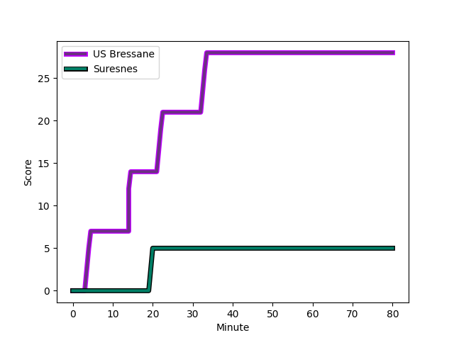
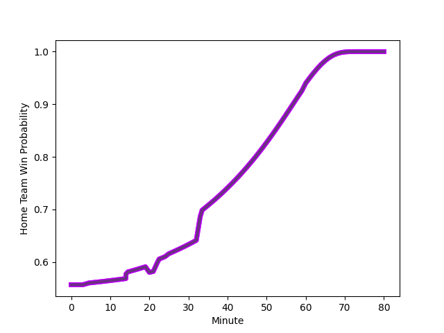

---  
layout: page  
title: Suresnes at US Bressane; 5-28  
date: 2022-11-18 19:30:00 18:00:00 -0500  
categories: match review  
---
# Suresnes (1374.89) at US Bressane (1473.87); 5-28

# Prediction: US Bressane by 12.9

US Bressane by 9.9 on a neutral field
## Scores over Time

## Win Probability over Time

# Pre-Match Prediction: US Bressane by 5.6

US Bressane by 2.6 on a neutral pitch

|   Away Minutes | Away Player                                                                  |   Away elo |   Away Percentile |   Number |   Home Percentile |   Home elo | Home Player                                                                       |   Home Minutes |
|---------------:|:-----------------------------------------------------------------------------|-----------:|------------------:|---------:|------------------:|-----------:|:----------------------------------------------------------------------------------|---------------:|
|             25 | [Sébastien Lafrancesca](..//playerfiles//SébastienLafrancesca_cleaned.md)    |      96.04 |                50 |        1 |                 5 |      81.67 | [Vazha Kapanadze](..//playerfiles//VazhaKapanadze_cleaned.md)                     |             60 |
|             63 | [Hayam El Bibouji](..//playerfiles//HayamElBibouji_cleaned.md)               |      94.01 |                46 |        2 |                12 |      85.84 | [Clement Jullien](..//playerfiles//ClementJullien_cleaned.md)                     |             53 |
|             60 | [Victor Damian Arias](..//playerfiles//VictorDamianArias_cleaned.md)         |     112.89 |                93 |        3 |                89 |     109.65 | [Erich de Jager](..//playerfiles//ErichdeJager_cleaned.md)                        |             80 |
|             80 | [Christopher van Leeuwen](..//playerfiles//ChristophervanLeeuwen_cleaned.md) |      76.25 |                 5 |        4 |                57 |      96.88 | [Wael May](..//playerfiles//WaelMay_cleaned.md)                                   |             80 |
|             55 | [Sacha Yahi](..//playerfiles//SachaYahi_cleaned.md)                          |     102.36 |                75 |        5 |                91 |     112.9  | [Cyril Veyret](..//playerfiles//CyrilVeyret_cleaned.md)                           |             80 |
|             62 | [Louis-Mathieu Jazeix](..//playerfiles//Louis-MathieuJazeix_cleaned.md)      |      88.45 |                21 |        6 |                74 |     103.15 | [Lucas Lyons](..//playerfiles//LucasLyons_cleaned.md)                             |             80 |
|             80 | [Wian Vosloo](..//playerfiles//WianVosloo_cleaned.md)                        |      95.32 |                49 |        7 |                63 |      99.35 | [Thomas Déliance](..//playerfiles//ThomasDéliance_cleaned.md)                     |             64 |
|             80 | [Antonie Claassen](..//playerfiles//AntonieClaassen_cleaned.md)              |     140.01 |                99 |        8 |                 3 |      75.96 | [TJ Ioane](..//playerfiles//TJIoane_cleaned.md)                                   |             50 |
|             62 | [Théo Bachiri](..//playerfiles//ThéoBachiri_cleaned.md)                      |      92.98 |                38 |        9 |                97 |     124.1  | [Nicolas Faure](..//playerfiles//NicolasFaure_cleaned.md)                         |             50 |
|             33 | [Goulwen Gueho](..//playerfiles//GoulwenGueho_cleaned.md)                    |      98.03 |                59 |       10 |                45 |      94.97 | [Sebastian Poet](..//playerfiles//SebastianPoet_cleaned.md)                       |             80 |
|             62 | [Alexis Clément](..//playerfiles//AlexisClément_cleaned.md)                  |      87.54 |                17 |       11 |                23 |      89.57 | [Élie De Fleurian](..//playerfiles//ÉlieDeFleurian_cleaned.md)                    |             80 |
|             80 | [Petero Tuwai](..//playerfiles//PeteroTuwai_cleaned.md)                      |      92.06 |                37 |       12 |                81 |     107.36 | [Parataiso Silafai-Lea'ana](..//playerfiles//ParataisoSilafai-Lea'ana_cleaned.md) |             80 |
|             80 | [Ervin Muric](..//playerfiles//ErvinMuric_cleaned.md)                        |      48.27 |                 0 |       13 |                 1 |      69.39 | [Benjamin Doy](..//playerfiles//BenjaminDoy_cleaned.md)                           |             64 |
|             80 | [Jean-Baptiste Fuster](..//playerfiles//Jean-BaptisteFuster_cleaned.md)      |      84.28 |                11 |       14 |                72 |     101.61 | [Audric Sanlaville](..//playerfiles//AudricSanlaville_cleaned.md)                 |             80 |
|             80 | [Thomas Baudy](..//playerfiles//ThomasBaudy_cleaned.md)                      |      85.67 |                14 |       15 |                88 |     112.09 | [Pierre Berard](..//playerfiles//PierreBerard_cleaned.md)                         |             80 |
|             55 | [Lucas Dycke](..//playerfiles//LucasDycke_cleaned.md)                        |      92.72 |                35 |       16 |                23 |      89.28 | [Loic Baradel](..//playerfiles//LoicBaradel_cleaned.md)                           |             30 |
|             47 | [Clément Amon](..//playerfiles//ClémentAmon_cleaned.md)                      |      77.47 |                 4 |       17 |                18 |      88.96 | [Jeremy Valencot](..//playerfiles//JeremyValencot_cleaned.md)                     |             30 |
|             25 | [Youssouf Yatera](..//playerfiles//YoussoufYatera_cleaned.md)                |      93.02 |                40 |       18 |                94 |     114.9  | [Sione Anga'aelangi](..//playerfiles//SioneAnga'aelangi_cleaned.md)               |             27 |
|             20 | [Leandro Mario Assi](..//playerfiles//LeandroMarioAssi_cleaned.md)           |     113.6  |                93 |       19 |                35 |      92.34 | [Adrien Buatier](..//playerfiles//AdrienBuatier_cleaned.md)                       |             16 |
|             18 | [Enzo Barbarit](..//playerfiles//EnzoBarbarit_cleaned.md)                    |      81.7  |                 7 |       20 |                73 |     102.68 | [Maile Mamao](..//playerfiles//MaileMamao_cleaned.md)                             |             16 |
|             18 | [Théo David Nathan Tanda](..//playerfiles//ThéoDavidNathanTanda_cleaned.md)  |      96.7  |                52 |       21 |                28 |      91.66 | [Teo Bordenave](..//playerfiles//TeoBordenave_cleaned.md)                         |             20 |
|             17 | [Anthony Bajart](..//playerfiles//AnthonyBajart_cleaned.md)                  |      87.88 |                20 |       22 |               nan |     nan    | nan                                                                               |            nan |
|             18 | [Gaëtan Robert](..//playerfiles//GaëtanRobert_cleaned.md)                    |      86.63 |                16 |       23 |               nan |     nan    | nan                                                                               |            nan |

