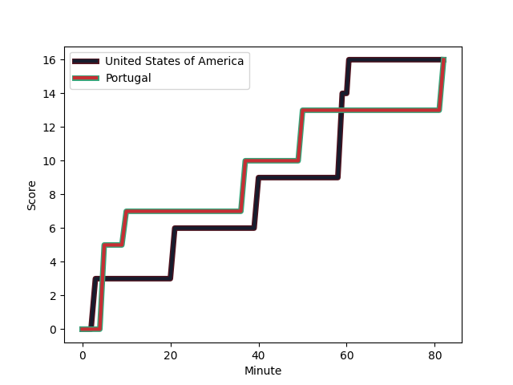
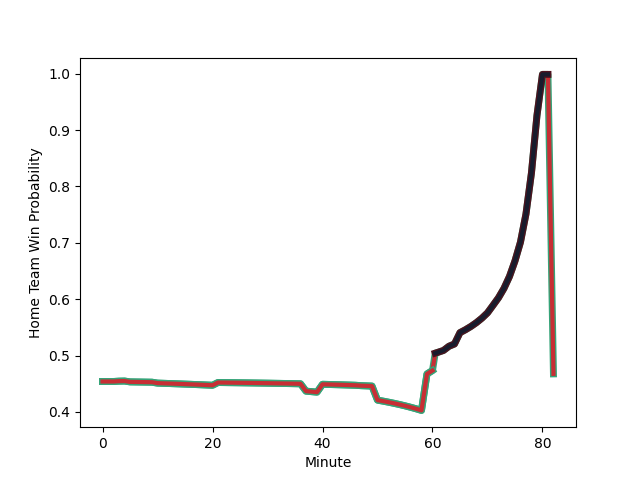

---  
layout: page  
title: Portugal at United States of America; 16.0-16.0  
date: 2022-11-18 10:30:00 18:00:00 -0500  
categories: match review  
---
# Portugal (1522.04) at United States of America (1441.95); 16.0-16.0

# Prediction: Portugal by 5.0

Portugal by 8.0 on a neutral field
## Scores over Time

## Win Probability over Time

# Pre-Match Prediction: Portugal by 4.4

Portugal by 7.4 on a neutral pitch

|   Away Minutes | Away Player                                                            |   Away elo |   Away Percentile |   Number |   Home Percentile |   Home elo | Home Player                                                                     |   Home Minutes |
|---------------:|:-----------------------------------------------------------------------|-----------:|------------------:|---------:|------------------:|-----------:|:--------------------------------------------------------------------------------|---------------:|
|             82 | [Francisco Fernandes](..//playerfiles//FranciscoFernandes_cleaned.md)  |      95    |               nan |        1 |                70 |     101.1  | [David Ainu'u](..//playerfiles//DavidAinu'u_cleaned.md)                         |             79 |
|             71 | [Mike Tadjer](..//playerfiles//MikeTadjer_cleaned.md)                  |     103.01 |                76 |        2 |                16 |      87.2  | [Kapeli Pifeleti](..//playerfiles//KapeliPifeleti_cleaned.md)                   |             65 |
|             71 | [Diogo Hasse Ferreira](..//playerfiles//DiogoHasseFerreira_cleaned.md) |      98.63 |                61 |        3 |                14 |      86.7  | [Paul Mullen](..//playerfiles//PaulMullen_cleaned.md)                           |             65 |
|             78 | [Steevy Cerqueira](..//playerfiles//SteevyCerqueira_cleaned.md)        |      89.1  |                25 |        4 |                 5 |      76.87 | [Greg Peterson](..//playerfiles//GregPeterson_cleaned.md)                       |             82 |
|             82 | [Jose Madeira](..//playerfiles//JoseMadeira_cleaned.md)                |      98.06 |                60 |        5 |                72 |     101.22 | [Cam Dolan](..//playerfiles//CamDolan_cleaned.md)                               |             82 |
|             82 | [Joao Granate](..//playerfiles//JoaoGranate_cleaned.md)                |     108.52 |               nan |        6 |               nan |      95    | [Viliami Helu](..//playerfiles//ViliamiHelu_cleaned.md)                         |             47 |
|             82 | [Rafael Simoes](..//playerfiles//RafaelSimoes_cleaned.md)              |      99.87 |                61 |        7 |                66 |      99.73 | [Cory Daniel](..//playerfiles//CoryDaniel_cleaned.md)                           |             82 |
|             65 | [Thibault de Freitas](..//playerfiles//ThibaultdeFreitas_cleaned.md)   |      95.65 |               nan |        8 |                65 |     101.38 | [Jamason Fa'anana-Schultz](..//playerfiles//JamasonFa'anana-Schultz_cleaned.md) |             76 |
|             82 | [Samuel Marques](..//playerfiles//SamuelMarques_cleaned.md)            |     119.88 |                96 |        9 |                32 |      92.05 | [Ruben de Haas](..//playerfiles//RubendeHaas_cleaned.md)                        |             82 |
|             82 | [Jeronimo Portela](..//playerfiles//JeronimoPortela_cleaned.md)        |     108.11 |                81 |       10 |                69 |     101.37 | [AJ MacGinty](..//playerfiles//AJMacGinty_cleaned.md)                           |             82 |
|             82 | [Rodrigo Marta](..//playerfiles//RodrigoMarta_cleaned.md)              |     105.64 |                80 |       11 |                71 |     101.13 | [Nate Augspurger](..//playerfiles//NateAugspurger_cleaned.md)                   |             82 |
|             82 | [Tomas Appleton](..//playerfiles//TomasAppleton_cleaned.md)            |      98.47 |                60 |       12 |                44 |      94.06 | [Paul Lasike](..//playerfiles//PaulLasike_cleaned.md)                           |             82 |
|             60 | [Jose Lima](..//playerfiles//JoseLima_cleaned.md)                      |     107.35 |                81 |       13 |                64 |      99.74 | [Bryce Campbell](..//playerfiles//BryceCampbell_cleaned.md)                     |             82 |
|             74 | [Raffaele Storti](..//playerfiles//RaffaeleStorti_cleaned.md)          |     103.12 |                76 |       14 |                63 |      98.47 | [Christian Dyer](..//playerfiles//ChristianDyer_cleaned.md)                     |             82 |
|             77 | [Nuno Sousa Guedes](..//playerfiles//NunoSousaGuedes_cleaned.md)       |      95    |               nan |       15 |                63 |      99.73 | [Mitch Wilson](..//playerfiles//MitchWilson_cleaned.md)                         |             82 |
|              8 | [David Costa](..//playerfiles//DavidCosta_cleaned.md)                  |      95.78 |               nan |       16 |                88 |     109.29 | [Mike Sosene-Feagai](..//playerfiles//MikeSosene-Feagai_cleaned.md)             |             17 |
|             11 | [Lionel Campergue](..//playerfiles//LionelCampergue_cleaned.md)        |      95    |               nan |       17 |                66 |      99.73 | [Jack Iscaro](..//playerfiles//JackIscaro_cleaned.md)                           |             17 |
|             11 | [Antonio Prim](..//playerfiles//AntonioPrim_cleaned.md)                |      95    |               nan |       18 |               nan |      95    | [Nathan Sylvia](..//playerfiles//NathanSylvia_cleaned.md)                       |              3 |
|              4 | [Jose Andrade](..//playerfiles//JoseAndrade_cleaned.md)                |      95    |               nan |       19 |               nan |      94.36 | [Benja Bonasso](..//playerfiles//BenjaBonasso_cleaned.md)                       |             35 |
|             17 | [Nicolas Martins](..//playerfiles//NicolasMartins_cleaned.md)          |     100.51 |                68 |       20 |               nan |      93.5  | [Moni Tonga’uiha](..//playerfiles//MoniTonga’uiha_cleaned.md)                   |              6 |
|              0 | [Pedro Lucas](..//playerfiles//PedroLucas_cleaned.md)                  |      95.5  |               nan |       21 |               nan |      95    | [Chris Mattina](..//playerfiles//ChrisMattina_cleaned.md)                       |              0 |
|             22 | [Vincent Pinto](..//playerfiles//VincentPinto_cleaned.md)              |      97.22 |                56 |       22 |                74 |     103.67 | [Luke Carty](..//playerfiles//LukeCarty_cleaned.md)                             |              0 |
|              5 | [Simao Bento](..//playerfiles//SimaoBento_cleaned.md)                  |     100.09 |                65 |       23 |                70 |     101.62 | [Tavite Lopeti](..//playerfiles//TaviteLopeti_cleaned.md)                       |              0 |

