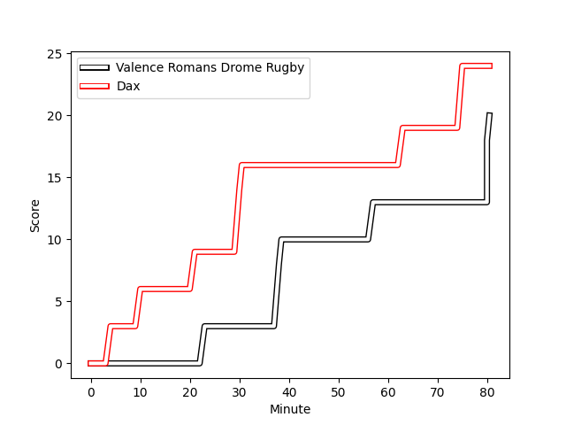
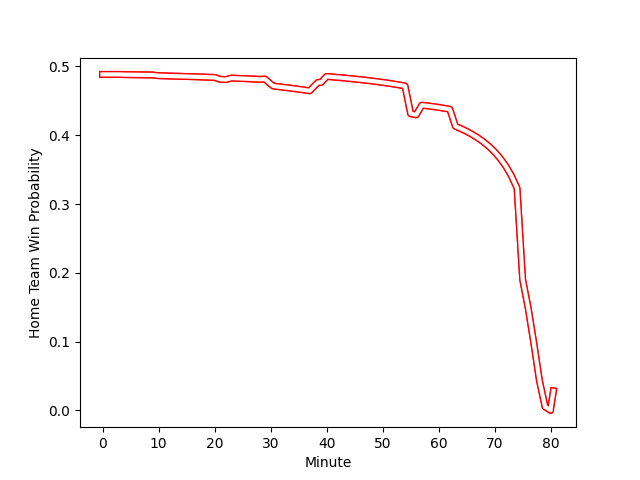

---  
layout: page  
title: Dax at Valence Romans Drome Rugby; 24-20  
date: 2022-11-18 19:00:00 18:00:00 -0500  
categories: match review  
---
# Dax (1461.6) at Valence Romans Drome Rugby (1441.7); 24-20

# Prediction: Valence Romans Drome Rugby by 1.0

Dax by 2.0 on a neutral field
## Scores over Time

## Win Probability over Time

# Pre-Match Prediction: Dax by 2.9

Dax by 5.9 on a neutral pitch

|   Away Minutes | Away Player                                                        |   Away elo |   Away Percentile |   Number |   Home Percentile |   Home elo | Home Player                                                           |   Home Minutes |
|---------------:|:-------------------------------------------------------------------|-----------:|------------------:|---------:|------------------:|-----------:|:----------------------------------------------------------------------|---------------:|
|             55 | [Asa Faitotoa](..//playerfiles//AsaFaitotoa_cleaned.md)            |     111.72 |                92 |        1 |                88 |     108.73 | [Anthony Aléo](..//playerfiles//AnthonyAléo_cleaned.md)               |             55 |
|             55 | [Maxime Delonca](..//playerfiles//MaximeDelonca_cleaned.md)        |      89.15 |                22 |        2 |                11 |      84.76 | [Dorian Marco Pena](..//playerfiles//DorianMarcoPena_cleaned.md)      |             50 |
|             55 | [Thibaud Dréan](..//playerfiles//ThibaudDréan_cleaned.md)          |      82.64 |                 7 |        3 |                35 |      92.68 | [Vincent Pelo](..//playerfiles//VincentPelo_cleaned.md)               |             29 |
|             80 | [Mattieu Bidau](..//playerfiles//MattieuBidau_cleaned.md)          |      93.04 |                40 |        4 |                60 |      97.78 | [Darrell Dyer](..//playerfiles//DarrellDyer_cleaned.md)               |             50 |
|             55 | [Yoan Gaune](..//playerfiles//YoanGaune_cleaned.md)                |     105.64 |                80 |        5 |                33 |      91.15 | [Florian Goumat](..//playerfiles//FlorianGoumat_cleaned.md)           |             80 |
|             40 | [Arnaud Aletti](..//playerfiles//ArnaudAletti_cleaned.md)          |     105.72 |                81 |        6 |                 2 |      71.84 | [Axel Bruchet](..//playerfiles//AxelBruchet_cleaned.md)               |             40 |
|             80 | [Paul Arnaud Ausset](..//playerfiles//PaulArnaudAusset_cleaned.md) |      97.82 |                57 |        7 |                14 |      85.92 | [Matthew Gicquel](..//playerfiles//MatthewGicquel_cleaned.md)         |             80 |
|             80 | [Brice Ferrer](..//playerfiles//BriceFerrer_cleaned.md)            |      97.18 |                53 |        8 |                39 |      93.32 | [Dylan Hayes](..//playerfiles//DylanHayes_cleaned.md)                 |             40 |
|             66 | [Simon Garrouteigt](..//playerfiles//SimonGarrouteigt_cleaned.md)  |      87.07 |                13 |        9 |                16 |      87.09 | [Tim Menzel](..//playerfiles//TimMenzel_cleaned.md)                   |             80 |
|             80 | [Hugo Cerisier](..//playerfiles//HugoCerisier_cleaned.md)          |     105.21 |                76 |       10 |                39 |      93.59 | [Lucas Meret](..//playerfiles//LucasMeret_cleaned.md)                 |             80 |
|             70 | [Julien Dechavanne](..//playerfiles//JulienDechavanne_cleaned.md)  |      89.88 |                20 |       11 |                66 |      99.75 | [Tim Giresse](..//playerfiles//TimGiresse_cleaned.md)                 |             80 |
|             60 | [Ilikena Bolakoro](..//playerfiles//IlikenaBolakoro_cleaned.md)    |      94.97 |                46 |       12 |                50 |      95.85 | [Ben Neiceru](..//playerfiles//BenNeiceru_cleaned.md)                 |             55 |
|             80 | [Sylvère Reteau](..//playerfiles//SylvèreReteau_cleaned.md)        |     109.35 |                86 |       13 |                91 |     115.06 | [Charles Bouldoire](..//playerfiles//CharlesBouldoire_cleaned.md)     |             80 |
|             80 | [Théo Gatelier](..//playerfiles//ThéoGatelier_cleaned.md)          |      91.72 |                35 |       14 |                69 |     100.56 | [Mason Emerson](..//playerfiles//MasonEmerson_cleaned.md)             |             80 |
|             80 | [Théo Duprat](..//playerfiles//ThéoDuprat_cleaned.md)              |     104.62 |                73 |       15 |                49 |      96.36 | [Joris Moura](..//playerfiles//JorisMoura_cleaned.md)                 |             80 |
|             25 | [Louis Mary](..//playerfiles//LouisMary_cleaned.md)                |      95.33 |                44 |       16 |                82 |     105.56 | [Sami Zouhair](..//playerfiles//SamiZouhair_cleaned.md)               |             25 |
|             25 | [Elvis Levi](..//playerfiles//ElvisLevi_cleaned.md)                |     105.17 |                80 |       17 |                77 |     103.24 | [Mehdi Boundjema](..//playerfiles//MehdiBoundjema_cleaned.md)         |             30 |
|             25 | [Anthony Pelmard](..//playerfiles//AnthonyPelmard_cleaned.md)      |      94.81 |                28 |       18 |                52 |      95.72 | [John Henry Fincham](..//playerfiles//JohnHenryFincham_cleaned.md)    |             51 |
|             25 | [Mat Luamanu](..//playerfiles//MatLuamanu_cleaned.md)              |      85.83 |                16 |       19 |                90 |     111.58 | [Francois Uys](..//playerfiles//FrancoisUys_cleaned.md)               |             30 |
|             40 | [Théo Tremeau](..//playerfiles//ThéoTremeau_cleaned.md)            |      96.55 |                53 |       20 |                48 |      95.08 | [Alexis Armary](..//playerfiles//AlexisArmary_cleaned.md)             |             40 |
|             14 | [Adrien Ayestaran](..//playerfiles//AdrienAyestaran_cleaned.md)    |      80.95 |                 6 |       21 |                74 |     102.97 | [Ioane Iashagashvili](..//playerfiles//IoaneIashagashvili_cleaned.md) |             40 |
|             10 | [Guillaume Bouche](..//playerfiles//GuillaumeBouche_cleaned.md)    |      96.19 |                52 |       22 |                25 |      88.66 | [Anatole Pauvert](..//playerfiles//AnatolePauvert_cleaned.md)         |             25 |
|             20 | [Hugo Fourquet](..//playerfiles//HugoFourquet_cleaned.md)          |     108.01 |                83 |       23 |               nan |     nan    | nan                                                                   |            nan |

