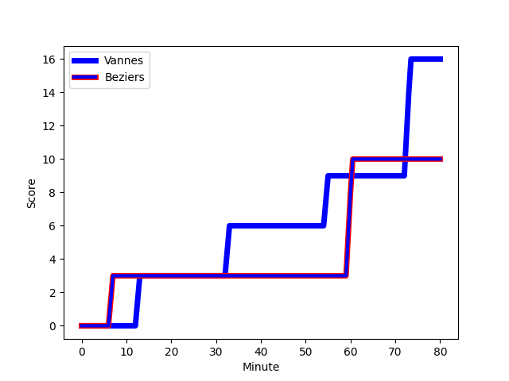
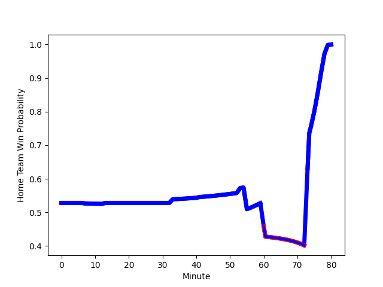

---  
layout: page  
title: Beziers at Vannes; 10-16  
date: 2022-11-18 19:30:00 18:00:00 -0500  
categories: match review  
---
# Beziers (1455.36) at Vannes (1504.41); 10-16

# Prediction: Vannes by 7.9

Vannes by 4.9 on a neutral field
## Scores over Time

## Win Probability over Time

# Pre-Match Prediction: Vannes by 5.5

Vannes by 2.5 on a neutral pitch

|   Away Minutes | Away Player                                                                    |   Away elo |   Away Percentile |   Number |   Home Percentile |   Home elo | Home Player                                                               |   Home Minutes |
|---------------:|:-------------------------------------------------------------------------------|-----------:|------------------:|---------:|------------------:|-----------:|:--------------------------------------------------------------------------|---------------:|
|             41 | [Zhorzhi (Jorji) Saldadze](..//playerfiles//Zhorzhi(Jorji)Saldadze_cleaned.md) |      85.47 |                18 |        1 |                43 |      94.06 | [Charles-Henri Berguet](..//playerfiles//Charles-HenriBerguet_cleaned.md) |             53 |
|             65 | [Marco Pinto Ferrer](..//playerfiles//MarcoPintoFerrer_cleaned.md)             |      86.96 |                15 |        2 |                71 |     100.98 | [Pat Leafa](..//playerfiles//PatLeafa_cleaned.md)                         |             53 |
|             55 | [Jon Zabala Arrieta](..//playerfiles//JonZabalaArrieta_cleaned.md)             |     103.55 |                77 |        3 |                39 |      94.05 | [John Afoa](..//playerfiles//JohnAfoa_cleaned.md)                         |             53 |
|             80 | [Clément Bitz](..//playerfiles//ClémentBitz_cleaned.md)                        |      93.33 |                46 |        4 |                83 |     107.8  | [Remi Leroux](..//playerfiles//RemiLeroux_cleaned.md)                     |             46 |
|             55 | [John Madigan](..//playerfiles//JohnMadigan_cleaned.md)                        |      91.88 |                35 |        5 |                17 |      84.67 | [Myles Edwards](..//playerfiles//MylesEdwards_cleaned.md)                 |             41 |
|             55 | [Jean-Baptiste Barrère](..//playerfiles//Jean-BaptisteBarrère_cleaned.md)      |      77.66 |                 4 |        6 |                 2 |      73.77 | [Karl Chateau](..//playerfiles//KarlChateau_cleaned.md)                   |             80 |
|             80 | [Gillian Benoy](..//playerfiles//GillianBenoy_cleaned.md)                      |      90.68 |                28 |        7 |                99 |     135.78 | [Francisco Gorrissen](..//playerfiles//FranciscoGorrissen_cleaned.md)     |             80 |
|             41 | [Thomas Hoarau](..//playerfiles//ThomasHoarau_cleaned.md)                      |      90.18 |                30 |        8 |                80 |     108    | [Léon Boulier](..//playerfiles//LéonBoulier_cleaned.md)                   |             80 |
|             67 | [Josh Valentine](..//playerfiles//JoshValentine_cleaned.md)                    |     120.45 |                96 |        9 |                25 |      91.24 | [Hugo Zabalza](..//playerfiles//HugoZabalza_cleaned.md)                   |             79 |
|             50 | [Adrien Latorre](..//playerfiles//AdrienLatorre_cleaned.md)                    |     108.3  |                84 |       10 |                44 |      94.82 | [Maxime Lafage](..//playerfiles//MaximeLafage_cleaned.md)                 |             80 |
|             80 | [Paul Reau](..//playerfiles//PaulReau_cleaned.md)                              |      95    |               nan |       11 |                86 |     111.75 | [Romaric Camou](..//playerfiles//RomaricCamou_cleaned.md)                 |             80 |
|             80 | [Paul Recor](..//playerfiles//PaulRecor_cleaned.md)                            |      91.72 |                34 |       12 |                31 |      90.9  | [Youenn Floch](..//playerfiles//YouennFloch_cleaned.md)                   |             58 |
|             80 | [Maxime Espeut](..//playerfiles//MaximeEspeut_cleaned.md)                      |     124.08 |                96 |       13 |                56 |      97.24 | [Theo Costosseque](..//playerfiles//TheoCostosseque_cleaned.md)           |             80 |
|             80 | [Watisoni Votu](..//playerfiles//WatisoniVotu_cleaned.md)                      |     105.88 |                81 |       14 |                69 |     100.55 | [Nathanael Hulleu](..//playerfiles//NathanaelHulleu_cleaned.md)           |             80 |
|             80 | [Gabin Lorre](..//playerfiles//GabinLorre_cleaned.md)                          |      95.7  |                54 |       15 |                98 |     128.87 | [Nick Abendanon](..//playerfiles//NickAbendanon_cleaned.md)               |             80 |
|             39 | [Maxence Lemardelet](..//playerfiles//MaxenceLemardelet_cleaned.md)            |      87.35 |                17 |       16 |                 1 |      67.83 | [Eric Marks](..//playerfiles//EricMarks_cleaned.md)                       |             39 |
|             39 | [Ferdinand Changel](..//playerfiles//FerdinandChangel_cleaned.md)              |      90.85 |               nan |       17 |                81 |     107.27 | [Edoardo Iachizzi](..//playerfiles//EdoardoIachizzi_cleaned.md)           |             34 |
|             30 | [Romain Uruty](..//playerfiles//RomainUruty_cleaned.md)                        |      89.59 |                23 |       18 |                67 |     100.58 | [Cyril Blanchard](..//playerfiles//CyrilBlanchard_cleaned.md)             |             27 |
|             25 | [William van Bost](..//playerfiles//WilliamvanBost_cleaned.md)                 |      98.27 |                60 |       19 |                18 |      89.44 | [Ximun Bessonart](..//playerfiles//XimunBessonart_cleaned.md)             |             27 |
|             25 | [Yannick Arroyo](..//playerfiles//YannickArroyo_cleaned.md)                    |     106.65 |                84 |       20 |               nan |      95    | [Simon Bourgeois](..//playerfiles//SimonBourgeois_cleaned.md)             |             27 |
|             25 | [Yassine Maamry](..//playerfiles//YassineMaamry_cleaned.md)                    |      79.45 |                 7 |       21 |                27 |      89.71 | [Dan Hollinshead](..//playerfiles//DanHollinshead_cleaned.md)             |             22 |
|             15 | [Yvann Lalevee](..//playerfiles//YvannLalevee_cleaned.md)                      |      97.77 |                48 |       22 |                52 |      96.14 | [Alexandre Gouaux](..//playerfiles//AlexandreGouaux_cleaned.md)           |              1 |
|             13 | [Mitch Short](..//playerfiles//MitchShort_cleaned.md)                          |      88.02 |                19 |       23 |               nan |     nan    | nan                                                                       |            nan |

