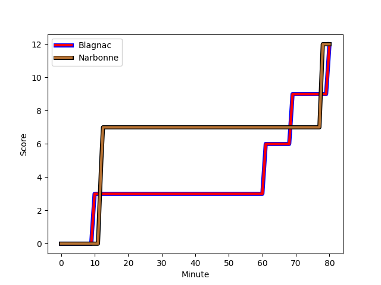
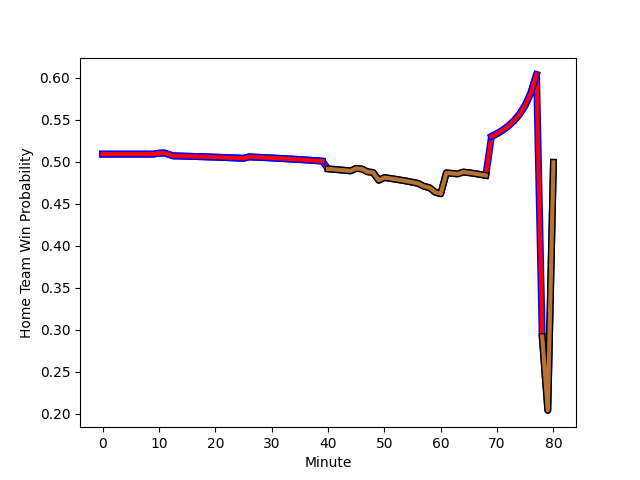

---  
layout: page  
title: Narbonne at Blagnac; 12-12  
date: 2022-11-19 18:00:00 18:00:00 -0500  
categories: match review  
---
# Narbonne (1388.98) at Blagnac (1405.19); 12-12

# Prediction: Blagnac by 4.6

Blagnac by 1.6 on a neutral field
## Scores over Time

## Win Probability over Time

# Pre-Match Prediction: Blagnac by 3.7

Blagnac by 0.7 on a neutral pitch

|   Away Minutes | Away Player                                                         |   Away elo |   Away Percentile |   Number |   Home Percentile |   Home elo | Home Player                                                              |   Home Minutes |
|---------------:|:--------------------------------------------------------------------|-----------:|------------------:|---------:|------------------:|-----------:|:-------------------------------------------------------------------------|---------------:|
|             50 | [Geoffrey Moise](..//playerfiles//GeoffreyMoise_cleaned.md)         |      98.68 |                62 |        1 |                32 |      93.44 | [Jean-Baptiste Martin](..//playerfiles//Jean-BaptisteMartin_cleaned.md)  |             26 |
|             64 | [Christophe David](..//playerfiles//ChristopheDavid_cleaned.md)     |     102.31 |                74 |        2 |                52 |      96.91 | [Florian Bertrand](..//playerfiles//FlorianBertrand_cleaned.md)          |             57 |
|             40 | [Matthieu Loudet](..//playerfiles//MatthieuLoudet_cleaned.md)       |      83.93 |                 9 |        3 |                31 |      91.91 | [Fabien Lorenzon](..//playerfiles//FabienLorenzon_cleaned.md)            |             49 |
|             80 | [Valentin Sese](..//playerfiles//ValentinSese_cleaned.md)           |      89.22 |                25 |        4 |                12 |      83.49 | [Lucas Tolofua](..//playerfiles//LucasTolofua_cleaned.md)                |             45 |
|             47 | [Mohamed Kbaier](..//playerfiles//MohamedKbaier_cleaned.md)         |      89.33 |                25 |        5 |                36 |      92.01 | [Vincent Mutel](..//playerfiles//VincentMutel_cleaned.md)                |             80 |
|             61 | [Bill Caffo](..//playerfiles//BillCaffo_cleaned.md)                 |      98.84 |                61 |        6 |                69 |     100.16 | [Nikita Bekov](..//playerfiles//NikitaBekov_cleaned.md)                  |             80 |
|             80 | [Paul Belzons](..//playerfiles//PaulBelzons_cleaned.md)             |      68.67 |                 1 |        7 |                69 |     102.39 | [Mateo Ibanez](..//playerfiles//MateoIbanez_cleaned.md)                  |             80 |
|             80 | [Luke Nakobukobua](..//playerfiles//LukeNakobukobua_cleaned.md)     |     103.83 |                74 |        8 |                54 |      97.79 | [Mathieu Vachon](..//playerfiles//MathieuVachon_cleaned.md)              |             80 |
|             59 | [Pierrick Nova](..//playerfiles//PierrickNova_cleaned.md)           |      77.46 |                 3 |        9 |                57 |      97.57 | [Paul Ravier](..//playerfiles//PaulRavier_cleaned.md)                    |             57 |
|             80 | [Tom Chauvet](..//playerfiles//TomChauvet_cleaned.md)               |      87.56 |                19 |       10 |                45 |      95.4  | [Ugo Seunes](..//playerfiles//UgoSeunes_cleaned.md)                      |             80 |
|             79 | [Étienne Ducom](..//playerfiles//ÉtienneDucom_cleaned.md)           |     100.51 |                68 |       11 |                 7 |      80.87 | [Benjamin Daurau Bedin](..//playerfiles//BenjaminDaurauBedin_cleaned.md) |             80 |
|             80 | [Sébastien Giorgis](..//playerfiles//SébastienGiorgis_cleaned.md)   |      94.48 |                45 |       12 |                25 |      89.29 | [Aurelien Labau](..//playerfiles//AurelienLabau_cleaned.md)              |             57 |
|             80 | [Pierre Nueno](..//playerfiles//PierreNueno_cleaned.md)             |      84.92 |                14 |       13 |                49 |      95.67 | [Clément Vareilles](..//playerfiles//ClémentVareilles_cleaned.md)        |             80 |
|             80 | [Pierre-Hugo Ducom](..//playerfiles//Pierre-HugoDucom_cleaned.md)   |     105.97 |                81 |       14 |                 5 |      79.25 | [Francois Tardieu](..//playerfiles//FrancoisTardieu_cleaned.md)          |             80 |
|             73 | [Tom Homer](..//playerfiles//TomHomer_cleaned.md)                   |      89.13 |                26 |       15 |                89 |     112.26 | [Jean-Andre Vernetti](..//playerfiles//Jean-AndreVernetti_cleaned.md)    |             49 |
|             30 | [Sylvain Abadie](..//playerfiles//SylvainAbadie_cleaned.md)         |      83.64 |                 8 |       16 |                69 |     100.53 | [Alexis Decaux](..//playerfiles//AlexisDecaux_cleaned.md)                |             54 |
|             16 | [Jordan Rochier](..//playerfiles//JordanRochier_cleaned.md)         |      91.54 |                32 |       17 |                79 |     103.87 | [Leeroy Cloostermans](..//playerfiles//LeeroyCloostermans_cleaned.md)    |             23 |
|             40 | [Théo Castinel](..//playerfiles//ThéoCastinel_cleaned.md)           |     115.24 |                94 |       18 |                50 |      96.85 | [Marco Trauth](..//playerfiles//MarcoTrauth_cleaned.md)                  |             31 |
|             33 | [Mauro Rebussone](..//playerfiles//MauroRebussone_cleaned.md)       |      98.86 |                55 |       19 |                50 |      96.76 | [Lilian Rousset](..//playerfiles//LilianRousset_cleaned.md)              |             35 |
|             19 | [Guillem Montagne](..//playerfiles//GuillemMontagne_cleaned.md)     |      92.87 |                39 |       20 |               nan |      95.4  | [Pierre Ferrari](..//playerfiles//PierreFerrari_cleaned.md)              |             23 |
|             21 | [Christopher Kaiser](..//playerfiles//ChristopherKaiser_cleaned.md) |      90.53 |                22 |       21 |                 5 |      77.62 | [Guillaume Piron](..//playerfiles//GuillaumePiron_cleaned.md)            |             23 |
|              1 | [Lucas Lebraud](..//playerfiles//LucasLebraud_cleaned.md)           |      75.43 |                 4 |       22 |                 4 |      76.79 | [Antoine Renaud](..//playerfiles//AntoineRenaud_cleaned.md)              |             31 |
|              7 | [Thibault Santoro](..//playerfiles//ThibaultSantoro_cleaned.md)     |      96.56 |                53 |       23 |               nan |     nan    | nan                                                                      |            nan |

