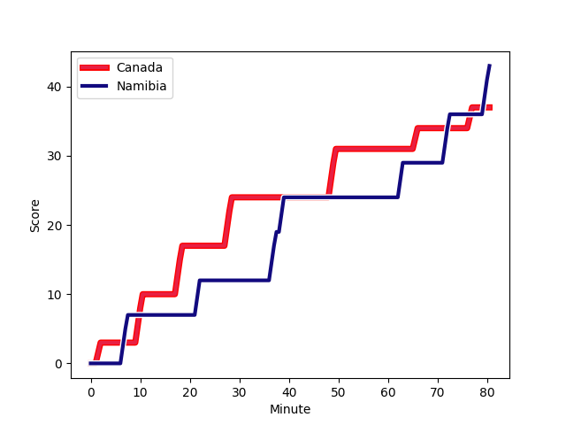
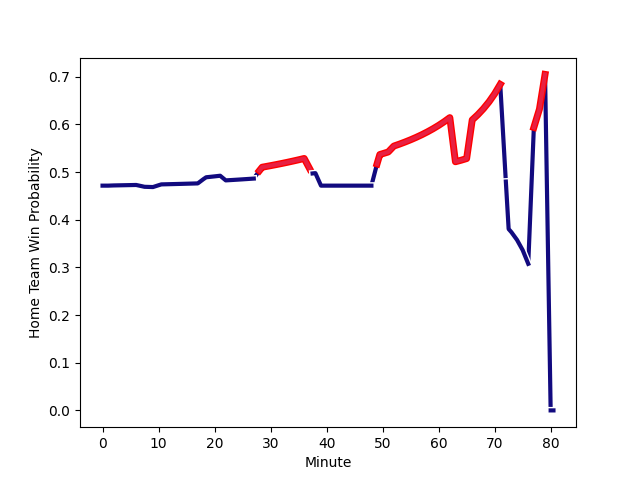

---  
layout: page  
title: Namibia at Canada; 43-37  
date: 2022-11-19 14:30:00 18:00:00 -0500  
categories: match review  
---
# Namibia (1441.66) at Canada (1392.08); 43-37

# Prediction: Namibia by 2.0

Namibia by 5.0 on a neutral field
## Scores over Time

## Win Probability over Time

# Pre-Match Prediction: Namibia by 3.6

Canada by 0.6 on a neutral pitch

|   Away Minutes | Away Player                                                                       |   Away elo |   Away Percentile |   Number |   Home Percentile |   Home elo | Home Player                                                           |   Home Minutes |
|---------------:|:----------------------------------------------------------------------------------|-----------:|------------------:|---------:|------------------:|-----------:|:----------------------------------------------------------------------|---------------:|
|             80 | [Jason Benade](..//playerfiles//JasonBenade_cleaned.md)                           |      85.86 |                12 |        1 |                 1 |      70.74 | [Djustice Sears-Duru](..//playerfiles//DjusticeSears-Duru_cleaned.md) |             80 |
|             80 | [Louis van der Westhuizen](..//playerfiles//LouisvanderWesthuizen_cleaned.md)     |     113.29 |                93 |        2 |                87 |     109.22 | [AJ Quattrin](..//playerfiles//AJQuattrin_cleaned.md)                 |             68 |
|             52 | [Casper Viviers](..//playerfiles//CasperViviers_cleaned.md)                       |     108.37 |                88 |        3 |                73 |     102.17 | [Tyler Rowland](..//playerfiles//TylerRowland_cleaned.md)             |             68 |
|             52 | [Ruan Ludick](..//playerfiles//RuanLudick_cleaned.md)                             |      67.51 |                 1 |        4 |                15 |      84.77 | [Conor Keys](..//playerfiles//ConorKeys_cleaned.md)                   |             80 |
|             80 | [Muharua Wilhelm Katjijeko](..//playerfiles//MuharuaWilhelmKatjijeko_cleaned.md)  |     107.57 |                84 |        5 |                11 |      82.62 | [Josh Larsen](..//playerfiles//JoshLarsen_cleaned.md)                 |             80 |
|             61 | [Wian Conradie](..//playerfiles//WianConradie_cleaned.md)                         |     114.04 |                92 |        6 |                38 |      92.56 | [Corey Thomas](..//playerfiles//CoreyThomas_cleaned.md)               |             62 |
|             80 | [Johan Retief](..//playerfiles//JohanRetief_cleaned.md)                           |      92.11 |                36 |        7 |                30 |      91.38 | [Lucas Rumball](..//playerfiles//LucasRumball_cleaned.md)             |             78 |
|             61 | [Prince Rivaldo Gino Gaoseb](..//playerfiles//PrinceRivaldoGinoGaoseb_cleaned.md) |      75.81 |                 3 |        8 |                43 |      94.55 | [Siaki Vikilani](..//playerfiles//SiakiVikilani_cleaned.md)           |             80 |
|             80 | [Helarius Kisting](..//playerfiles//HelariusKisting_cleaned.md)                   |      89.43 |               nan |        9 |                59 |      98.91 | [Jason Higgins](..//playerfiles//JasonHiggins_cleaned.md)             |             59 |
|             56 | [Cliven Loubser](..//playerfiles//ClivenLoubser_cleaned.md)                       |     108.53 |                81 |       10 |                83 |     109.63 | [Robert Povey](..//playerfiles//RobertPovey_cleaned.md)               |             80 |
|             80 | [Darryl Neville Wellman](..//playerfiles//DarrylNevilleWellman_cleaned.md)        |      95    |               nan |       11 |                56 |      97.25 | [Josiah Morra](..//playerfiles//JosiahMorra_cleaned.md)               |             52 |
|             80 | [Le Roux Malan](..//playerfiles//LeRouxMalan_cleaned.md)                          |      99.17 |                62 |       12 |                55 |      97.09 | [Josh Thiel](..//playerfiles//JoshThiel_cleaned.md)                   |             80 |
|             80 | [Johan Deysel (Jnr)](..//playerfiles//JohanDeysel(Jnr)_cleaned.md)                |     105.93 |                79 |       13 |                43 |      94.04 | [Ben LeSage](..//playerfiles//BenLeSage_cleaned.md)                   |             80 |
|             80 | [Warren Adrienne Ludwig](..//playerfiles//WarrenAdrienneLudwig_cleaned.md)        |      90.27 |                25 |       14 |                 8 |      81.43 | [Andrew Coe](..//playerfiles//AndrewCoe_cleaned.md)                   |             66 |
|             80 | [Andre (Dries) Van der Berg](..//playerfiles//Andre(Dries)VanderBerg_cleaned.md)  |      89.35 |                25 |       15 |                22 |      87.85 | [Cooper Coats](..//playerfiles//CooperCoats_cleaned.md)               |             80 |
|             28 | [Jano Otto](..//playerfiles//JanoOtto_cleaned.md)                                 |      94.41 |               nan |       16 |                45 |      93.58 | [Lindsay Stevens](..//playerfiles//LindsayStevens_cleaned.md)         |             12 |
|             28 | [PJ van Lill](..//playerfiles//PJvanLill_cleaned.md)                              |     119.4  |                96 |       17 |               nan |      95    | [Kyle Steeves](..//playerfiles//KyleSteeves_cleaned.md)               |             12 |
|             19 | [Richard Hardwick](..//playerfiles//RichardHardwick_cleaned.md)                   |      90.39 |                25 |       18 |               nan |      95    | [Piet von Dadelszen](..//playerfiles//PietvonDadelszen_cleaned.md)    |             18 |
|             19 | [Jan Adriaan Booysen](..//playerfiles//JanAdriaanBooysen_cleaned.md)              |      69.17 |                 1 |       19 |               nan |      95    | [Owain Ruttan](..//playerfiles//OwainRuttan_cleaned.md)               |              2 |
|             24 | [Damian Stevens](..//playerfiles//DamianStevens_cleaned.md)                       |      86.36 |                14 |       20 |                29 |      91.36 | [Ross Braude](..//playerfiles//RossBraude_cleaned.md)                 |             21 |
|            nan | nan                                                                               |     nan    |               nan |       21 |                55 |      97.73 | [Brock Webster](..//playerfiles//BrockWebster_cleaned.md)             |             28 |
|            nan | nan                                                                               |     nan    |               nan |       22 |               nan |      95.47 | [David Richard](..//playerfiles//DavidRichard_cleaned.md)             |             14 |

