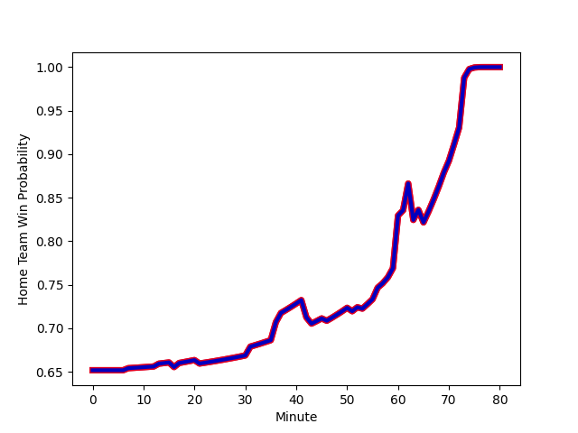

---  
layout: page  
title: Japan at France; 17.0-35.0  
date: 2022-11-19 14:00:00 18:00:00 -0500  
categories: match review  
---
# Japan (1464.67) at France (1737.08); 17.0-35.0

# Prediction: France by 30.2

France by 27.2 on a neutral field
## Scores over Time

## Win Probability over Time

# Pre-Match Prediction: France by 30.4

France by 27.4 on a neutral pitch

|   Away Minutes | Away Player                                                         |   Away elo |   Away Percentile |   Number |   Home Percentile |   Home elo | Home Player                                                         |   Home Minutes |
|---------------:|:--------------------------------------------------------------------|-----------:|------------------:|---------:|------------------:|-----------:|:--------------------------------------------------------------------|---------------:|
|             56 | [Keita Inagaki](..//playerfiles//KeitaInagaki_cleaned.md)           |     112.34 |                92 |        1 |                94 |     114.47 | [Reda Wardi](..//playerfiles//RedaWardi_cleaned.md)                 |             61 |
|             75 | [Atsushi Sakate](..//playerfiles//AtsushiSakate_cleaned.md)         |      98.31 |                62 |        2 |                91 |     110.95 | [Julien Marchand](..//playerfiles//JulienMarchand_cleaned.md)       |             59 |
|             75 | [Jiwon Koo](..//playerfiles//JiwonKoo_cleaned.md)                   |      79.17 |                 4 |        3 |                96 |     117.96 | [Uini Atonio](..//playerfiles//UiniAtonio_cleaned.md)               |             46 |
|             75 | [Warner Dearns](..//playerfiles//WarnerDearns_cleaned.md)           |      95.47 |                50 |        4 |                37 |      92.37 | [Cameron Woki](..//playerfiles//CameronWoki_cleaned.md)             |             75 |
|             80 | [Jack Cornelsen](..//playerfiles//JackCornelsen_cleaned.md)         |     106.91 |                83 |        5 |                93 |     116.54 | [Romain Taofifenua](..//playerfiles//RomainTaofifenua_cleaned.md)   |             59 |
|             80 | [Michael Leitch](..//playerfiles//MichaelLeitch_cleaned.md)         |     113.43 |                91 |        6 |                92 |     113.98 | [Anthony Jelonch](..//playerfiles//AnthonyJelonch_cleaned.md)       |             80 |
|             80 | [Pieter Labuschagne](..//playerfiles//PieterLabuschagne_cleaned.md) |      93.68 |               nan |        7 |                97 |     125.34 | [Charles Ollivon](..//playerfiles//CharlesOllivon_cleaned.md)       |             80 |
|             51 | [Kazuki Himeno](..//playerfiles//KazukiHimeno_cleaned.md)           |     100.28 |                67 |        8 |                94 |     125.32 | [Gregory Alldritt](..//playerfiles//GregoryAlldritt_cleaned.md)     |             80 |
|             51 | [Naoto Saito](..//playerfiles//NaotoSaito_cleaned.md)               |      90.76 |                36 |        9 |                99 |     139.42 | [Maxime Lucu](..//playerfiles//MaximeLucu_cleaned.md)               |             70 |
|             80 | [Seungsin Lee](..//playerfiles//SeungsinLee_cleaned.md)             |      94.98 |                55 |       10 |                88 |     114.02 | [Romain Ntamack](..//playerfiles//RomainNtamack_cleaned.md)         |             57 |
|             80 | [Siosaia Fifita](..//playerfiles//SiosaiaFifita_cleaned.md)         |      74.9  |                 3 |       11 |                88 |     111.82 | [Yoram Moefana](..//playerfiles//YoramMoefana_cleaned.md)           |             80 |
|             53 | [Ryoto Nakamura](..//playerfiles//RyotoNakamura_cleaned.md)         |     107.68 |                82 |       12 |                89 |     113.93 | [Jonathan Danty](..//playerfiles//JonathanDanty_cleaned.md)         |             80 |
|             80 | [Shogo Nakano](..//playerfiles//ShogoNakano_cleaned.md)             |      93.44 |                41 |       13 |                95 |     122.31 | [Gael Fickou](..//playerfiles//GaelFickou_cleaned.md)               |             16 |
|             80 | [Dylan Riley](..//playerfiles//DylanRiley_cleaned.md)               |     107.62 |                82 |       14 |                84 |     107.48 | [Damian Penaud](..//playerfiles//DamianPenaud_cleaned.md)           |             80 |
|             75 | [Ryohei Yamanaka](..//playerfiles//RyoheiYamanaka_cleaned.md)       |      93.16 |                43 |       15 |                98 |     128.8  | [Thomas Ramos](..//playerfiles//ThomasRamos_cleaned.md)             |             80 |
|              5 | [Kosuke Horikoshi](..//playerfiles//KosukeHorikoshi_cleaned.md)     |     104.04 |                80 |       16 |                94 |     117.11 | [Peato Mauvaka](..//playerfiles//PeatoMauvaka_cleaned.md)           |             21 |
|             24 | [Craig Millar](..//playerfiles//CraigMillar_cleaned.md)             |      95.49 |                60 |       17 |                77 |     101.9  | [Dany Priso](..//playerfiles//DanyPriso_cleaned.md)                 |             19 |
|              0 | [Syuhei Takeuchi](..//playerfiles//SyuheiTakeuchi_cleaned.md)       |      95    |               nan |       18 |                80 |     105.06 | [Sipili Falatea](..//playerfiles//SipiliFalatea_cleaned.md)         |             34 |
|              5 | [Wimpie van der Walt](..//playerfiles//WimpievanderWalt_cleaned.md) |     103.41 |                77 |       19 |                89 |     112.19 | [Florian Verhaeghe](..//playerfiles//FlorianVerhaeghe_cleaned.md)   |              5 |
|             29 | [Tevita Tatafu](..//playerfiles//TevitaTatafu_cleaned.md)           |     100.36 |                63 |       20 |                94 |     118.33 | [Bastien Chalureau](..//playerfiles//BastienChalureau_cleaned.md)   |             21 |
|             29 | [Yutaka Nagare](..//playerfiles//YutakaNagare_cleaned.md)           |     109.06 |                86 |       21 |                84 |     109.97 | [Sekou Macalou](..//playerfiles//SekouMacalou_cleaned.md)           |             64 |
|              5 | [Hayata Nakao](..//playerfiles//HayataNakao_cleaned.md)             |      95    |               nan |       22 |                97 |     124.74 | [Baptiste Couilloud](..//playerfiles//BaptisteCouilloud_cleaned.md) |             10 |
|             27 | [Kotaro Matsushima](..//playerfiles//KotaroMatsushima_cleaned.md)   |     122.17 |                96 |       23 |                86 |     111.22 | [Matthieu Jalibert](..//playerfiles//MatthieuJalibert_cleaned.md)   |             23 |

