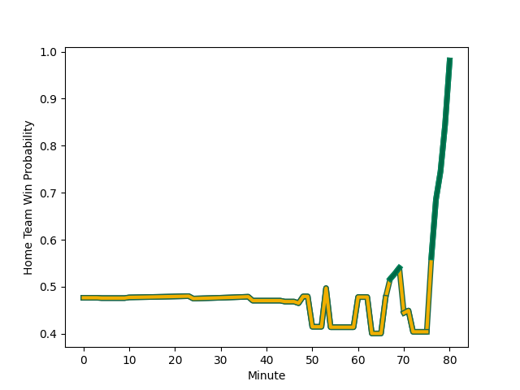

---  
layout: page  
title: Australia at Ireland; 10.0-13.0  
date: 2022-11-19 15:00:00 18:00:00 -0500  
categories: match review  
---
# Australia (1705.05) at Ireland (1664.29); 10.0-13.0

# Prediction: Australia by 1.1

Australia by 4.1 on a neutral field
## Scores over Time

## Win Probability over Time

# Pre-Match Prediction: Australia by 2.6

Australia by 5.6 on a neutral pitch

|   Away Minutes | Away Player                                                           |   Away elo |   Away Percentile |   Number |   Home Percentile |   Home elo | Home Player                                                           |   Home Minutes |
|---------------:|:----------------------------------------------------------------------|-----------:|------------------:|---------:|------------------:|-----------:|:----------------------------------------------------------------------|---------------:|
|             77 | [James Slipper](..//playerfiles//JamesSlipper_cleaned.md)             |     135.04 |                99 |        1 |                77 |     103.66 | [Andrew Porter](..//playerfiles//AndrewPorter_cleaned.md)             |             72 |
|             24 | [Dave Porecki](..//playerfiles//DavePorecki_cleaned.md)               |     117.17 |                94 |        2 |                62 |      97.98 | [Dan Sheehan](..//playerfiles//DanSheehan_cleaned.md)                 |             72 |
|             80 | [Allan Alaalatoa](..//playerfiles//AllanAlaalatoa_cleaned.md)         |     114.54 |                94 |        3 |                93 |     113.32 | [Tadhg Furlong](..//playerfiles//TadhgFurlong_cleaned.md)             |             63 |
|             80 | [Nick Frost](..//playerfiles//NickFrost_cleaned.md)                   |      87.02 |                19 |        4 |                92 |     114.94 | [Tadhg Beirne](..//playerfiles//TadhgBeirne_cleaned.md)               |             60 |
|             53 | [Cadeyrn Neville](..//playerfiles//CadeyrnNeville_cleaned.md)         |     114.53 |                91 |        5 |                93 |     116.68 | [James Ryan](..//playerfiles//JamesRyan_cleaned.md)                   |             80 |
|             80 | [Jed Holloway](..//playerfiles//JedHolloway_cleaned.md)               |      89.36 |                23 |        6 |                11 |      84.62 | [Peter O'Mahony](..//playerfiles//PeterO'Mahony_cleaned.md)           |             50 |
|             80 | [Michael Hooper](..//playerfiles//MichaelHooper_cleaned.md)           |     144.29 |                99 |        7 |                97 |     125.46 | [Josh van der Flier](..//playerfiles//JoshvanderFlier_cleaned.md)     |             80 |
|             75 | [Rob Valetini](..//playerfiles//RobValetini_cleaned.md)               |     117.12 |                91 |        8 |                95 |     120.18 | [Caelan Doris](..//playerfiles//CaelanDoris_cleaned.md)               |             80 |
|             74 | [Nic White](..//playerfiles//NicWhite_cleaned.md)                     |     135.34 |                99 |        9 |                93 |     115.36 | [Jamison Gibson-Park](..//playerfiles//JamisonGibson-Park_cleaned.md) |             63 |
|             80 | [Bernard Foley](..//playerfiles//BernardFoley_cleaned.md)             |     141.22 |                99 |       10 |                61 |      97.72 | [Jack Crowley](..//playerfiles//JackCrowley_cleaned.md)               |             72 |
|             80 | [Tom Wright](..//playerfiles//TomWright_cleaned.md)                   |      92.24 |                35 |       11 |                90 |     113.16 | [Jimmy O'Brien](..//playerfiles//JimmyO'Brien_cleaned.md)             |             80 |
|              4 | [Hunter Paisami](..//playerfiles//HunterPaisami_cleaned.md)           |     107.26 |                81 |       12 |                98 |     130.83 | [Stuart McCloskey](..//playerfiles//StuartMcCloskey_cleaned.md)       |             54 |
|             80 | [Len Ikitau](..//playerfiles//LenIkitau_cleaned.md)                   |     118.48 |                93 |       13 |                82 |     104.14 | [Garry Ringrose](..//playerfiles//GarryRingrose_cleaned.md)           |             80 |
|             80 | [Mark Nawaqanitawase](..//playerfiles//MarkNawaqanitawase_cleaned.md) |      97.62 |                58 |       14 |                61 |      98.22 | [Mack Hansen](..//playerfiles//MackHansen_cleaned.md)                 |             80 |
|             60 | [Andrew Kellaway](..//playerfiles//AndrewKellaway_cleaned.md)         |     114.7  |                92 |       15 |                95 |     122.51 | [Hugo Keenan](..//playerfiles//HugoKeenan_cleaned.md)                 |             80 |
|             23 | [Folau Fainga'a](..//playerfiles//FolauFainga'a_cleaned.md)           |     132.72 |                99 |       16 |                78 |     103.67 | [Rob Herring](..//playerfiles//RobHerring_cleaned.md)                 |              8 |
|              3 | [Tom Robertson](..//playerfiles//TomRobertson_cleaned.md)             |     106.73 |                81 |       17 |                95 |     115.01 | [Cian Healy](..//playerfiles//CianHealy_cleaned.md)                   |              8 |
|              3 | [Taniela Tupou](..//playerfiles//TanielaTupou_cleaned.md)             |     114.97 |                94 |       18 |                77 |     102.82 | [Finlay Bealham](..//playerfiles//FinlayBealham_cleaned.md)           |             17 |
|             27 | [Will Skelton](..//playerfiles//WillSkelton_cleaned.md)               |     108.91 |                86 |       19 |                71 |     101.14 | [Joe McCarthy](..//playerfiles//JoeMcCarthy_cleaned.md)               |             20 |
|             31 | [Pete Samu](..//playerfiles//PeteSamu_cleaned.md)                     |     101.89 |                67 |       20 |                94 |     122.88 | [Jack Conan](..//playerfiles//JackConan_cleaned.md)                   |             30 |
|             26 | [Jake Gordon](..//playerfiles//JakeGordon_cleaned.md)                 |      94.03 |                43 |       21 |                66 |      98.29 | [Craig Casey](..//playerfiles//CraigCasey_cleaned.md)                 |             17 |
|              0 | [Noah Lolesio](..//playerfiles//NoahLolesio_cleaned.md)               |      93.91 |                40 |       22 |                72 |     103.19 | [Ross Byrne](..//playerfiles//RossByrne_cleaned.md)                   |              8 |
|             73 | [Jordan Petaia](..//playerfiles//JordanPetaia_cleaned.md)             |     109.18 |                89 |       23 |                96 |     125.32 | [Bundee Aki](..//playerfiles//BundeeAki_cleaned.md)                   |             26 |

