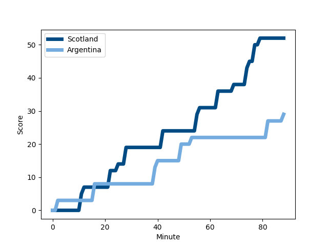
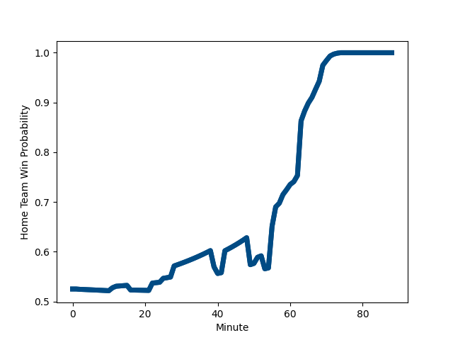

---  
layout: page  
title: Argentina at Scotland; 29.0-52.0  
date: 2022-11-19 10:15:00 18:00:00 -0500  
categories: match review  
---
# Argentina (1576.75) at Scotland (1620.3); 29.0-52.0

# Prediction: Scotland by 7.4

Scotland by 4.4 on a neutral field
## Scores over Time

## Win Probability over Time

# Pre-Match Prediction: Scotland by 5.8

Scotland by 2.8 on a neutral pitch

|   Away Minutes | Away Player                                                              |   Away elo |   Away Percentile |   Number |   Home Percentile |   Home elo | Home Player                                                         |   Home Minutes |
|---------------:|:-------------------------------------------------------------------------|-----------:|------------------:|---------:|------------------:|-----------:|:--------------------------------------------------------------------|---------------:|
|             73 | [Thomas Gallo](..//playerfiles//ThomasGallo_cleaned.md)                  |     105.87 |                83 |        1 |                27 |      91.24 | [Pierre Schoeman](..//playerfiles//PierreSchoeman_cleaned.md)       |             66 |
|             64 | [Julian Montoya](..//playerfiles//JulianMontoya_cleaned.md)              |     104.53 |                80 |        2 |                95 |     117.58 | [Fraser Brown](..//playerfiles//FraserBrown_cleaned.md)             |             58 |
|             57 | [Eduardo Bello](..//playerfiles//EduardoBello_cleaned.md)                |      96.17 |                50 |        3 |                96 |     118.93 | [Zander Fagerson](..//playerfiles//ZanderFagerson_cleaned.md)       |             66 |
|             88 | [Matias Alemanno](..//playerfiles//MatiasAlemanno_cleaned.md)            |     118.72 |                94 |        4 |                77 |     104.6  | [Jonny Gray](..//playerfiles//JonnyGray_cleaned.md)                 |             88 |
|             61 | [Tomas Lavanini](..//playerfiles//TomasLavanini_cleaned.md)              |     112.28 |                89 |        5 |                88 |     110.12 | [Grant Gilchrist](..//playerfiles//GrantGilchrist_cleaned.md)       |             75 |
|             88 | [Juan Martin Gonzalez](..//playerfiles//JuanMartinGonzalez_cleaned.md)   |     115.21 |                92 |        6 |                91 |     117.89 | [Matt Fagerson](..//playerfiles//MattFagerson_cleaned.md)           |             88 |
|             88 | [Marcos Kremer](..//playerfiles//MarcosKremer_cleaned.md)                |      90.73 |                28 |        7 |                98 |     130.77 | [Jamie Ritchie](..//playerfiles//JamieRitchie_cleaned.md)           |             88 |
|             88 | [Pablo Matera](..//playerfiles//PabloMatera_cleaned.md)                  |     118.16 |                91 |        8 |                13 |      86.68 | [Jack Dempsey](..//playerfiles//JackDempsey_cleaned.md)             |             58 |
|             77 | [Gonzalo Bertranou](..//playerfiles//GonzaloBertranou_cleaned.md)        |      99.66 |                67 |        9 |                82 |     106.99 | [Ali Price](..//playerfiles//AliPrice_cleaned.md)                   |             53 |
|             61 | [Santiago Carreras](..//playerfiles//SantiagoCarreras_cleaned.md)        |     126.57 |                96 |       10 |                94 |     122.94 | [Finn Russell](..//playerfiles//FinnRussell_cleaned.md)             |             88 |
|             88 | [Emiliano Boffelli](..//playerfiles//EmilianoBoffelli_cleaned.md)        |      89.69 |                23 |       11 |                45 |      94.47 | [Duhan van der Merwe](..//playerfiles//DuhanvanderMerwe_cleaned.md) |             71 |
|             51 | [Jeronimo de la Fuente](..//playerfiles//JeronimodelaFuente_cleaned.md)  |     115.25 |                91 |       12 |                 7 |      79.49 | [Sione Tuipulotu](..//playerfiles//SioneTuipulotu_cleaned.md)       |             88 |
|             88 | [Matias Orlando](..//playerfiles//MatiasOrlando_cleaned.md)              |      76.47 |                 4 |       13 |                85 |     108.82 | [Chris Harris](..//playerfiles//ChrisHarris_cleaned.md)             |             61 |
|             63 | [Bautista Delguy](..//playerfiles//BautistaDelguy_cleaned.md)            |     112.84 |                89 |       14 |                93 |     116.39 | [Darcy Graham](..//playerfiles//DarcyGraham_cleaned.md)             |             88 |
|             88 | [Juan Cruz Mallia](..//playerfiles//JuanCruzMallia_cleaned.md)           |     100.65 |                65 |       15 |                79 |     107.04 | [Stuart Hogg](..//playerfiles//StuartHogg_cleaned.md)               |             88 |
|             24 | [Ignacio Ruiz](..//playerfiles//IgnacioRuiz_cleaned.md)                  |      93.8  |               nan |       16 |                96 |     119.31 | [George Turner](..//playerfiles//GeorgeTurner_cleaned.md)           |             30 |
|             25 | [Nahuel Tetaz Chaparro](..//playerfiles//NahuelTetazChaparro_cleaned.md) |     106.19 |                86 |       17 |                84 |     105.73 | [Jamie Bhatti](..//playerfiles//JamieBhatti_cleaned.md)             |             22 |
|             31 | [Santiago Medrano](..//playerfiles//SantiagoMedrano_cleaned.md)          |      97.78 |                58 |       18 |               nan |      90.49 | [Murphy Walker](..//playerfiles//MurphyWalker_cleaned.md)           |             22 |
|             37 | [Lucas Paulos](..//playerfiles//LucasPaulos_cleaned.md)                  |     103.15 |                77 |       19 |                69 |      98    | [Glen Young](..//playerfiles//GlenYoung_cleaned.md)                 |             13 |
|             15 | [Facundo Isa](..//playerfiles//FacundoIsa_cleaned.md)                    |     118.97 |                95 |       20 |                54 |      96.67 | [Andy Christie](..//playerfiles//AndyChristie_cleaned.md)           |             30 |
|             11 | [Lautaro Bazan Velez](..//playerfiles//LautaroBazanVelez_cleaned.md)     |      92.36 |                41 |       21 |                82 |     107.95 | [Ben White](..//playerfiles//BenWhite_cleaned.md)                   |             35 |
|             27 | [Nicolas Sanchez](..//playerfiles//NicolasSanchez_cleaned.md)            |     127.58 |                96 |       22 |                98 |     135.97 | [Blair Kinghorn](..//playerfiles//BlairKinghorn_cleaned.md)         |             17 |
|             27 | [Matias Moroni](..//playerfiles//MatiasMoroni_cleaned.md)                |     117.66 |                93 |       23 |                79 |     106.34 | [Cameron Redpath](..//playerfiles//CameronRedpath_cleaned.md)       |             27 |

