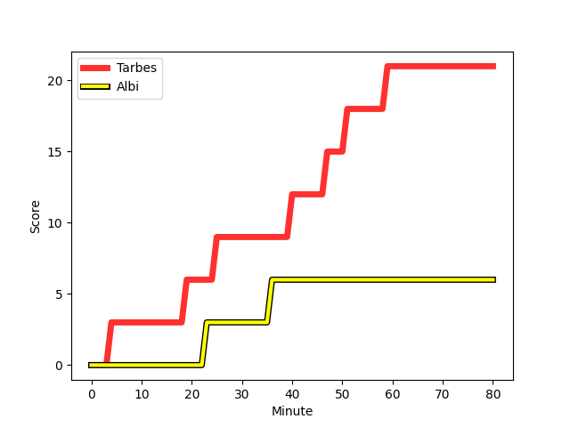
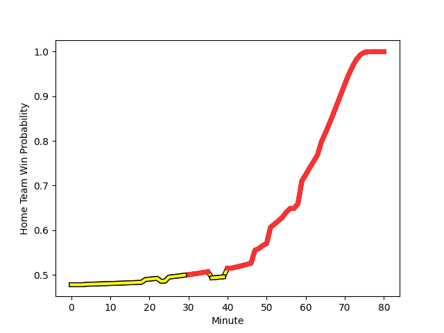

---  
layout: page  
title: Albi at Tarbes; 6-21  
date: 2022-11-19 19:00:00 18:00:00 -0500  
categories: match review  
---
# Albi (1449.88) at Tarbes (1411.19); 6-21

# Prediction: Albi by 0.9

Albi by 3.9 on a neutral field
## Scores over Time

## Win Probability over Time

# Pre-Match Prediction: Albi by 1.6

Albi by 4.6 on a neutral pitch

|   Away Minutes | Away Player                                                                        |   Away elo |   Away Percentile |   Number |   Home Percentile |   Home elo | Home Player                                                                      |   Home Minutes |
|---------------:|:-----------------------------------------------------------------------------------|-----------:|------------------:|---------:|------------------:|-----------:|:---------------------------------------------------------------------------------|---------------:|
|             57 | [Pierre Commenge](..//playerfiles//PierreCommenge_cleaned.md)                      |     102.94 |                76 |        1 |                 9 |      83.44 | [Johan Mees Erasmus](..//playerfiles//JohanMeesErasmus_cleaned.md)               |             63 |
|             62 | [Arthur Castant](..//playerfiles//ArthurCastant_cleaned.md)                        |      90.22 |                22 |        2 |                52 |      96.16 | [Enzo Mondon](..//playerfiles//EnzoMondon_cleaned.md)                            |             59 |
|             57 | [Kevin Brou](..//playerfiles//KevinBrou_cleaned.md)                                |      94.42 |               nan |        3 |                25 |      90.38 | [Mariano Ezequiel Filomeno](..//playerfiles//MarianoEzequielFilomeno_cleaned.md) |             59 |
|             55 | [Pilbarnon Djossou Lokossou](..//playerfiles//PilbarnonDjossouLokossou_cleaned.md) |      97.01 |                57 |        4 |                62 |      98.49 | [Antoine Bousquet](..//playerfiles//AntoineBousquet_cleaned.md)                  |             74 |
|             80 | [Jacques Engelbrecht](..//playerfiles//JacquesEngelbrecht_cleaned.md)              |      89.66 |                26 |        5 |                24 |      88.86 | [Jone Trevor Seuvou](..//playerfiles//JoneTrevorSeuvou_cleaned.md)               |             80 |
|             80 | [Hugo Boutin](..//playerfiles//HugoBoutin_cleaned.md)                              |      80.63 |                 6 |        6 |                69 |     101.23 | [Léo Saint-Guilhem](..//playerfiles//LéoSaint-Guilhem_cleaned.md)                |             76 |
|             64 | [Pierre Roussel](..//playerfiles//PierreRoussel_cleaned.md)                        |     114.78 |                92 |        7 |                92 |     113.65 | [Aurelien Ricart](..//playerfiles//AurelienRicart_cleaned.md)                    |             80 |
|             57 | [Guillem Calmon](..//playerfiles//GuillemCalmon_cleaned.md)                        |      94.66 |               nan |        8 |                26 |      89.71 | [Gigi Leshkasheli](..//playerfiles//GigiLeshkasheli_cleaned.md)                  |             63 |
|             49 | [Théo Vidal](..//playerfiles//ThéoVidal_cleaned.md)                                |      90.63 |                27 |        9 |                94 |     117.97 | [Thomas Lhusero](..//playerfiles//ThomasLhusero_cleaned.md)                      |             80 |
|             80 | [Benjamin Pehau](..//playerfiles//BenjaminPehau_cleaned.md)                        |      94.59 |                43 |       10 |                 5 |      79.03 | [Anthony Fuertes](..//playerfiles//AnthonyFuertes_cleaned.md)                    |             76 |
|             80 | [Enzo Marzocca](..//playerfiles//EnzoMarzocca_cleaned.md)                          |     113.75 |                91 |       11 |                81 |     105.87 | [Jonathan Duffau](..//playerfiles//JonathanDuffau_cleaned.md)                    |             80 |
|             80 | [Simon Andreu](..//playerfiles//SimonAndreu_cleaned.md)                            |      91.96 |                35 |       12 |                63 |      99.71 | [Josaia Vakacegu](..//playerfiles//JosaiaVakacegu_cleaned.md)                    |             80 |
|             80 | [Wandile Mjekevu](..//playerfiles//WandileMjekevu_cleaned.md)                      |     110.86 |                86 |       13 |                24 |      87.67 | [Julien Cantan](..//playerfiles//JulienCantan_cleaned.md)                        |             74 |
|             80 | [Gautier Lacointa](..//playerfiles//GautierLacointa_cleaned.md)                    |      90.78 |                27 |       14 |                 1 |      71.44 | [Maxime Oltmann](..//playerfiles//MaximeOltmann_cleaned.md)                      |             80 |
|             41 | [Paul Clergue](..//playerfiles//PaulClergue_cleaned.md)                            |      93.03 |                40 |       15 |                30 |      91.4  | [William Pees](..//playerfiles//WilliamPees_cleaned.md)                          |             80 |
|             23 | [Antoine Soave](..//playerfiles//AntoineSoave_cleaned.md)                          |     102.56 |                73 |       16 |                31 |      92.07 | [Alexandre Combier](..//playerfiles//AlexandreCombier_cleaned.md)                |             17 |
|             18 | [Thibaud Sebire](..//playerfiles//ThibaudSebire_cleaned.md)                        |      95    |               nan |       17 |                19 |      88.19 | [Florian Lamothe](..//playerfiles//FlorianLamothe_cleaned.md)                    |             21 |
|             23 | [Charles Foures](..//playerfiles//CharlesFoures_cleaned.md)                        |     104.65 |                81 |       18 |                20 |      88.98 | [Alexandre Duny](..//playerfiles//AlexandreDuny_cleaned.md)                      |             21 |
|             25 | [Dimitri Tchapnga](..//playerfiles//DimitriTchapnga_cleaned.md)                    |      92.21 |                32 |       19 |               nan |      98.08 | [Beau Farrance](..//playerfiles//BeauFarrance_cleaned.md)                        |              6 |
|             23 | [Sandrick Maciotta](..//playerfiles//SandrickMaciotta_cleaned.md)                  |     101    |                60 |       20 |               nan |      95    | [Léo Estaque](..//playerfiles//LéoEstaque_cleaned.md)                            |              4 |
|             16 | [Gael Ekpe](..//playerfiles//GaelEkpe_cleaned.md)                                  |      92.46 |                36 |       21 |                 3 |      75.55 | [Paul Sajous](..//playerfiles//PaulSajous_cleaned.md)                            |             17 |
|             31 | [Titouan Pouzoullic](..//playerfiles//TitouanPouzoullic_cleaned.md)                |      86.96 |                14 |       22 |                 2 |      74.84 | [Thomas Millet](..//playerfiles//ThomasMillet_cleaned.md)                        |              4 |
|             39 | [Téo Dospital](..//playerfiles//TéoDospital_cleaned.md)                            |      96.33 |                54 |       23 |                40 |      92.78 | [Thibaut Trotta](..//playerfiles//ThibautTrotta_cleaned.md)                      |              6 |

