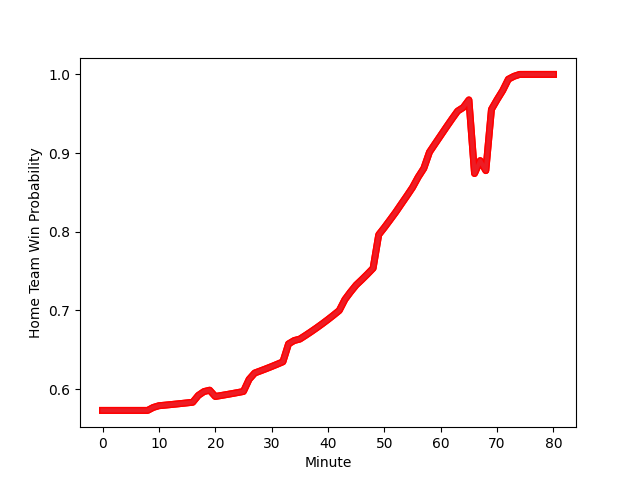

---  
layout: page  
title: Uruguay at Tonga; 19.0-43.0  
date: 2022-11-19 05:45:00 18:00:00 -0500  
categories: match review  
---
# Uruguay (1398.82) at Tonga (1526.19); 19.0-43.0

# Prediction: Tonga by 15.7

Tonga by 12.7 on a neutral field
## Scores over Time

## Win Probability over Time

# Pre-Match Prediction: Tonga by 14.4

Tonga by 11.4 on a neutral pitch

|   Away Minutes | Away Player                                                        |   Away elo |   Away Percentile |   Number |   Home Percentile |   Home elo | Home Player                                                           |   Home Minutes |
|---------------:|:-------------------------------------------------------------------|-----------:|------------------:|---------:|------------------:|-----------:|:----------------------------------------------------------------------|---------------:|
|             70 | [Mateo Sanguinetti](..//playerfiles//MateoSanguinetti_cleaned.md)  |      87.9  |                18 |        1 |                 1 |      71.95 | [David Lolohea](..//playerfiles//DavidLolohea_cleaned.md)             |             58 |
|             44 | [Guillermo Pujadas](..//playerfiles//GuillermoPujadas_cleaned.md)  |      94.01 |                46 |        2 |                 3 |      78.3  | [Samiuela Moli](..//playerfiles//SamiuelaMoli_cleaned.md)             |             66 |
|             80 | [Ignacio Peculo](..//playerfiles//IgnacioPeculo_cleaned.md)        |      99.14 |                64 |        3 |                99 |     128.52 | [Ben Tameifuna](..//playerfiles//BenTameifuna_cleaned.md)             |             66 |
|             60 | [Ignacio Dotti](..//playerfiles//IgnacioDotti_cleaned.md)          |      94.2  |                44 |        4 |                90 |     112.94 | [Leva Fifita](..//playerfiles//LevaFifita_cleaned.md)                 |             64 |
|             53 | [Eric Dosantos](..//playerfiles//EricDosantos_cleaned.md)          |      92.7  |                38 |        5 |                63 |     100.39 | [Tanginoa Halaifonua](..//playerfiles//TanginoaHalaifonua_cleaned.md) |             80 |
|             56 | [Lucas Bianchi](..//playerfiles//LucasBianchi_cleaned.md)          |     105.42 |                82 |        6 |                93 |     115.23 | [Vaea Fifita](..//playerfiles//VaeaFifita_cleaned.md)                 |             80 |
|             64 | [Santiago Civetta](..//playerfiles//SantiagoCivetta_cleaned.md)    |      90.38 |                27 |        7 |                47 |      94.88 | [Solomone Funaki](..//playerfiles//SolomoneFunaki_cleaned.md)         |             43 |
|             80 | [Manuel Ardao](..//playerfiles//ManuelArdao_cleaned.md)            |      89.27 |                23 |        8 |                65 |     100.52 | [Zane Kapeli](..//playerfiles//ZaneKapeli_cleaned.md)                 |             70 |
|             72 | [Tomas Inciarte](..//playerfiles//TomasInciarte_cleaned.md)        |      86.88 |                15 |        9 |                74 |     103    | [Augustine Pulu](..//playerfiles//AugustinePulu_cleaned.md)           |             73 |
|             80 | [Felipe Etcheverry](..//playerfiles//FelipeEtcheverry_cleaned.md)  |      95.4  |                50 |       10 |                67 |     100.85 | [William Havili](..//playerfiles//WilliamHavili_cleaned.md)           |             80 |
|             80 | [Juan Manuel Alonso](..//playerfiles//JuanManuelAlonso_cleaned.md) |      90.68 |                27 |       11 |                73 |     101.6  | [Solomone Kata](..//playerfiles//SolomoneKata_cleaned.md)             |             51 |
|             80 | [Andres Vilaseca](..//playerfiles//AndresVilaseca_cleaned.md)      |      89.88 |                26 |       12 |                87 |     110.94 | [George Moala](..//playerfiles//GeorgeMoala_cleaned.md)               |             80 |
|             80 | [Felipe Arcos Perez](..//playerfiles//FelipeArcosPerez_cleaned.md) |      94.1  |                44 |       13 |                85 |     109.3  | [Malakai Fekitoa](..//playerfiles//MalakaiFekitoa_cleaned.md)         |             80 |
|             80 | [Baltazar Amaya](..//playerfiles//BaltazarAmaya_cleaned.md)        |     101.52 |                72 |       14 |                 7 |      82.72 | [Anzelo Tuitavuki](..//playerfiles//AnzeloTuitavuki_cleaned.md)       |             80 |
|             72 | [Rodrigo Silva](..//playerfiles//RodrigoSilva_cleaned.md)          |      89.59 |                23 |       15 |                86 |     109.37 | [Afusipa Taumoepeau](..//playerfiles//AfusipaTaumoepeau_cleaned.md)   |             64 |
|             36 | [German Kessler](..//playerfiles//GermanKessler_cleaned.md)        |      87.55 |                17 |       16 |               nan |      95    | [Sosefo Sakalia](..//playerfiles//SosefoSakalia_cleaned.md)           |             14 |
|             10 | [Juan Echeverria](..//playerfiles//JuanEcheverria_cleaned.md)      |      94.37 |               nan |       17 |                83 |     105.74 | [Tau Koloamatangi](..//playerfiles//TauKoloamatangi_cleaned.md)       |             22 |
|              8 | [Reinaldo Piussi](..//playerfiles//ReinaldoPiussi_cleaned.md)      |      95    |               nan |       18 |                50 |      95.96 | [Joe Apikotoa](..//playerfiles//JoeApikotoa_cleaned.md)               |             24 |
|             27 | [Diego Magno](..//playerfiles//DiegoMagno_cleaned.md)              |      91.6  |                35 |       19 |                51 |      97.69 | [Steve Mafi](..//playerfiles//SteveMafi_cleaned.md)                   |             16 |
|             20 | [Felipe Aliaga](..//playerfiles//FelipeAliaga_cleaned.md)          |      94.62 |               nan |       20 |                84 |     109.79 | [Sione Havili](..//playerfiles//SioneHavili_cleaned.md)               |             37 |
|             24 | [Manuel Diana](..//playerfiles//ManuelDiana_cleaned.md)            |      98.79 |                57 |       21 |                46 |      94.42 | [Manu Paea](..//playerfiles//ManuPaea_cleaned.md)                     |              7 |
|             16 | [Santiago Alvarez](..//playerfiles//SantiagoAlvarez_cleaned.md)    |      94.41 |               nan |       22 |               nan |      91.65 | [Otumaka Mausia](..//playerfiles//OtumakaMausia_cleaned.md)           |             16 |
|              8 | [Juan Zuccarino](..//playerfiles//JuanZuccarino_cleaned.md)        |      94.52 |               nan |       23 |                72 |     102.1  | [Fetuli Paea](..//playerfiles//FetuliPaea_cleaned.md)                 |             29 |

