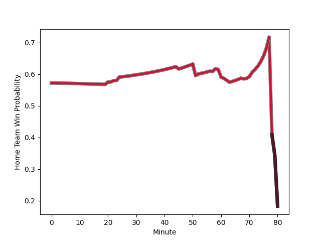

---  
layout: page  
title: Georgia at Wales; 13.0-12.0  
date: 2022-11-19 08:00:00 18:00:00 -0500  
categories: match review  
---
# Georgia (1455.33) at Wales (1581.61); 13.0-12.0

# Prediction: Wales by 15.6

Wales by 12.6 on a neutral field
## Scores over Time

## Win Probability over Time

# Pre-Match Prediction: Wales by 14.4

Wales by 11.4 on a neutral pitch

|   Away Minutes | Away Player                                                                   |   Away elo |   Away Percentile |   Number |   Home Percentile |   Home elo | Home Player                                                       |   Home Minutes |
|---------------:|:------------------------------------------------------------------------------|-----------:|------------------:|---------:|------------------:|-----------:|:------------------------------------------------------------------|---------------:|
|             58 | [Guram Gogichashvili](..//playerfiles//GuramGogichashvili_cleaned.md)         |     100.08 |                67 |        1 |                12 |      86.18 | [Gareth Thomas](..//playerfiles//GarethThomas_cleaned.md)         |             61 |
|             57 | [Giorgi Chkoidze](..//playerfiles//GiorgiChkoidze_cleaned.md)                 |      93.82 |                46 |        2 |                72 |     101.37 | [Ken Owens](..//playerfiles//KenOwens_cleaned.md)                 |             69 |
|             68 | [Guram Papidze](..//playerfiles//GuramPapidze_cleaned.md)                     |      82.18 |                 6 |        3 |                93 |     113.86 | [Dillon Lewis](..//playerfiles//DillonLewis_cleaned.md)           |             45 |
|             80 | [Nodar Cheishvili](..//playerfiles//NodarCheishvili_cleaned.md)               |     123.83 |                97 |        4 |                50 |      95.86 | [Ben Carter](..//playerfiles//BenCarter_cleaned.md)               |             58 |
|             63 | [Kote Mikautadze](..//playerfiles//KoteMikautadze_cleaned.md)                 |      80.33 |                 9 |        5 |                68 |     100.13 | [Adam Beard](..//playerfiles//AdamBeard_cleaned.md)               |             80 |
|             80 | [Beka Gorgadze](..//playerfiles//BekaGorgadze_cleaned.md)                     |      99.01 |                59 |        6 |                71 |     104.14 | [Jac Morgan](..//playerfiles//JacMorgan_cleaned.md)               |             80 |
|             80 | [Beka Saginadze](..//playerfiles//BekaSaginadze_cleaned.md)                   |      94.42 |                45 |        7 |                97 |     122.57 | [Justin Tipuric](..//playerfiles//JustinTipuric_cleaned.md)       |             80 |
|             71 | [Tornike Jalagonia](..//playerfiles//TornikeJalagonia_cleaned.md)             |     103.03 |                73 |        8 |                30 |      91.34 | [Josh MacLeod](..//playerfiles//JoshMacLeod_cleaned.md)           |             52 |
|             80 | [Vasil Lobzhanidze](..//playerfiles//VasilLobzhanidze_cleaned.md)             |      92.41 |                35 |        9 |                92 |     114.93 | [Tomos Williams](..//playerfiles//TomosWilliams_cleaned.md)       |             80 |
|             74 | [Tedo Abzhandadze](..//playerfiles//TedoAbzhandadze_cleaned.md)               |      95.82 |                47 |       10 |                31 |      92.99 | [Rhys Priestland](..//playerfiles//RhysPriestland_cleaned.md)     |             61 |
|             80 | [Alexander Todua](..//playerfiles//AlexanderTodua_cleaned.md)                 |      94.02 |                43 |       11 |                82 |     106.71 | [Josh Adams](..//playerfiles//JoshAdams_cleaned.md)               |             62 |
|             80 | [Merab Sharikadze](..//playerfiles//MerabSharikadze_cleaned.md)               |     102.74 |                73 |       12 |                87 |     110.54 | [Owen Watkin](..//playerfiles//OwenWatkin_cleaned.md)             |             80 |
|             80 | [Demur Tapladze](..//playerfiles//DemurTapladze_cleaned.md)                   |      97.01 |                55 |       13 |                99 |     132.53 | [George North](..//playerfiles//GeorgeNorth_cleaned.md)           |             80 |
|             59 | [Mirian Modebadze](..//playerfiles//MirianModebadze_cleaned.md)               |      95    |               nan |       14 |                95 |     120.5  | [Alex Cuthbert](..//playerfiles//AlexCuthbert_cleaned.md)         |             80 |
|             80 | [Davit Niniashvili](..//playerfiles//DavitNiniashvili_cleaned.md)             |      94.62 |                48 |       15 |                65 |     100.6  | [Louis Rees-Zammit](..//playerfiles//LouisRees-Zammit_cleaned.md) |             80 |
|             23 | [Shalva Mamukashvili](..//playerfiles//ShalvaMamukashvili_cleaned.md)         |     101.5  |                75 |       16 |                43 |      93.33 | [Bradley Roberts](..//playerfiles//BradleyRoberts_cleaned.md)     |             11 |
|             22 | [Nika Abuladze](..//playerfiles//NikaAbuladze_cleaned.md)                     |      93.38 |                40 |       17 |                32 |      93    | [Rhodri Jones](..//playerfiles//RhodriJones_cleaned.md)           |             19 |
|             12 | [Alexandre Kuntelia](..//playerfiles//AlexandreKuntelia_cleaned.md)           |      95    |               nan |       18 |               nan |      93.31 | [Sam Wainwright](..//playerfiles//SamWainwright_cleaned.md)       |             35 |
|             17 | [Vladimeri Chachanidze](..//playerfiles//VladimeriChachanidze_cleaned.md)     |      97.14 |                58 |       19 |                71 |     101.14 | [Dafydd Jenkins](..//playerfiles//DafyddJenkins_cleaned.md)       |             22 |
|              9 | [Sandro Mamamtavrishvili](..//playerfiles//SandroMamamtavrishvili_cleaned.md) |      89.66 |                24 |       20 |                59 |      99.21 | [Taulupe Faletau](..//playerfiles//TaulupeFaletau_cleaned.md)     |             28 |
|              6 | [Luka Matkava](..//playerfiles//LukaMatkava_cleaned.md)                       |      95.11 |               nan |       21 |                 5 |      78    | [Dane Blacker](..//playerfiles//DaneBlacker_cleaned.md)           |              0 |
|             21 | [Lasha Khmaladze](..//playerfiles//LashaKhmaladze_cleaned.md)                 |     105.37 |                76 |       22 |                 3 |      74.05 | [Sam Costelow](..//playerfiles//SamCostelow_cleaned.md)           |             19 |
|              0 | [Lasha Lomidze](..//playerfiles//LashaLomidze_cleaned.md)                     |     101.29 |               nan |       23 |                28 |      89.47 | [Leigh Halfpenny](..//playerfiles//LeighHalfpenny_cleaned.md)     |             18 |

