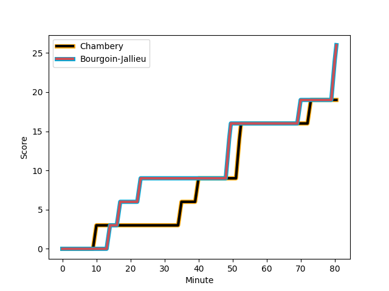
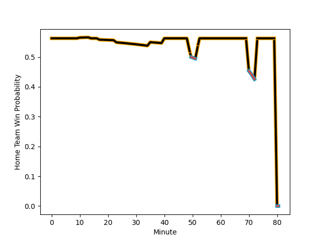

---  
layout: page  
title: Bourgoin-Jallieu at Chambery; 26-19  
date: 2022-11-20 15:00:00 18:00:00 -0500  
categories: match review  
---
# Bourgoin-Jallieu (1338.19) at Chambery (1447.76); 26-19

# Prediction: Chambery by 14.0

Chambery by 11.0 on a neutral field
## Scores over Time

## Win Probability over Time

# Pre-Match Prediction: Chambery by 12.6

Chambery by 9.6 on a neutral pitch

|   Away Minutes | Away Player                                                               |   Away elo |   Away Percentile |   Number |   Home Percentile |   Home elo | Home Player                                                                 |   Home Minutes |
|---------------:|:--------------------------------------------------------------------------|-----------:|------------------:|---------:|------------------:|-----------:|:----------------------------------------------------------------------------|---------------:|
|             80 | [Nugzar Somkhishvili](..//playerfiles//NugzarSomkhishvili_cleaned.md)     |      87.25 |                15 |        1 |                67 |      99.81 | [Fabio Gonzalez](..//playerfiles//FabioGonzalez_cleaned.md)                 |             80 |
|             80 | [Maxime Castant](..//playerfiles//MaximeCastant_cleaned.md)               |      87.78 |                20 |        2 |                18 |      88.71 | [Gauthier Brute de Remur](..//playerfiles//GauthierBrutedeRemur_cleaned.md) |             80 |
|             80 | [Rossouw De Klerk](..//playerfiles//RossouwDeKlerk_cleaned.md)            |      89.43 |                19 |        3 |                67 |     100.08 | [Giorgi Pertaia](..//playerfiles//GiorgiPertaia_cleaned.md)                 |             80 |
|             80 | [Kemueli Lavetanakoroi](..//playerfiles//KemueliLavetanakoroi_cleaned.md) |      97.99 |                64 |        4 |                49 |      95.07 | [Fabien Witz](..//playerfiles//FabienWitz_cleaned.md)                       |             80 |
|             80 | [Jonathan Kpoku](..//playerfiles//JonathanKpoku_cleaned.md)               |      90.93 |                34 |        5 |                82 |     106.26 | [Corentin Astier](..//playerfiles//CorentinAstier_cleaned.md)               |             80 |
|             80 | [Theophile Cotte](..//playerfiles//TheophileCotte_cleaned.md)             |      78.04 |                 4 |        6 |                93 |     116.96 | [Pierre-Nicolas Dance](..//playerfiles//Pierre-NicolasDance_cleaned.md)     |             80 |
|             80 | [Bynjamin Rabatel](..//playerfiles//BynjaminRabatel_cleaned.md)           |      89.07 |                23 |        7 |                37 |      92.38 | [Colin Lebian](..//playerfiles//ColinLebian_cleaned.md)                     |             80 |
|             80 | [Poutasi Luafutu](..//playerfiles//PoutasiLuafutu_cleaned.md)             |      95.12 |                46 |        8 |                84 |     109.05 | [Jean-Baptiste Grenod](..//playerfiles//Jean-BaptisteGrenod_cleaned.md)     |             80 |
|             80 | [Tomas Munilla lo Duca](..//playerfiles//TomasMunillaloDuca_cleaned.md)   |      98.7  |                63 |        9 |                28 |      90.92 | [Thibault Dufau](..//playerfiles//ThibaultDufau_cleaned.md)                 |             80 |
|             80 | [Nicolas Vuillemin](..//playerfiles//NicolasVuillemin_cleaned.md)         |      82.63 |                10 |       10 |                47 |      95.09 | [Mattéo Faucher](..//playerfiles//MattéoFaucher_cleaned.md)                 |             80 |
|             80 | [Quentin Lefort](..//playerfiles//QuentinLefort_cleaned.md)               |      92.23 |                34 |       11 |                85 |     109.28 | [Mosese Mawalu](..//playerfiles//MoseseMawalu_cleaned.md)                   |             80 |
|             80 | [Romain Sola](..//playerfiles//RomainSola_cleaned.md)                     |      85.96 |                15 |       12 |                 2 |      70.87 | [Vereniki Goneva](..//playerfiles//VerenikiGoneva_cleaned.md)               |             80 |
|             80 | [Pablo Patilla](..//playerfiles//PabloPatilla_cleaned.md)                 |      85.44 |                16 |       13 |                 6 |      80.34 | [Victor Pisano](..//playerfiles//VictorPisano_cleaned.md)                   |             80 |
|             80 | [Remi Bouet](..//playerfiles//RemiBouet_cleaned.md)                       |      92.92 |                39 |       14 |                66 |      99.4  | [Thomas Hecquet](..//playerfiles//ThomasHecquet_cleaned.md)                 |             80 |
|             80 | [Nicolas Cachet](..//playerfiles//NicolasCachet_cleaned.md)               |      84.7  |                15 |       15 |                44 |      93.55 | [Jules Dorrival](..//playerfiles//JulesDorrival_cleaned.md)                 |             80 |

