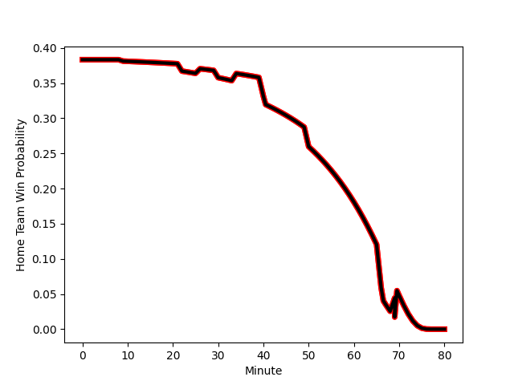

---  
layout: page  
title: Nice at Cognac Saint Jean d'Angély; 28-13  
date: 2022-11-20 15:00:00 18:00:00 -0500  
categories: match review  
---
# Nice (1437.73) at Cognac Saint Jean d'Angély (1231.3); 28-13

# Prediction: Nice by 17.6

Nice by 20.6 on a neutral field
## Scores over Time

## Win Probability over Time

# Pre-Match Prediction: Nice by 15.1

Nice by 18.1 on a neutral pitch

|   Away Minutes | Away Player                                                               |   Away elo |   Away Percentile |   Number |   Home Percentile |   Home elo | Home Player                                                         |   Home Minutes |
|---------------:|:--------------------------------------------------------------------------|-----------:|------------------:|---------:|------------------:|-----------:|:--------------------------------------------------------------------|---------------:|
|             80 | [Nicolas Lemaire](..//playerfiles//NicolasLemaire_cleaned.md)             |     105.21 |                81 |        1 |                56 |      97.4  | [Giorgi Zakashvili](..//playerfiles//GiorgiZakashvili_cleaned.md)   |             80 |
|             80 | [Badri Alkhazashvili](..//playerfiles//BadriAlkhazashvili_cleaned.md)     |      87.15 |                15 |        2 |                 9 |      83.93 | [Paul Sauzaret](..//playerfiles//PaulSauzaret_cleaned.md)           |             80 |
|             80 | [Jemal Shatirishvili](..//playerfiles//JemalShatirishvili_cleaned.md)     |      85.75 |                13 |        3 |                 9 |      83.82 | [Giorgi Sharashidze](..//playerfiles//GiorgiSharashidze_cleaned.md) |             80 |
|             80 | [Thibaud Rey](..//playerfiles//ThibaudRey_cleaned.md)                     |      99.22 |                66 |        4 |                 0 |      54    | [Thomas Toevalu](..//playerfiles//ThomasToevalu_cleaned.md)         |             80 |
|             80 | [Martin Freytes](..//playerfiles//MartinFreytes_cleaned.md)               |      92.47 |                44 |        5 |                23 |      88.49 | [Clément Praud](..//playerfiles//ClémentPraud_cleaned.md)           |             80 |
|             80 | [Steffon Armitage](..//playerfiles//SteffonArmitage_cleaned.md)           |     107.89 |                83 |        6 |                12 |      84.94 | [Matthieu Thomas](..//playerfiles//MatthieuThomas_cleaned.md)       |             80 |
|             80 | [Arthur Vignolles](..//playerfiles//ArthurVignolles_cleaned.md)           |      95    |                47 |        7 |                 2 |      70.85 | [Lucas Gulizzi](..//playerfiles//LucasGulizzi_cleaned.md)           |             80 |
|             80 | [Laijiasa Bolenaivalu](..//playerfiles//LaijiasaBolenaivalu_cleaned.md)   |     114.79 |                89 |        8 |                68 |      98.9  | [Filipe Manu](..//playerfiles//FilipeManu_cleaned.md)               |             80 |
|             80 | [Mathieu Loree](..//playerfiles//MathieuLoree_cleaned.md)                 |     100.29 |                69 |        9 |                13 |      85.78 | [William Beaudon](..//playerfiles//WilliamBeaudon_cleaned.md)       |             80 |
|             80 | [Alban Conduche](..//playerfiles//AlbanConduche_cleaned.md)               |      80.68 |                 7 |       10 |                 8 |      79.61 | [Mathis Garnier](..//playerfiles//MathisGarnier_cleaned.md)         |             80 |
|             80 | [Augustin Slowik](..//playerfiles//AugustinSlowik_cleaned.md)             |      95.65 |                51 |       11 |                 1 |      67.23 | [Jone Tuva](..//playerfiles//JoneTuva_cleaned.md)                   |             80 |
|             80 | [Julien Fritz](..//playerfiles//JulienFritz_cleaned.md)                   |     107.32 |                81 |       12 |                41 |      92.84 | [Isimeli Kuruibua](..//playerfiles//IsimeliKuruibua_cleaned.md)     |             80 |
|             80 | [Luca Cutayar](..//playerfiles//LucaCutayar_cleaned.md)                   |      89.79 |                26 |       13 |                 6 |      78.48 | [Eneri Lotawa](..//playerfiles//EneriLotawa_cleaned.md)             |             80 |
|             80 | [Sakiusa Bureitakiyaca](..//playerfiles//SakiusaBureitakiyaca_cleaned.md) |      90.87 |                27 |       14 |                 7 |      80.94 | [Vincent Pageneau](..//playerfiles//VincentPageneau_cleaned.md)     |             80 |
|             80 | [Loic Le Gal](..//playerfiles//LoicLeGal_cleaned.md)                      |      85.66 |                16 |       15 |                14 |      84.11 | [Dany Antunes](..//playerfiles//DanyAntunes_cleaned.md)             |             80 |

