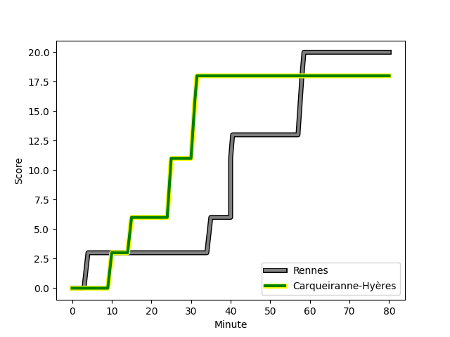
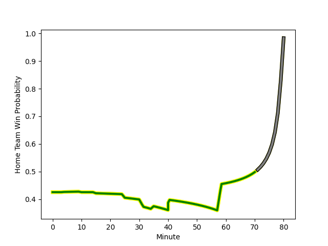

---  
layout: page  
title: Carqueiranne-Hyères at Rennes; 18-20  
date: 2022-11-20 15:00:00 18:00:00 -0500  
categories: match review  
---
# Carqueiranne-Hyères (1393.14) at Rennes (1262.78); 18-20

# Prediction: Carqueiranne-Hyères by 10.0

Carqueiranne-Hyères by 13.0 on a neutral field
## Scores over Time

## Win Probability over Time

# Pre-Match Prediction: Carqueiranne-Hyères by 8.4

Carqueiranne-Hyères by 11.4 on a neutral pitch

|   Away Minutes | Away Player                                                            |   Away elo |   Away Percentile |   Number |   Home Percentile |   Home elo | Home Player                                                                |   Home Minutes |
|---------------:|:-----------------------------------------------------------------------|-----------:|------------------:|---------:|------------------:|-----------:|:---------------------------------------------------------------------------|---------------:|
|             80 | [Liam Chad Hendricks](..//playerfiles//LiamChadHendricks_cleaned.md)   |      86.87 |                15 |        1 |                23 |      87.98 | [Grégory Querin](..//playerfiles//GrégoryQuerin_cleaned.md)                |             80 |
|             80 | [Yan Tabarot](..//playerfiles//YanTabarot_cleaned.md)                  |      87.99 |                21 |        2 |                39 |      92.73 | [Pierre Strippoli](..//playerfiles//PierreStrippoli_cleaned.md)            |             80 |
|             80 | [Costel Burtila](..//playerfiles//CostelBurtila_cleaned.md)            |      95.27 |                47 |        3 |                24 |      89.85 | [Luvuyo Pupuma](..//playerfiles//LuvuyoPupuma_cleaned.md)                  |             80 |
|             80 | [Lucas Cazac](..//playerfiles//LucasCazac_cleaned.md)                  |      69.07 |                 1 |        4 |                 1 |      67.1  | [Victor Fromenteze](..//playerfiles//VictorFromenteze_cleaned.md)          |             80 |
|             80 | [Nathan Gendre](..//playerfiles//NathanGendre_cleaned.md)              |      97.38 |                59 |        5 |                 9 |      81.09 | [Alexandre Gueroult](..//playerfiles//AlexandreGueroult_cleaned.md)        |             80 |
|             80 | [Florian Munoz Rivero](..//playerfiles//FlorianMunozRivero_cleaned.md) |     100.53 |                68 |        6 |                44 |      94.74 | [Téo Gazin](..//playerfiles//TéoGazin_cleaned.md)                          |             80 |
|             80 | [Alexander Nowicki](..//playerfiles//AlexanderNowicki_cleaned.md)      |      90.51 |                34 |        7 |                15 |      86.52 | [Luca Di Salvatore](..//playerfiles//LucaDiSalvatore_cleaned.md)           |             80 |
|             80 | [Joachim Beaumont](..//playerfiles//JoachimBeaumont_cleaned.md)        |      94.07 |                44 |        8 |                 6 |      78.47 | [Gaétan Béraud](..//playerfiles//GaétanBéraud_cleaned.md)                  |             80 |
|             80 | [Thomas Sonetti](..//playerfiles//ThomasSonetti_cleaned.md)            |      98.46 |                67 |        9 |                 8 |      82.05 | [Lucas Ollion](..//playerfiles//LucasOllion_cleaned.md)                    |             80 |
|             80 | [Théo Defrance](..//playerfiles//ThéoDefrance_cleaned.md)              |      91.87 |                31 |       10 |                 7 |      81.2  | [Yvan Leroyer](..//playerfiles//YvanLeroyer_cleaned.md)                    |             80 |
|             80 | [Vincent Alessi](..//playerfiles//VincentAlessi_cleaned.md)            |      80.58 |                 7 |       11 |                 3 |      76.47 | [Alexandre Nicoue](..//playerfiles//AlexandreNicoue_cleaned.md)            |             80 |
|             80 | [Romain Leveque](..//playerfiles//RomainLeveque_cleaned.md)            |     101.94 |                71 |       12 |                17 |      86.41 | [Gonzalo Lopez Bontempo](..//playerfiles//GonzaloLopezBontempo_cleaned.md) |             80 |
|             80 | [Charles Brousse](..//playerfiles//CharlesBrousse_cleaned.md)          |     119.89 |                94 |       13 |                11 |      82.73 | [Ryan Dubois](..//playerfiles//RyanDubois_cleaned.md)                      |             80 |
|             80 | [Quentin Bourdieu](..//playerfiles//QuentinBourdieu_cleaned.md)        |      86.39 |                15 |       14 |                20 |      86.98 | [Mathieu Brignonen](..//playerfiles//MathieuBrignonen_cleaned.md)          |             80 |
|             80 | [Josselyn Bouchon](..//playerfiles//JosselynBouchon_cleaned.md)        |      92.31 |                38 |       15 |                24 |      88.45 | [Pedro Soto](..//playerfiles//PedroSoto_cleaned.md)                        |             80 |

