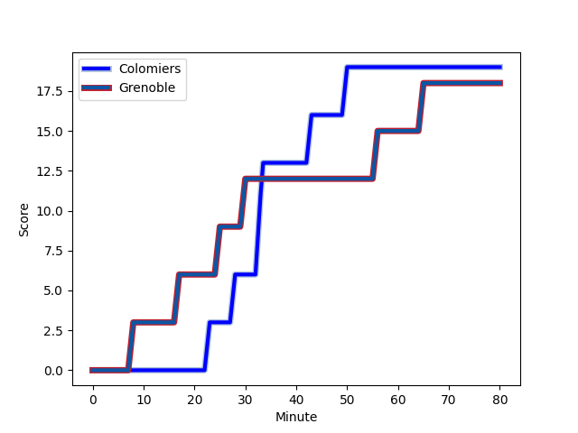
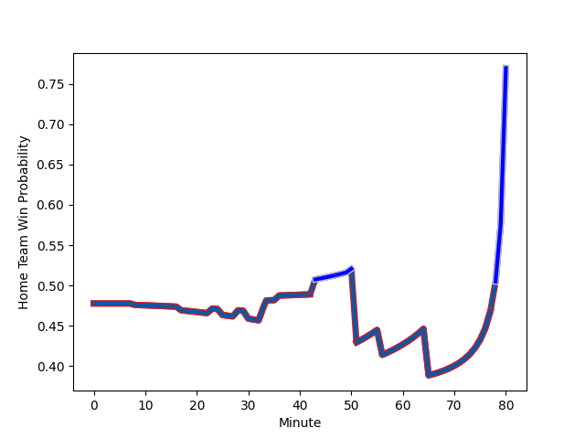

---  
layout: page  
title: Grenoble at Colomiers; 18-19  
date: 2022-11-25 21:00:00 18:00:00 -0500  
categories: match review  
---
# Grenoble (1417.64) at Colomiers (1378.86); 18-19

# Prediction: Grenoble by 0.9

Grenoble by 3.9 on a neutral field
## Scores over Time

## Win Probability over Time

# Pre-Match Prediction: Grenoble by 1.1

Grenoble by 4.1 on a neutral pitch

|   Away Minutes | Away Player                                                           |   Away elo |   Away Percentile |   Number |   Home Percentile |   Home elo | Home Player                                                               |   Home Minutes |
|---------------:|:----------------------------------------------------------------------|-----------:|------------------:|---------:|------------------:|-----------:|:--------------------------------------------------------------------------|---------------:|
|             60 | [Luka Goginava](..//playerfiles//LukaGoginava_cleaned.md)             |      97.13 |                46 |        1 |                 3 |      71.91 | [Thomas Dubois](..//playerfiles//ThomasDubois_cleaned.md)                 |             56 |
|             54 | [Jean Charles Orioli](..//playerfiles//JeanCharlesOrioli_cleaned.md)  |      86.83 |                11 |        2 |                13 |      86.17 | [Andrew Ready](..//playerfiles//AndrewReady_cleaned.md)                   |             51 |
|             50 | [Vincent Vial](..//playerfiles//VincentVial_cleaned.md)               |      93.71 |               nan |        3 |                82 |     105.53 | [Marco Fepulea'i](..//playerfiles//MarcoFepulea'i_cleaned.md)             |             56 |
|             80 | [Thomas Lainault](..//playerfiles//ThomasLainault_cleaned.md)         |     101.8  |                74 |        4 |                64 |      98.9  | [Jean Thomas](..//playerfiles//JeanThomas_cleaned.md)                     |             80 |
|             50 | [Adrien Vigne](..//playerfiles//AdrienVigne_cleaned.md)               |      90.8  |                27 |        5 |                55 |      95.32 | [Alexandre Ricard](..//playerfiles//AlexandreRicard_cleaned.md)           |             51 |
|             80 | [Antonin Berruyer](..//playerfiles//AntoninBerruyer_cleaned.md)       |      91.3  |                31 |        6 |                 0 |      59.23 | [Anthony Coletta](..//playerfiles//AnthonyColetta_cleaned.md)             |             56 |
|             54 | [Clement Ancely](..//playerfiles//ClementAncely_cleaned.md)           |      85.67 |                14 |        7 |                13 |      85.34 | [Waël Ponpon](..//playerfiles//WaëlPonpon_cleaned.md)                     |             80 |
|             80 | [Marko Gazzotti](..//playerfiles//MarkoGazzotti_cleaned.md)           |      96.29 |               nan |        8 |                28 |      90.4  | [Yann Peysson](..//playerfiles//YannPeysson_cleaned.md)                   |             60 |
|             39 | [Eric Escande](..//playerfiles//EricEscande_cleaned.md)               |      97.6  |                52 |        9 |                75 |     103.51 | [Ugo Seguela](..//playerfiles//UgoSeguela_cleaned.md)                     |             66 |
|             64 | [Thomas Fortunel](..//playerfiles//ThomasFortunel_cleaned.md)         |      92.9  |                31 |       10 |                 7 |      79.22 | [Thomas Girard](..//playerfiles//ThomasGirard_cleaned.md)                 |             36 |
|             80 | [Lucas Dupont](..//playerfiles//LucasDupont_cleaned.md)               |      95.41 |                49 |       11 |                13 |      85.26 | [Valentin Saurs](..//playerfiles//ValentinSaurs_cleaned.md)               |             80 |
|             80 | [Bautista Ezcurra](..//playerfiles//BautistaEzcurra_cleaned.md)       |     100.5  |                65 |       12 |                85 |     109.31 | [Paul Pimienta](..//playerfiles//PaulPimienta_cleaned.md)                 |             80 |
|             57 | [Romain Fusier](..//playerfiles//RomainFusier_cleaned.md)             |      95.51 |                48 |       13 |                76 |     104.35 | [Fabien Perrin](..//playerfiles//FabienPerrin_cleaned.md)                 |             80 |
|             80 | [Karim Qadiri](..//playerfiles//KarimQadiri_cleaned.md)               |      89.43 |                22 |       14 |                51 |      96.13 | [Peni Rokoduguni](..//playerfiles//PeniRokoduguni_cleaned.md)             |             80 |
|             80 | [Hugo Trouilloud](..//playerfiles//HugoTrouilloud_cleaned.md)         |      87.19 |                21 |       15 |                32 |      89.87 | [Max Auriac](..//playerfiles//MaxAuriac_cleaned.md)                       |             80 |
|             41 | [Felipe Ezcurra](..//playerfiles//FelipeEzcurra_cleaned.md)           |     131.91 |                99 |       16 |                22 |      89.59 | [Romuald Séguy](..//playerfiles//RomualdSéguy_cleaned.md)                 |             44 |
|             30 | [Irakli Aptsiauri](..//playerfiles//IrakliAptsiauri_cleaned.md)       |      95.71 |                49 |       17 |                16 |      85.46 | [Maxime Granouillet](..//playerfiles//MaximeGranouillet_cleaned.md)       |             29 |
|             30 | [Levi Douglas](..//playerfiles//LeviDouglas_cleaned.md)               |      80.85 |                 8 |       18 |               nan |      95    | [Toma Kolokilagi](..//playerfiles//TomaKolokilagi_cleaned.md)             |             29 |
|             26 | [Steeve Blanc-Mappaz](..//playerfiles//SteeveBlanc-Mappaz_cleaned.md) |     103.33 |                75 |       19 |                88 |     108.61 | [Guillaume Tartas](..//playerfiles//GuillaumeTartas_cleaned.md)           |             24 |
|             26 | [Mathis Sarragallet](..//playerfiles//MathisSarragallet_cleaned.md)   |      94.74 |                49 |       20 |                18 |      86.53 | [Pierre-Samuel Pacheco](..//playerfiles//Pierre-SamuelPacheco_cleaned.md) |             24 |
|             23 | [Romain Trouilloud](..//playerfiles//RomainTrouilloud_cleaned.md)     |      93.56 |                42 |       21 |                 8 |      83.55 | [Hugo Pirlet](..//playerfiles//HugoPirlet_cleaned.md)                     |             24 |
|             20 | [Eli Eglaine](..//playerfiles//EliEglaine_cleaned.md)                 |      67.74 |                 1 |       22 |                52 |      95.94 | [Aldric Lescure](..//playerfiles//AldricLescure_cleaned.md)               |             20 |
|             16 | [Corentin Glenat](..//playerfiles//CorentinGlenat_cleaned.md)         |      95.69 |                40 |       23 |                63 |      98.3  | [Edoardo Gori](..//playerfiles//EdoardoGori_cleaned.md)                   |             14 |

