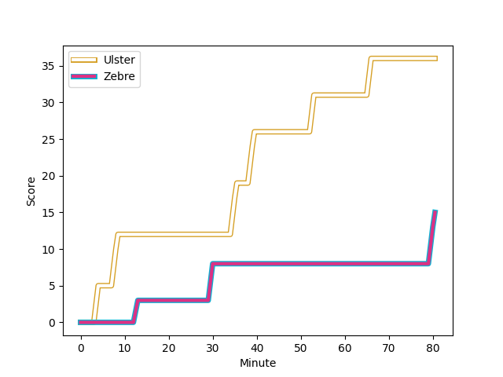
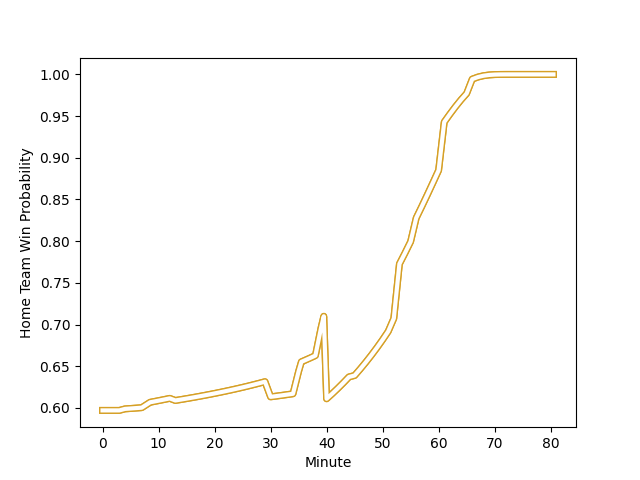

---  
layout: page  
title: Zebre at Ulster; 15-36  
date: 2022-11-25 20:35:00 18:00:00 -0500  
categories: match review  
---
# Zebre (1421.18) at Ulster (1591.79); 15-36

# Prediction: Ulster by 20.1

Ulster by 17.1 on a neutral field
## Scores over Time

## Win Probability over Time

# Pre-Match Prediction: Ulster by 17.5

Ulster by 14.5 on a neutral pitch

|   Away Minutes | Away Player                                                                 |   Away elo |   Away Percentile |   Number |   Home Percentile |   Home elo | Home Player                                                         |   Home Minutes |
|---------------:|:----------------------------------------------------------------------------|-----------:|------------------:|---------:|------------------:|-----------:|:--------------------------------------------------------------------|---------------:|
|             45 | [Juan Manuel Pitinari](..//playerfiles//JuanManuelPitinari_cleaned.md)      |      91.34 |                28 |        1 |               nan |      96.37 | [Callum Reid](..//playerfiles//CallumReid_cleaned.md)               |             61 |
|             56 | [Jacques du Toit](..//playerfiles//JacquesduToit_cleaned.md)                |      88.33 |                20 |        2 |                66 |      99.06 | [Tom Stewart](..//playerfiles//TomStewart_cleaned.md)               |             61 |
|             67 | [Matteo Nocera](..//playerfiles//MatteoNocera_cleaned.md)                   |      93.91 |                41 |        3 |                79 |     104.68 | [Marty Moore](..//playerfiles//MartyMoore_cleaned.md)               |             40 |
|             40 | [Jan Uys](..//playerfiles//JanUys_cleaned.md)                               |      97.38 |                64 |        4 |               nan |      96.89 | [Cormac Izuchukwu](..//playerfiles//CormacIzuchukwu_cleaned.md)     |             52 |
|             80 | [Andrea Zambonin](..//playerfiles//AndreaZambonin_cleaned.md)               |      85.92 |                17 |        5 |                89 |     112.03 | [Sam Carter](..//playerfiles//SamCarter_cleaned.md)                 |             80 |
|             53 | [Guido Volpi](..//playerfiles//GuidoVolpi_cleaned.md)                       |      89.21 |                22 |        6 |                27 |      91.23 | [Matthew Rea](..//playerfiles//MatthewRea_cleaned.md)               |             54 |
|             80 | [Giacomo Ferrari](..//playerfiles//GiacomoFerrari_cleaned.md)               |      94.35 |               nan |        7 |                94 |     116.97 | [Marcus Rea](..//playerfiles//MarcusRea_cleaned.md)                 |             80 |
|             80 | [Matt Kvesic](..//playerfiles//MattKvesic_cleaned.md)                       |     102.5  |                68 |        8 |                98 |     136.45 | [Duane Vermeulen](..//playerfiles//DuaneVermeulen_cleaned.md)       |             80 |
|             80 | [Chris Cook](..//playerfiles//ChrisCook_cleaned.md)                         |      92.07 |                33 |        9 |                35 |      92.75 | [Nathan Doak](..//playerfiles//NathanDoak_cleaned.md)               |             80 |
|             80 | [Geronimo Prisciantelli](..//playerfiles//GeronimoPrisciantelli_cleaned.md) |     126.68 |                96 |       10 |                41 |      94.85 | [Jake Flannery](..//playerfiles//JakeFlannery_cleaned.md)           |             61 |
|             80 | [Simone Gesi](..//playerfiles//SimoneGesi_cleaned.md)                       |      94.24 |                45 |       11 |                84 |     108.09 | [Jacob Stockdale](..//playerfiles//JacobStockdale_cleaned.md)       |             77 |
|             40 | [Enrico Lucchin](..//playerfiles//EnricoLucchin_cleaned.md)                 |     113.79 |                87 |       12 |                90 |     114.95 | [Luke Marshall](..//playerfiles//LukeMarshall_cleaned.md)           |             65 |
|             64 | [Richard Kriel](..//playerfiles//RichardKriel_cleaned.md)                   |     101.63 |                69 |       13 |                67 |     100.76 | [James Hume](..//playerfiles//JamesHume_cleaned.md)                 |             80 |
|             57 | [Jacopo Trulla](..//playerfiles//JacopoTrulla_cleaned.md)                   |      79.87 |                 6 |       14 |                82 |     106.77 | [Ethan McIlroy](..//playerfiles//EthanMcIlroy_cleaned.md)           |             80 |
|             80 | [Lorenzo Pani](..//playerfiles//LorenzoPani_cleaned.md)                     |      98.22 |                64 |       15 |                91 |     114.4  | [Stewart Moore](..//playerfiles//StewartMoore_cleaned.md)           |             80 |
|             40 | [Leonard Krumov](..//playerfiles//LeonardKrumov_cleaned.md)                 |      70.58 |                 2 |       16 |                94 |     114.72 | [Jeff Toomaga-Allen](..//playerfiles//JeffToomaga-Allen_cleaned.md) |             40 |
|             40 | [Joey Caputo](..//playerfiles//JoeyCaputo_cleaned.md)                       |      93.97 |               nan |       17 |                80 |     105.13 | [Iain Henderson](..//playerfiles//IainHenderson_cleaned.md)         |             28 |
|             35 | [Giampietro Ribaldi](..//playerfiles//GiampietroRibaldi_cleaned.md)         |      99.68 |                69 |       18 |               nan |      93.68 | [Michael McDonald](..//playerfiles//MichaelMcDonald_cleaned.md)     |             19 |
|             27 | [Iacopo Bianchi](..//playerfiles//IacopoBianchi_cleaned.md)                 |      74.48 |                 2 |       19 |                72 |     101.57 | [Andrew Warwick](..//playerfiles//AndrewWarwick_cleaned.md)         |             19 |
|             24 | [Marco Manfredi](..//playerfiles//MarcoManfredi_cleaned.md)                 |      70.68 |                 1 |       20 |                 9 |      84.96 | [John Andrew](..//playerfiles//JohnAndrew_cleaned.md)               |             19 |
|             23 | [Erich Cronje](..//playerfiles//ErichCronje_cleaned.md)                     |      90.59 |                29 |       21 |                41 |      96.45 | [Angus Curtis](..//playerfiles//AngusCurtis_cleaned.md)             |             15 |
|             16 | [Ratko Jelic](..//playerfiles//RatkoJelic_cleaned.md)                       |      93.7  |               nan |       22 |                61 |      98.23 | [Ben Moxham](..//playerfiles//BenMoxham_cleaned.md)                 |              3 |
|             13 | [Riccardo Genovese](..//playerfiles//RiccardoGenovese_cleaned.md)           |      95    |               nan |       23 |                75 |     103.17 | [David McCann](..//playerfiles//DavidMcCann_cleaned.md)             |             26 |

