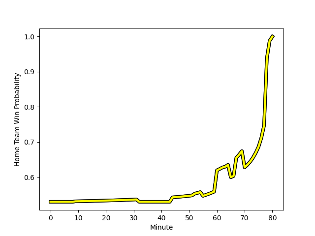

---  
layout: page  
title: US Bressane at Albi; 9-15  
date: 2022-11-26 18:00:00 18:00:00 -0500  
categories: match review  
---
# US Bressane (1387.4) at Albi (1439.16); 9-15

# Prediction: Albi by 8.2

Albi by 5.2 on a neutral field
## Scores over Time

## Win Probability over Time

# Pre-Match Prediction: Albi by 4.7

Albi by 1.7 on a neutral pitch

|   Away Minutes | Away Player                                                                       |   Away elo |   Away Percentile |   Number |   Home Percentile |   Home elo | Home Player                                                                 |   Home Minutes |
|---------------:|:----------------------------------------------------------------------------------|-----------:|------------------:|---------:|------------------:|-----------:|:----------------------------------------------------------------------------|---------------:|
|             55 | [Teo Bordenave](..//playerfiles//TeoBordenave_cleaned.md)                         |      91.97 |                29 |        1 |                73 |     102.14 | [Antoine Soave](..//playerfiles//AntoineSoave_cleaned.md)                   |             52 |
|             73 | [Clement Jullien](..//playerfiles//ClementJullien_cleaned.md)                     |      86.72 |                14 |        2 |                19 |      88.27 | [Arthur Castant](..//playerfiles//ArthurCastant_cleaned.md)                 |             80 |
|             80 | [Zauri Tevdorashvili](..//playerfiles//ZauriTevdorashvili_cleaned.md)             |      85.33 |                11 |        3 |                33 |      92.54 | [Jean Baptiste De Clercq](..//playerfiles//JeanBaptisteDeClercq_cleaned.md) |             52 |
|             80 | [Louis Bruinsma](..//playerfiles//LouisBruinsma_cleaned.md)                       |      94.49 |                47 |        4 |                82 |     104.13 | [Charles Foures](..//playerfiles//CharlesFoures_cleaned.md)                 |             60 |
|             70 | [Cyril Veyret](..//playerfiles//CyrilVeyret_cleaned.md)                           |     114.13 |                91 |        5 |                17 |      86.25 | [Jacques Engelbrecht](..//playerfiles//JacquesEngelbrecht_cleaned.md)       |             80 |
|             80 | [Romain Falcoz](..//playerfiles//RomainFalcoz_cleaned.md)                         |      93.23 |               nan |        6 |                55 |      96.75 | [Lucas Guillaume](..//playerfiles//LucasGuillaume_cleaned.md)               |             80 |
|             80 | [Lucas Lyons](..//playerfiles//LucasLyons_cleaned.md)                             |     104.44 |                78 |        7 |                91 |     113.32 | [Pierre Roussel](..//playerfiles//PierreRoussel_cleaned.md)                 |             52 |
|             60 | [TJ Ioane](..//playerfiles//TJIoane_cleaned.md)                                   |      76.33 |                 4 |        8 |                61 |     100.41 | [Sandrick Maciotta](..//playerfiles//SandrickMaciotta_cleaned.md)           |             80 |
|             79 | [Jeremy Valencot](..//playerfiles//JeremyValencot_cleaned.md)                     |      89.55 |                19 |        9 |                14 |      85.87 | [Titouan Pouzoullic](..//playerfiles//TitouanPouzoullic_cleaned.md)         |             55 |
|             55 | [Christian Lacombe](..//playerfiles//ChristianLacombe_cleaned.md)                 |      80.76 |                 7 |       10 |                35 |      92.98 | [Benjamin Pehau](..//playerfiles//BenjaminPehau_cleaned.md)                 |             80 |
|             75 | [Élie De Fleurian](..//playerfiles//ÉlieDeFleurian_cleaned.md)                    |      90.7  |                27 |       11 |                87 |     111    | [Enzo Marzocca](..//playerfiles//EnzoMarzocca_cleaned.md)                   |             80 |
|             80 | [Parataiso Silafai-Lea'ana](..//playerfiles//ParataisoSilafai-Lea'ana_cleaned.md) |     108.88 |                84 |       12 |                24 |      88.9  | [Simon Andreu](..//playerfiles//SimonAndreu_cleaned.md)                     |             70 |
|             80 | [Benjamin Doy](..//playerfiles//BenjaminDoy_cleaned.md)                           |      69.58 |                 1 |       13 |                88 |     112.5  | [Baptiste Couchinave](..//playerfiles//BaptisteCouchinave_cleaned.md)       |             80 |
|             63 | [Audrey Soubeyrand](..//playerfiles//AudreySoubeyrand_cleaned.md)                 |      95    |               nan |       14 |                17 |      87.74 | [Charly Trussardi](..//playerfiles//CharlyTrussardi_cleaned.md)             |             80 |
|             80 | [Thibaut Perrette](..//playerfiles//ThibautPerrette_cleaned.md)                   |      92.73 |                37 |       15 |                53 |      94.98 | [Téo Dospital](..//playerfiles//TéoDospital_cleaned.md)                     |             80 |
|             25 | [Quentin Drancourt](..//playerfiles//QuentinDrancourt_cleaned.md)                 |     107.36 |                86 |       16 |                 5 |      81.21 | [Maxime Escur](..//playerfiles//MaximeEscur_cleaned.md)                     |             28 |
|              7 | [Louis Dasalmartini](..//playerfiles//LouisDasalmartini_cleaned.md)               |      95.45 |               nan |       17 |                38 |      92.29 | [Dimitri Tchapnga](..//playerfiles//DimitriTchapnga_cleaned.md)             |             28 |
|             10 | [Wael May](..//playerfiles//WaelMay_cleaned.md)                                   |      99.27 |                66 |       18 |                73 |     101.62 | [Mohsen Essid](..//playerfiles//MohsenEssid_cleaned.md)                     |             20 |
|             20 | [Loic Baradel](..//playerfiles//LoicBaradel_cleaned.md)                           |      89.5  |                23 |       19 |                 4 |      78.91 | [Hugo Boutin](..//playerfiles//HugoBoutin_cleaned.md)                       |             28 |
|              1 | [Robin Graulle](..//playerfiles//RobinGraulle_cleaned.md)                         |      88.36 |                18 |       20 |                29 |      91.15 | [Gilen Queheille](..//playerfiles//GilenQueheille_cleaned.md)               |             25 |
|             25 | [Sebastian Poet](..//playerfiles//SebastianPoet_cleaned.md)                       |      95.54 |                45 |       21 |                19 |      87.37 | [François Fontaine](..//playerfiles//FrançoisFontaine_cleaned.md)           |             10 |
|              5 | [Melvin Champenois](..//playerfiles//MelvinChampenois_cleaned.md)                 |      95.35 |               nan |       22 |               nan |     nan    | nan                                                                         |            nan |
|             17 | [Audric Sanlaville](..//playerfiles//AudricSanlaville_cleaned.md)                 |     102.79 |                74 |       23 |               nan |     nan    | nan                                                                         |            nan |

