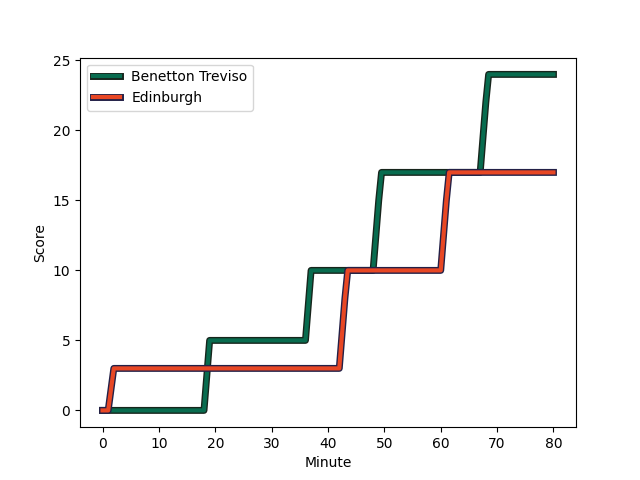
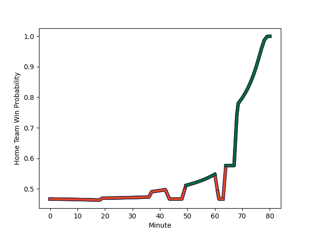

---  
layout: page  
title: Edinburgh at Benetton Treviso; 17-24  
date: 2022-11-26 14:00:00 18:00:00 -0500  
categories: match review  
---
# Edinburgh (1554.39) at Benetton Treviso (1495.68); 17-24

# Prediction: Edinburgh by 2.9

Edinburgh by 5.9 on a neutral field
## Scores over Time

## Win Probability over Time

# Pre-Match Prediction: Edinburgh by 2.4

Edinburgh by 5.4 on a neutral pitch

|   Away Minutes | Away Player                                                     |   Away elo |   Away Percentile |   Number |   Home Percentile |   Home elo | Home Player                                                              |   Home Minutes |
|---------------:|:----------------------------------------------------------------|-----------:|------------------:|---------:|------------------:|-----------:|:-------------------------------------------------------------------------|---------------:|
|             77 | [Boan Venter](..//playerfiles//BoanVenter_cleaned.md)           |     109.87 |                89 |        1 |                86 |     105.43 | [Nahuel Tetaz Chaparro](..//playerfiles//NahuelTetazChaparro_cleaned.md) |             40 |
|             68 | [Stuart McInally](..//playerfiles//StuartMcInally_cleaned.md)   |      75.66 |                 2 |        2 |                33 |      90.04 | [Gianmarco Lucchesi](..//playerfiles//GianmarcoLucchesi_cleaned.md)      |             48 |
|             50 | [Angus Williams](..//playerfiles//AngusWilliams_cleaned.md)     |     102.49 |                69 |        3 |                71 |      99.48 | [Simone Ferrari](..//playerfiles//SimoneFerrari_cleaned.md)              |             48 |
|             80 | [Marshall Sykes](..//playerfiles//MarshallSykes_cleaned.md)     |     102.22 |                72 |        4 |                 3 |      72.48 | [Niccolo Cannone](..//playerfiles//NiccoloCannone_cleaned.md)            |             48 |
|             68 | [Jamie Hodgson](..//playerfiles//JamieHodgson_cleaned.md)       |      99.29 |                66 |        5 |                64 |      98.87 | [Federico Ruzza](..//playerfiles//FedericoRuzza_cleaned.md)              |             80 |
|             80 | [Nick Haining](..//playerfiles//NickHaining_cleaned.md)         |     120.99 |                95 |        6 |                 9 |      83.27 | [Sebastian Negri](..//playerfiles//SebastianNegri_cleaned.md)            |             80 |
|             80 | [Luke Crosbie](..//playerfiles//LukeCrosbie_cleaned.md)         |     113.45 |                91 |        7 |                42 |      92.41 | [Manuel Zuliani](..//playerfiles//ManuelZuliani_cleaned.md)              |             64 |
|             58 | [Ben Muncaster](..//playerfiles//BenMuncaster_cleaned.md)       |     100.57 |                68 |        8 |                82 |     107.65 | [Lorenzo Cannone](..//playerfiles//LorenzoCannone_cleaned.md)            |             80 |
|             55 | [Henry Pyrgos](..//playerfiles//HenryPyrgos_cleaned.md)         |      96.7  |                52 |        9 |                95 |     119.5  | [Dewaldt Duvenage](..//playerfiles//DewaldtDuvenage_cleaned.md)          |             80 |
|             80 | [Charlie Savala](..//playerfiles//CharlieSavala_cleaned.md)     |      99.46 |                63 |       10 |                88 |     112.4  | [Tomas Albornoz](..//playerfiles//TomasAlbornoz_cleaned.md)              |             52 |
|             80 | [Wes Goosen](..//playerfiles//WesGoosen_cleaned.md)             |     114.03 |                91 |       11 |                55 |      97.09 | [Matteo Minozzi](..//playerfiles//MatteoMinozzi_cleaned.md)              |             80 |
|             80 | [James Lang](..//playerfiles//JamesLang_cleaned.md)             |     109.24 |                85 |       12 |                80 |     106.13 | [Marco Zanon](..//playerfiles//MarcoZanon_cleaned.md)                    |             58 |
|             55 | [Matt Currie](..//playerfiles//MattCurrie_cleaned.md)           |     105.6  |                79 |       13 |                65 |     100.32 | [Juan Ignacio Brex](..//playerfiles//JuanIgnacioBrex_cleaned.md)         |             80 |
|             80 | [Damien Hoyland](..//playerfiles//DamienHoyland_cleaned.md)     |     105.09 |                79 |       14 |                48 |      93.99 | [Marcus Watson](..//playerfiles//MarcusWatson_cleaned.md)                |             80 |
|             80 | [Henry Immelman](..//playerfiles//HenryImmelman_cleaned.md)     |     107.86 |                81 |       15 |                66 |     100.51 | [Rhyno Smith](..//playerfiles//RhynoSmith_cleaned.md)                    |             80 |
|             30 | [Lee-Roy Atalifo](..//playerfiles//Lee-RoyAtalifo_cleaned.md)   |      87.96 |                17 |       16 |                63 |      98.84 | [Tiziano Pasquali](..//playerfiles//TizianoPasquali_cleaned.md)          |             40 |
|             25 | [Ben Vellacott](..//playerfiles//BenVellacott_cleaned.md)       |     103.43 |                75 |       17 |                65 |      98.44 | [Ivan Nemer](..//playerfiles//IvanNemer_cleaned.md)                      |             32 |
|             25 | [Chris Dean](..//playerfiles//ChrisDean_cleaned.md)             |      87.75 |                21 |       18 |                84 |     106.58 | [Giacomo Nicotera](..//playerfiles//GiacomoNicotera_cleaned.md)          |             32 |
|             22 | [Connor Boyle](..//playerfiles//ConnorBoyle_cleaned.md)         |      97.57 |                61 |       19 |                80 |     105.26 | [Scott Scrafton](..//playerfiles//ScottScrafton_cleaned.md)              |             32 |
|             12 | [Patrick Harrison](..//playerfiles//PatrickHarrison_cleaned.md) |      95    |               nan |       20 |                77 |     105.7  | [Jacob Umaga](..//playerfiles//JacobUmaga_cleaned.md)                    |             28 |
|             12 | [Glen Young](..//playerfiles//GlenYoung_cleaned.md)             |      98.58 |                70 |       21 |                77 |     102.7  | [Tommaso Menoncello](..//playerfiles//TommasoMenoncello_cleaned.md)      |             22 |
|              3 | [Jamie Jack](..//playerfiles//JamieJack_cleaned.md)             |      78.38 |                 3 |       22 |                86 |     109.31 | [Giovanni Pettinelli](..//playerfiles//GiovanniPettinelli_cleaned.md)    |             16 |

