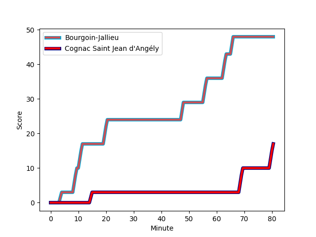
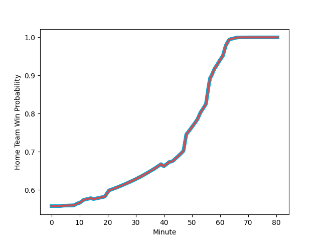

---  
layout: page  
title: Cognac Saint Jean d'Angély at Bourgoin-Jallieu; 17-48  
date: 2022-11-26 18:30:00 18:00:00 -0500  
categories: match review  
---
# Cognac Saint Jean d'Angély (1300.22) at Bourgoin-Jallieu (1400.29); 17-48

# Prediction: Bourgoin-Jallieu by 13.0

Bourgoin-Jallieu by 10.0 on a neutral field
## Scores over Time

## Win Probability over Time

# Pre-Match Prediction: Bourgoin-Jallieu by 16.5

Bourgoin-Jallieu by 13.5 on a neutral pitch

|   Away Minutes | Away Player                                                             |   Away elo |   Away Percentile |   Number |   Home Percentile |   Home elo | Home Player                                                               |   Home Minutes |
|---------------:|:------------------------------------------------------------------------|-----------:|------------------:|---------:|------------------:|-----------:|:--------------------------------------------------------------------------|---------------:|
|             67 | [Beqa Kakabadze](..//playerfiles//BeqaKakabadze_cleaned.md)             |     111.48 |                92 |        1 |                26 |      90.81 | [Nugzar Somkhishvili](..//playerfiles//NugzarSomkhishvili_cleaned.md)     |             40 |
|             80 | [Maxime Gau](..//playerfiles//MaximeGau_cleaned.md)                     |      80.76 |                 5 |        2 |                22 |      89.55 | [Maxime Castant](..//playerfiles//MaximeCastant_cleaned.md)               |             40 |
|             62 | [Giorgi Sharashidze](..//playerfiles//GiorgiSharashidze_cleaned.md)     |      82.72 |                 7 |        3 |                25 |      90.4  | [Rossouw De Klerk](..//playerfiles//RossouwDeKlerk_cleaned.md)            |             52 |
|             80 | [Utu Maninoa](..//playerfiles//UtuManinoa_cleaned.md)                   |      71.68 |                 3 |        4 |                54 |      96.75 | [Léandre Cotte](..//playerfiles//LéandreCotte_cleaned.md)                 |             80 |
|             80 | [Clément Praud](..//playerfiles//ClémentPraud_cleaned.md)               |      87.61 |                20 |        5 |                38 |      92.57 | [Jonathan Kpoku](..//playerfiles//JonathanKpoku_cleaned.md)               |             53 |
|             40 | [Thomas Toevalu](..//playerfiles//ThomasToevalu_cleaned.md)             |      53.13 |                 0 |        6 |                69 |     100.33 | [Kemueli Lavetanakoroi](..//playerfiles//KemueliLavetanakoroi_cleaned.md) |             80 |
|             67 | [Gio Sordia](..//playerfiles//GioSordia_cleaned.md)                     |     119.09 |                95 |        7 |                42 |      93.67 | [Bynjamin Rabatel](..//playerfiles//BynjaminRabatel_cleaned.md)           |             53 |
|             80 | [Filipe Manu](..//playerfiles//FilipeManu_cleaned.md)                   |     100.59 |                63 |        8 |                49 |      95.96 | [Poutasi Luafutu](..//playerfiles//PoutasiLuafutu_cleaned.md)             |             80 |
|             80 | [Mathieu Billou](..//playerfiles//MathieuBillou_cleaned.md)             |      80.5  |                 6 |        9 |                60 |      98.31 | [Tomas Munilla lo Duca](..//playerfiles//TomasMunillaloDuca_cleaned.md)   |             60 |
|             80 | [Dany Antunes](..//playerfiles//DanyAntunes_cleaned.md)                 |      83.88 |                14 |       10 |                15 |      85.9  | [Nicolas Vuillemin](..//playerfiles//NicolasVuillemin_cleaned.md)         |             80 |
|             80 | [Nils Guyon](..//playerfiles//NilsGuyon_cleaned.md)                     |      88.98 |                21 |       11 |                55 |      96.99 | [Quentin Lefort](..//playerfiles//QuentinLefort_cleaned.md)               |             80 |
|             58 | [Rhema Sagote](..//playerfiles//RhemaSagote_cleaned.md)                 |     114.21 |                90 |       12 |                23 |      88.62 | [Romain Sola](..//playerfiles//RomainSola_cleaned.md)                     |             80 |
|             80 | [Eneri Lotawa](..//playerfiles//EneriLotawa_cleaned.md)                 |      76    |                 4 |       13 |                17 |      91.13 | [Makalea Foliaki](..//playerfiles//MakaleaFoliaki_cleaned.md)             |             80 |
|             71 | [Vincent Pageneau](..//playerfiles//VincentPageneau_cleaned.md)         |      78.6  |                 5 |       14 |                46 |      94.83 | [Remi Bouet](..//playerfiles//RemiBouet_cleaned.md)                       |             43 |
|             80 | [Jone Tuva](..//playerfiles//JoneTuva_cleaned.md)                       |      66.14 |                 0 |       15 |                21 |      87.19 | [Nicolas Cachet](..//playerfiles//NicolasCachet_cleaned.md)               |             60 |
|             40 | [Matthieu Thomas](..//playerfiles//MatthieuThomas_cleaned.md)           |      83.87 |                10 |       16 |                58 |      98.28 | [Oktay Yilmaz](..//playerfiles//OktayYilmaz_cleaned.md)                   |             40 |
|             22 | [Isimeli Kuruibua](..//playerfiles//IsimeliKuruibua_cleaned.md)         |      90.72 |                30 |       17 |                38 |      92.93 | [Mohamed Khribache](..//playerfiles//MohamedKhribache_cleaned.md)         |             40 |
|             18 | [Alico Kaikatsishvili](..//playerfiles//AlicoKaikatsishvili_cleaned.md) |      92.56 |               nan |       18 |                14 |      85.75 | [Matthieu Nicolas](..//playerfiles//MatthieuNicolas_cleaned.md)           |             37 |
|             13 | [Kevin Tougne](..//playerfiles//KevinTougne_cleaned.md)                 |      85.61 |                14 |       19 |                52 |      97.52 | [Michael Simutoga](..//playerfiles//MichaelSimutoga_cleaned.md)           |             28 |
|             13 | [Khaled Hammouten](..//playerfiles//KhaledHammouten_cleaned.md)         |      95    |               nan |       20 |                71 |     102.73 | [Matteo Broeders](..//playerfiles//MatteoBroeders_cleaned.md)             |             27 |
|              9 | [Paul Boitard](..//playerfiles//PaulBoitard_cleaned.md)                 |      94.97 |               nan |       21 |                58 |      97.84 | [Kevin Chaudouard](..//playerfiles//KevinChaudouard_cleaned.md)           |             27 |
|            nan | nan                                                                     |     nan    |               nan |       22 |                45 |      94.37 | [Adrien Pontarollo](..//playerfiles//AdrienPontarollo_cleaned.md)         |             20 |
|            nan | nan                                                                     |     nan    |               nan |       23 |                16 |      85.97 | [Pablo Patilla](..//playerfiles//PabloPatilla_cleaned.md)                 |             20 |

