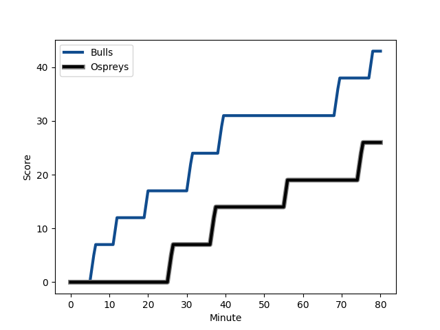
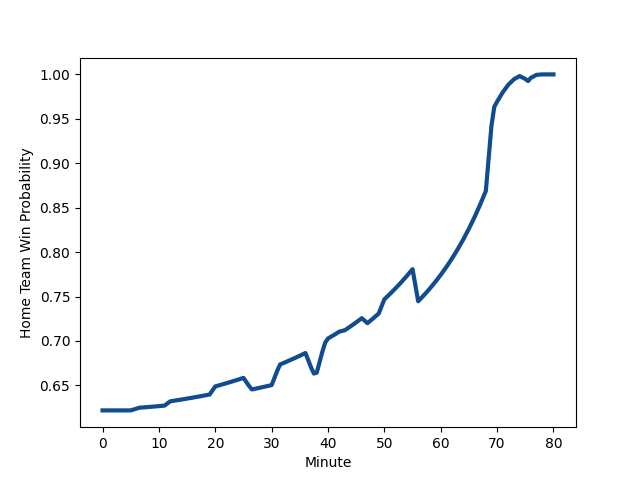

---  
layout: page  
title: Ospreys at Bulls; 26-43  
date: 2022-11-26 14:00:00 18:00:00 -0500  
categories: match review  
---
# Ospreys (1359.68) at Bulls (1575.71); 26-43

# Prediction: Bulls by 24.6

Bulls by 21.6 on a neutral field
## Scores over Time

## Win Probability over Time

# Pre-Match Prediction: Bulls by 23.8

Bulls by 20.8 on a neutral pitch

|   Away Minutes | Away Player                                                                 |   Away elo |   Away Percentile |   Number |   Home Percentile |   Home elo | Home Player                                                               |   Home Minutes |
|---------------:|:----------------------------------------------------------------------------|-----------:|------------------:|---------:|------------------:|-----------:|:--------------------------------------------------------------------------|---------------:|
|             43 | [Garyn Phillips](..//playerfiles//GarynPhillips_cleaned.md)                 |      91.95 |                25 |        1 |                91 |     111.29 | [Gerhard Steenekamp](..//playerfiles//GerhardSteenekamp_cleaned.md)       |             47 |
|             50 | [Scott Baldwin](..//playerfiles//ScottBaldwin_cleaned.md)                   |     111.79 |                92 |        2 |                96 |     118.67 | [Bismarck du Plessis](..//playerfiles//BismarckduPlessis_cleaned.md)      |             47 |
|             59 | [Tom Botha](..//playerfiles//TomBotha_cleaned.md)                           |      73.01 |                 2 |        3 |                27 |      91.01 | [Francois Klopper](..//playerfiles//FrancoisKlopper_cleaned.md)           |             47 |
|             40 | [Bradley Davies](..//playerfiles//BradleyDavies_cleaned.md)                 |     100.89 |                74 |        4 |                50 |      95.96 | [Janko Swanepoel](..//playerfiles//JankoSwanepoel_cleaned.md)             |             71 |
|             80 | [Huw Owen-Sutton](..//playerfiles//HuwOwen-Sutton_cleaned.md)               |      96.66 |                56 |        5 |                81 |     105.51 | [Ruan Nortje](..//playerfiles//RuanNortje_cleaned.md)                     |             80 |
|             80 | [Ethan Roots](..//playerfiles//EthanRoots_cleaned.md)                       |      93.61 |                41 |        6 |                76 |     104.85 | [Nizaam Carr](..//playerfiles//NizaamCarr_cleaned.md)                     |             57 |
|             70 | [Will Hickey](..//playerfiles//WillHickey_cleaned.md)                       |      95    |               nan |        7 |                53 |      97.73 | [WJ Steenkamp](..//playerfiles//WJSteenkamp_cleaned.md)                   |             80 |
|             80 | [Morgan Morris](..//playerfiles//MorganMorris_cleaned.md)                   |      78.16 |                 5 |        8 |                81 |     107.17 | [Elrigh Louw](..//playerfiles//ElrighLouw_cleaned.md)                     |             80 |
|             64 | [Rhys Webb](..//playerfiles//RhysWebb_cleaned.md)                           |      98.58 |                62 |        9 |                84 |     108.05 | [Embrose Papier](..//playerfiles//EmbrosePapier_cleaned.md)               |             47 |
|             80 | [Jack Walsh](..//playerfiles//JackWalsh_cleaned.md)                         |      94.23 |                41 |       10 |                89 |     113.93 | [Chris Smith](..//playerfiles//ChrisSmith_cleaned.md)                     |             59 |
|             80 | [Keelan Giles](..//playerfiles//KeelanGiles_cleaned.md)                     |      70.3  |                 1 |       11 |                18 |      89.45 | [Stravino Jacobs](..//playerfiles//StravinoJacobs_cleaned.md)             |             57 |
|             64 | [Keiran Williams](..//playerfiles//KeiranWilliams_cleaned.md)               |     100.02 |                64 |       12 |                97 |     127.68 | [Harold Vorster](..//playerfiles//HaroldVorster_cleaned.md)               |             80 |
|             59 | [Tiaan Thomas-Wheeler](..//playerfiles//TiaanThomas-Wheeler_cleaned.md)     |      87    |                18 |       13 |                82 |     107.68 | [Lionel Mapoe](..//playerfiles//LionelMapoe_cleaned.md)                   |             80 |
|             80 | [Luke Morgan](..//playerfiles//LukeMorgan_cleaned.md)                       |      79.22 |                 6 |       14 |                94 |     118.35 | [David Kriel](..//playerfiles//DavidKriel_cleaned.md)                     |             80 |
|             80 | [Max Nagy](..//playerfiles//MaxNagy_cleaned.md)                             |      92.89 |                40 |       15 |                82 |     106.64 | [Wandisile Simelane](..//playerfiles//WandisileSimelane_cleaned.md)       |             80 |
|             40 | [Jack Regan](..//playerfiles//JackRegan_cleaned.md)                         |      94.5  |               nan |       16 |                 7 |      84.48 | [Jan Hendrik Wessels](..//playerfiles//JanHendrikWessels_cleaned.md)      |             33 |
|             37 | [Rhys Henry](..//playerfiles//RhysHenry_cleaned.md)                         |      97.41 |                56 |       17 |                61 |     100.66 | [Simphiwe Matanzima](..//playerfiles//SimphiweMatanzima_cleaned.md)       |             33 |
|             30 | [Sam Parry](..//playerfiles//SamParry_cleaned.md)                           |      87.52 |                14 |       18 |                56 |      97.22 | [Mornay Smith](..//playerfiles//MornaySmith_cleaned.md)                   |             33 |
|             21 | [Ben Warren](..//playerfiles//BenWarren_cleaned.md)                         |      96.4  |               nan |       19 |                85 |     108.37 | [Zak Burger](..//playerfiles//ZakBurger_cleaned.md)                       |             33 |
|             16 | [Cai Evans](..//playerfiles//CaiEvans_cleaned.md)                           |      91.17 |               nan |       20 |                11 |      82.97 | [Marco Jansen van Vuren](..//playerfiles//MarcoJansenvanVuren_cleaned.md) |             23 |
|             21 | [Luke Scully](..//playerfiles//LukeScully_cleaned.md)                       |      94.95 |               nan |       21 |                59 |      99.62 | [Morne Steyn](..//playerfiles//MorneSteyn_cleaned.md)                     |             21 |
|             16 | [Reuben Morgan-Williams](..//playerfiles//ReubenMorgan-Williams_cleaned.md) |      96.41 |                53 |       22 |                11 |      84.47 | [Cyle Brink](..//playerfiles//CyleBrink_cleaned.md)                       |             23 |
|             10 | [James Fender](..//playerfiles//JamesFender_cleaned.md)                     |      96    |                52 |       23 |                19 |      87.17 | [Ruan Vermaak](..//playerfiles//RuanVermaak_cleaned.md)                   |              9 |

