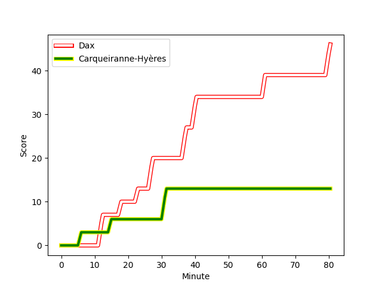
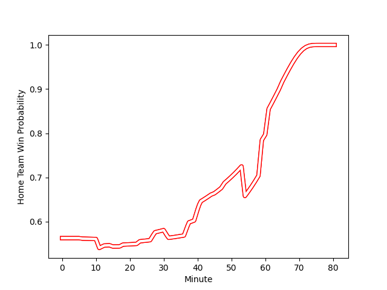

---  
layout: page  
title: Carqueiranne-Hyères at Dax; 13-46  
date: 2022-11-26 19:00:00 18:00:00 -0500  
categories: match review  
---
# Carqueiranne-Hyères (1372.93) at Dax (1482.17); 13-46

# Prediction: Dax by 13.9

Dax by 10.9 on a neutral field
## Scores over Time

## Win Probability over Time

# Pre-Match Prediction: Dax by 15.3

Dax by 12.3 on a neutral pitch

|   Away Minutes | Away Player                                                                   |   Away elo |   Away Percentile |   Number |   Home Percentile |   Home elo | Home Player                                                                |   Home Minutes |
|---------------:|:------------------------------------------------------------------------------|-----------:|------------------:|---------:|------------------:|-----------:|:---------------------------------------------------------------------------|---------------:|
|             55 | [Eli Serra-Miglietti](..//playerfiles//EliSerra-Miglietti_cleaned.md)         |      91.89 |                38 |        1 |                91 |     110.64 | [Asa Faitotoa](..//playerfiles//AsaFaitotoa_cleaned.md)                    |             41 |
|             54 | [Yan Tabarot](..//playerfiles//YanTabarot_cleaned.md)                         |      85.42 |                12 |        2 |                24 |      89.97 | [Maxime Delonca](..//playerfiles//MaximeDelonca_cleaned.md)                |             41 |
|             45 | [Lasha Mchelidze](..//playerfiles//LashaMchelidze_cleaned.md)                 |      89.9  |                27 |        3 |                 9 |      83.86 | [Thibaud Dréan](..//playerfiles//ThibaudDréan_cleaned.md)                  |             41 |
|             80 | [Sven D'Hooghe](..//playerfiles//SvenD'Hooghe_cleaned.md)                     |      84.45 |               nan |        4 |                54 |      96.04 | [Mattieu Bidau](..//playerfiles//MattieuBidau_cleaned.md)                  |             48 |
|             48 | [Nathan Gendre](..//playerfiles//NathanGendre_cleaned.md)                     |      94.26 |                46 |        5 |                84 |     107.38 | [Yoan Gaune](..//playerfiles//YoanGaune_cleaned.md)                        |             80 |
|             59 | [Florian Munoz Rivero](..//playerfiles//FlorianMunozRivero_cleaned.md)        |      99.11 |                63 |        6 |                53 |      97.94 | [Théo Tremeau](..//playerfiles//ThéoTremeau_cleaned.md)                    |             80 |
|             80 | [Alexander Nowicki](..//playerfiles//AlexanderNowicki_cleaned.md)             |      87.77 |                19 |        7 |                68 |     100.7  | [Paul Arnaud Ausset](..//playerfiles//PaulArnaudAusset_cleaned.md)         |             80 |
|             80 | [Julien Ormea](..//playerfiles//JulienOrmea_cleaned.md)                       |      90.19 |                28 |        8 |                20 |      88.07 | [Mat Luamanu](..//playerfiles//MatLuamanu_cleaned.md)                      |             59 |
|             54 | [Rémi Dubié](..//playerfiles//RémiDubié_cleaned.md)                           |      86.88 |                17 |        9 |                23 |      89.71 | [Simon Garrouteigt](..//playerfiles//SimonGarrouteigt_cleaned.md)          |             54 |
|             65 | [Lachie Munro](..//playerfiles//LachieMunro_cleaned.md)                       |     101.74 |                70 |       10 |                82 |     108.12 | [Hugo Cerisier](..//playerfiles//HugoCerisier_cleaned.md)                  |             54 |
|             11 | [Sanaila Radevokula](..//playerfiles//SanailaRadevokula_cleaned.md)           |      77.09 |                 4 |       11 |                31 |      91.53 | [Julien Dechavanne](..//playerfiles//JulienDechavanne_cleaned.md)          |             48 |
|             80 | [Dylan Sage](..//playerfiles//DylanSage_cleaned.md)                           |      90.2  |                26 |       12 |                51 |      96.13 | [Ilikena Bolakoro](..//playerfiles//IlikenaBolakoro_cleaned.md)            |             80 |
|             80 | [David Raikuna](..//playerfiles//DavidRaikuna_cleaned.md)                     |      76.22 |                 4 |       13 |                83 |     108.79 | [Hugo Fourquet](..//playerfiles//HugoFourquet_cleaned.md)                  |             80 |
|             80 | [David Smith](..//playerfiles//DavidSmith_cleaned.md)                         |     104.5  |                78 |       14 |                47 |      95.15 | [Théo Gatelier](..//playerfiles//ThéoGatelier_cleaned.md)                  |             80 |
|             80 | [Adrien Amans](..//playerfiles//AdrienAmans_cleaned.md)                       |      76.66 |                 6 |       15 |                78 |     106.08 | [Théo Duprat](..//playerfiles//ThéoDuprat_cleaned.md)                      |             80 |
|             25 | [Leonel Oviedo](..//playerfiles//LeonelOviedo_cleaned.md)                     |     107.86 |                86 |       16 |                42 |      96.11 | [Louis Mary](..//playerfiles//LouisMary_cleaned.md)                        |             39 |
|             26 | [Michael Tyumenev](..//playerfiles//MichaelTyumenev_cleaned.md)               |      76.44 |                 2 |       17 |                80 |     105.28 | [Elvis Levi](..//playerfiles//ElvisLevi_cleaned.md)                        |             39 |
|             32 | [Geoffrey Nouhaillaguet](..//playerfiles//GeoffreyNouhaillaguet_cleaned.md)   |      86.17 |                16 |       18 |                28 |      95.67 | [Anthony Pelmard](..//playerfiles//AnthonyPelmard_cleaned.md)              |             39 |
|             21 | [Nicolas Baquer](..//playerfiles//NicolasBaquer_cleaned.md)                   |      93.58 |                43 |       19 |                52 |      95.68 | [Étienne Loiret](..//playerfiles//ÉtienneLoiret_cleaned.md)                |             32 |
|             15 | [Théo Defrance](..//playerfiles//ThéoDefrance_cleaned.md)                     |      89.19 |                22 |       20 |                22 |      89.97 | [Diaby Doucouré](..//playerfiles//DiabyDoucouré_cleaned.md)                |             21 |
|             26 | [Bastien Bourgier](..//playerfiles//BastienBourgier_cleaned.md)               |      93.2  |                39 |       21 |                87 |     111.94 | [Sylvère Reteau](..//playerfiles//SylvèreReteau_cleaned.md)                |             26 |
|             69 | [Charles Brousse](..//playerfiles//CharlesBrousse_cleaned.md)                 |     120.21 |                95 |       22 |                51 |      96.97 | [Felipe Berchesi Pisano](..//playerfiles//FelipeBerchesiPisano_cleaned.md) |             26 |
|             35 | [Jean-Baptiste Reggiardo](..//playerfiles//Jean-BaptisteReggiardo_cleaned.md) |      95.31 |                50 |       23 |                51 |      96.42 | [Guillaume Bouche](..//playerfiles//GuillaumeBouche_cleaned.md)            |             32 |

