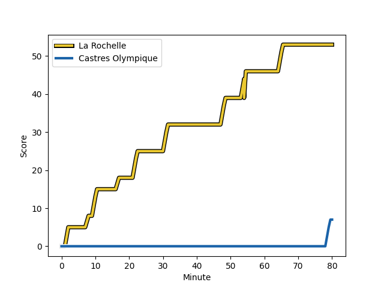
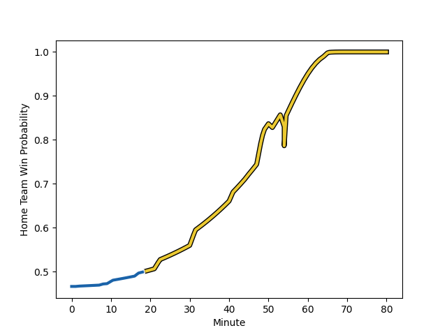

---  
layout: page  
title: Castres Olympique at La Rochelle; 7-53  
date: 2022-11-26 15:00:00 18:00:00 -0500  
categories: match review  
---
# Castres Olympique (1565.32) at La Rochelle (1506.89); 7-53

# Prediction: Castres Olympique by 2.8

Castres Olympique by 5.8 on a neutral field
## Scores over Time

## Win Probability over Time

# Pre-Match Prediction: Castres Olympique by 2.0

Castres Olympique by 5.0 on a neutral pitch

|   Away Minutes | Away Player                                                             |   Away elo |   Away Percentile |   Number |   Home Percentile |   Home elo | Home Player                                                           |   Home Minutes |
|---------------:|:------------------------------------------------------------------------|-----------:|------------------:|---------:|------------------:|-----------:|:----------------------------------------------------------------------|---------------:|
|             45 | [Quentin Walcker](..//playerfiles//QuentinWalcker_cleaned.md)           |      93.65 |                40 |        1 |                37 |      93.25 | [Thierry Paiva](..//playerfiles//ThierryPaiva_cleaned.md)             |             49 |
|             45 | [Gaetan Barlot](..//playerfiles//GaetanBarlot_cleaned.md)               |     107.28 |                86 |        2 |                78 |     104.73 | [Pierre Bourgarit](..//playerfiles//PierreBourgarit_cleaned.md)       |             59 |
|             66 | [Aurélien Azar](..//playerfiles//AurélienAzar_cleaned.md)               |      80.42 |                 4 |        3 |                94 |     114.08 | [Uini Atonio](..//playerfiles//UiniAtonio_cleaned.md)                 |             51 |
|             45 | [Florent Vanverberghe](..//playerfiles//FlorentVanverberghe_cleaned.md) |     106.49 |                81 |        4 |                74 |     102.14 | [Thomas Lavault](..//playerfiles//ThomasLavault_cleaned.md)           |             54 |
|             80 | [Tom Staniforth](..//playerfiles//TomStaniforth_cleaned.md)             |      96.82 |                56 |        5 |                86 |     109.21 | [Will Skelton](..//playerfiles//WillSkelton_cleaned.md)               |             80 |
|             45 | [Mathieu Babillot](..//playerfiles//MathieuBabillot_cleaned.md)         |     103.22 |                75 |        6 |                86 |     109.26 | [Remi Bourdeau](..//playerfiles//RemiBourdeau_cleaned.md)             |             54 |
|             54 | [Asier Usarraga](..//playerfiles//AsierUsarraga_cleaned.md)             |      98.28 |                60 |        7 |                 3 |      75.53 | [Kyle Hatherell](..//playerfiles//KyleHatherell_cleaned.md)           |             80 |
|             80 | [Teariki Ben-Nicholas](..//playerfiles//TearikiBen-Nicholas_cleaned.md) |     103.89 |                68 |        8 |                56 |      98.85 | [Yoan Tanga](..//playerfiles//YoanTanga_cleaned.md)                   |             80 |
|             45 | [Julien Blanc](..//playerfiles//JulienBlanc_cleaned.md)                 |     100.28 |                70 |        9 |                98 |     126.1  | [Tawera Kerr-Barlow](..//playerfiles//TaweraKerr-Barlow_cleaned.md)   |             51 |
|             54 | [Ben Botica](..//playerfiles//BenBotica_cleaned.md)                     |     130.91 |                98 |       10 |                10 |      82.56 | [Antoine Hastoy](..//playerfiles//AntoineHastoy_cleaned.md)           |             80 |
|             80 | [Geoffrey Palis](..//playerfiles//GeoffreyPalis_cleaned.md)             |     116.87 |                93 |       11 |                83 |     107.3  | [Dillyn Leyds](..//playerfiles//DillynLeyds_cleaned.md)               |             80 |
|             80 | [Adrien Seguret](..//playerfiles//AdrienSeguret_cleaned.md)             |      95.35 |                47 |       12 |                23 |      88.63 | [Pierre Boudehent](..//playerfiles//PierreBoudehent_cleaned.md)       |             41 |
|             80 | [Adrea Cocagi](..//playerfiles//AdreaCocagi_cleaned.md)                 |     128.44 |                97 |       13 |                67 |     101.08 | [Raymond Rhule](..//playerfiles//RaymondRhule_cleaned.md)             |             80 |
|             80 | [Martin Laveau](..//playerfiles//MartinLaveau_cleaned.md)               |     105.92 |                81 |       14 |                71 |     101.29 | [Teddy Thomas](..//playerfiles//TeddyThomas_cleaned.md)               |             80 |
|             80 | [Thomas Larregain](..//playerfiles//ThomasLarregain_cleaned.md)         |     110.59 |                86 |       15 |                88 |     111.65 | [Brice Dulin](..//playerfiles//BriceDulin_cleaned.md)                 |             54 |
|             35 | [Antoine Tichit](..//playerfiles//AntoineTichit_cleaned.md)             |     106.82 |                85 |       16 |                83 |     108.3  | [Jonathan Danty](..//playerfiles//JonathanDanty_cleaned.md)           |             39 |
|             35 | [Gauthier Doubrere](..//playerfiles//GauthierDoubrere_cleaned.md)       |     101.7  |                71 |       17 |                89 |     109.78 | [Reda Wardi](..//playerfiles//RedaWardi_cleaned.md)                   |             31 |
|             35 | [Pierre Colonna](..//playerfiles//PierreColonna_cleaned.md)             |      96.7  |               nan |       18 |               nan |      93.61 | [Aleksandre Kuntelia](..//playerfiles//AleksandreKuntelia_cleaned.md) |             29 |
|             35 | [Gauthier Maravat](..//playerfiles//GauthierMaravat_cleaned.md)         |      92.51 |                29 |       19 |                34 |      90.82 | [Thomas Berjon](..//playerfiles//ThomasBerjon_cleaned.md)             |             29 |
|             35 | [Tyler Ardron](..//playerfiles//TylerArdron_cleaned.md)                 |     105.84 |                79 |       20 |                80 |     105.72 | [Ultan Dillane](..//playerfiles//UltanDillane_cleaned.md)             |             26 |
|             26 | [Louis Le Brun](..//playerfiles//LouisLeBrun_cleaned.md)                |      91.86 |                28 |       21 |                44 |      93.51 | [Romain Sazy](..//playerfiles//RomainSazy_cleaned.md)                 |             26 |
|             26 | [Josaia Raisuqe](..//playerfiles//JosaiaRaisuqe_cleaned.md)             |      90.43 |                26 |       22 |                42 |      95.12 | [Pierre Popelin](..//playerfiles//PierrePopelin_cleaned.md)           |             26 |
|             14 | [Levan Chilachava](..//playerfiles//LevanChilachava_cleaned.md)         |     111.02 |               nan |       23 |                10 |      84.84 | [Quentin Lespiaucq](..//playerfiles//QuentinLespiaucq_cleaned.md)     |             21 |

