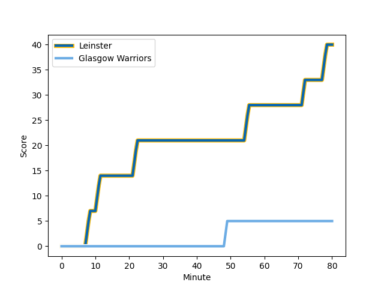
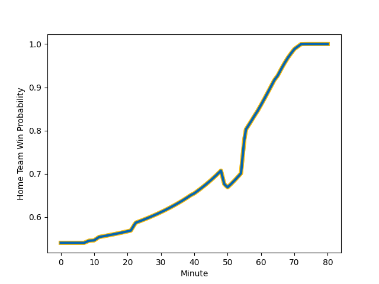

---  
layout: page  
title: Glasgow Warriors at Leinster; 5-40  
date: 2022-11-26 16:15:00 18:00:00 -0500  
categories: match review  
---
# Glasgow Warriors (1542.46) at Leinster (1613.15); 5-40

# Prediction: Leinster by 10.1

Leinster by 7.1 on a neutral field
## Scores over Time

## Win Probability over Time

# Pre-Match Prediction: Leinster by 12.0

Leinster by 9.0 on a neutral pitch

|   Away Minutes | Away Player                                                               |   Away elo |   Away Percentile |   Number |   Home Percentile |   Home elo | Home Player                                                 |   Home Minutes |
|---------------:|:--------------------------------------------------------------------------|-----------:|------------------:|---------:|------------------:|-----------:|:------------------------------------------------------------|---------------:|
|             55 | [Oli Kebble](..//playerfiles//OliKebble_cleaned.md)                       |     125.8  |                99 |        1 |                96 |     118.51 | [Ed Byrne](..//playerfiles//EdByrne_cleaned.md)             |             50 |
|             55 | [Fraser Brown](..//playerfiles//FraserBrown_cleaned.md)                   |     119.51 |                96 |        2 |                94 |     117.23 | [Ronan Kelleher](..//playerfiles//RonanKelleher_cleaned.md) |             65 |
|             55 | [Murphy Walker](..//playerfiles//MurphyWalker_cleaned.md)                 |      97.52 |                56 |        3 |                55 |      97.13 | [Tom Clarkson](..//playerfiles//TomClarkson_cleaned.md)     |             50 |
|             80 | [Sintu Manjezi](..//playerfiles//SintuManjezi_cleaned.md)                 |      98.81 |                64 |        4 |                97 |     124.06 | [Ross Molony](..//playerfiles//RossMolony_cleaned.md)       |             80 |
|             59 | [Alex Samuel](..//playerfiles//AlexSamuel_cleaned.md)                     |     122.86 |                96 |        5 |                71 |     100.74 | [Joe McCarthy](..//playerfiles//JoeMcCarthy_cleaned.md)     |             50 |
|             80 | [Gregor Brown](..//playerfiles//GregorBrown_cleaned.md)                   |      97.22 |                56 |        6 |                98 |     127.29 | [Rhys Ruddock](..//playerfiles//RhysRuddock_cleaned.md)     |             50 |
|             80 | [Sione Vailanu](..//playerfiles//SioneVailanu_cleaned.md)                 |      90.39 |                28 |        7 |                69 |     101.32 | [Scott Penny](..//playerfiles//ScottPenny_cleaned.md)       |             80 |
|             80 | [Jack Dempsey](..//playerfiles//JackDempsey_cleaned.md)                   |      89.1  |                25 |        8 |                89 |     114.2  | [Max Deegan](..//playerfiles//MaxDeegan_cleaned.md)         |             80 |
|             70 | [George Horne](..//playerfiles//GeorgeHorne_cleaned.md)                   |     124.69 |                98 |        9 |                90 |     112.51 | [Luke McGrath](..//playerfiles//LukeMcGrath_cleaned.md)     |             59 |
|             80 | [Tom Jordan](..//playerfiles//TomJordan_cleaned.md)                       |      90.99 |                25 |       10 |                73 |     103.04 | [Ross Byrne](..//playerfiles//RossByrne_cleaned.md)         |             70 |
|             55 | [Rufus McLean](..//playerfiles//RufusMcLean_cleaned.md)                   |     100.28 |                68 |       11 |                91 |     113.78 | [Dave Kearney](..//playerfiles//DaveKearney_cleaned.md)     |             80 |
|             80 | [Stafford McDowall](..//playerfiles//StaffordMcDowall_cleaned.md)         |     107    |                80 |       12 |                91 |     115.67 | [Charlie Ngatai](..//playerfiles//CharlieNgatai_cleaned.md) |             40 |
|             80 | [Kyle Steyn](..//playerfiles//KyleSteyn_cleaned.md)                       |      96.54 |                51 |       13 |                73 |     103.13 | [Liam Turner](..//playerfiles//LiamTurner_cleaned.md)       |             80 |
|             80 | [Sebastian Cancelliere](..//playerfiles//SebastianCancelliere_cleaned.md) |     113.89 |                91 |       14 |                38 |      92.84 | [Rob Russell](..//playerfiles//RobRussell_cleaned.md)       |             80 |
|             80 | [Josh McKay](..//playerfiles//JoshMcKay_cleaned.md)                       |      98.09 |                59 |       15 |                69 |     100.82 | [Jamie Osborne](..//playerfiles//JamieOsborne_cleaned.md)   |             80 |
|             25 | [Johnny Matthews](..//playerfiles//JohnnyMatthews_cleaned.md)             |      92.83 |                33 |       16 |                88 |     113.26 | [Harry Byrne](..//playerfiles//HarryByrne_cleaned.md)       |             40 |
|             25 | [Jamie Bhatti](..//playerfiles//JamieBhatti_cleaned.md)                   |     106.41 |                84 |       17 |                55 |      96.41 | [Jason Jenkins](..//playerfiles//JasonJenkins_cleaned.md)   |             30 |
|             25 | [Simon Berghan](..//playerfiles//SimonBerghan_cleaned.md)                 |      92.92 |                40 |       18 |                85 |     108.34 | [Ryan Baird](..//playerfiles//RyanBaird_cleaned.md)         |             30 |
|             18 | [Ross Thompson](..//playerfiles//RossThompson_cleaned.md)                 |      90.81 |                22 |       19 |               nan |      94.68 | [Michael Milne](..//playerfiles//MichaelMilne_cleaned.md)   |             30 |
|             21 | [JP du Preez](..//playerfiles//JPduPreez_cleaned.md)                      |      88.87 |                25 |       20 |               nan |      95.24 | [Vakh Abdaladze](..//playerfiles//VakhAbdaladze_cleaned.md) |             30 |
|             10 | [Jamie Dobie](..//playerfiles//JamieDobie_cleaned.md)                     |      92.85 |                37 |       21 |                38 |      92.98 | [Cormac Foley](..//playerfiles//CormacFoley_cleaned.md)     |             21 |
|              7 | [Euan Ferrie](..//playerfiles//EuanFerrie_cleaned.md)                     |     107.66 |               nan |       22 |                55 |      96.64 | [John McKee](..//playerfiles//JohnMcKee_cleaned.md)         |             15 |
|            nan | nan                                                                       |     nan    |               nan |       23 |                62 |      98.57 | [Chris Cosgrave](..//playerfiles//ChrisCosgrave_cleaned.md) |             10 |

