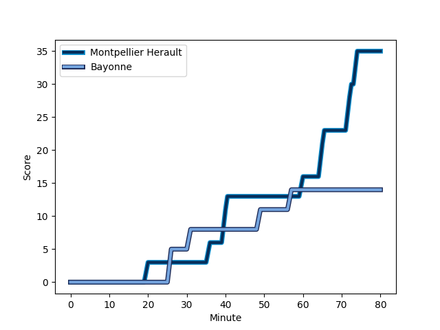
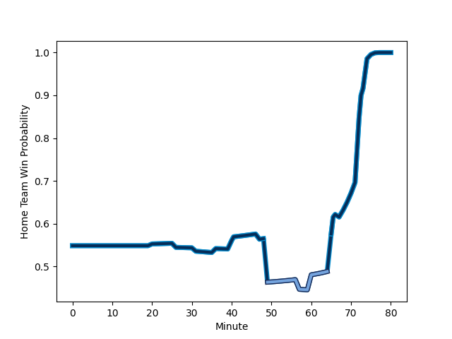

---  
layout: page  
title: Bayonne at Montpellier Herault; 14-35  
date: 2022-11-26 15:00:00 18:00:00 -0500  
categories: match review  
---
# Bayonne (1511.03) at Montpellier Herault (1595.79); 14-35

# Prediction: Montpellier Herault by 11.5

Montpellier Herault by 8.5 on a neutral field
## Scores over Time

## Win Probability over Time

# Pre-Match Prediction: Montpellier Herault by 12.4

Montpellier Herault by 9.4 on a neutral pitch

|   Away Minutes | Away Player                                                                  |   Away elo |   Away Percentile |   Number |   Home Percentile |   Home elo | Home Player                                                                     |   Home Minutes |
|---------------:|:-----------------------------------------------------------------------------|-----------:|------------------:|---------:|------------------:|-----------:|:--------------------------------------------------------------------------------|---------------:|
|             47 | [Matis Perchaud](..//playerfiles//MatisPerchaud_cleaned.md)                  |      77.72 |                 3 |        1 |                86 |     107.18 | [Enzo Forletta](..//playerfiles//EnzoForletta_cleaned.md)                       |             49 |
|             47 | [Thomas Acquier](..//playerfiles//ThomasAcquier_cleaned.md)                  |     120.53 |                96 |        2 |                23 |      89.84 | [Brandon Paenga-Amosa](..//playerfiles//BrandonPaenga-Amosa_cleaned.md)         |             67 |
|             55 | [Pieter Scholtz](..//playerfiles//PieterScholtz_cleaned.md)                  |      92.13 |                32 |        3 |                35 |      92.75 | [Titi Lamositele](..//playerfiles//TitiLamositele_cleaned.md)                   |             49 |
|             80 | [Denis Marchois](..//playerfiles//DenisMarchois_cleaned.md)                  |     114.51 |                92 |        4 |                90 |     112.29 | [Florian Verhaeghe](..//playerfiles//FlorianVerhaeghe_cleaned.md)               |             80 |
|             47 | [Kote Mikautadze](..//playerfiles//KoteMikautadze_cleaned.md)                |      79.28 |                 7 |        5 |                95 |     119.12 | [Bastien Chalureau](..//playerfiles//BastienChalureau_cleaned.md)               |             73 |
|             47 | [Pierre Huguet](..//playerfiles//PierreHuguet_cleaned.md)                    |      92.02 |                34 |        6 |                94 |     117.42 | [Yacouba Camara](..//playerfiles//YacoubaCamara_cleaned.md)                     |             80 |
|             80 | [Baptiste Heguy](..//playerfiles//BaptisteHeguy_cleaned.md)                  |     104.43 |                78 |        7 |                40 |      93.24 | [Alexandre Becognee](..//playerfiles//AlexandreBecognee_cleaned.md)             |             80 |
|             80 | [OJ Noa](..//playerfiles//OJNoa_cleaned.md)                                  |      95.22 |                45 |        8 |                66 |     101.82 | [Zach Mercer](..//playerfiles//ZachMercer_cleaned.md)                           |             80 |
|             55 | [Michael Ruru](..//playerfiles//MichaelRuru_cleaned.md)                      |     116.59 |                93 |        9 |                76 |     104.51 | [Léo Coly](..//playerfiles//LéoColy_cleaned.md)                                 |             57 |
|             80 | [Camille Lopez](..//playerfiles//CamilleLopez_cleaned.md)                    |     129.25 |                96 |       10 |                72 |     102.92 | [Louis Carbonel](..//playerfiles//LouisCarbonel_cleaned.md)                     |             65 |
|             80 | [Remy Baget](..//playerfiles//RemyBaget_cleaned.md)                          |      94.11 |                44 |       11 |                93 |     116.43 | [Ben Lam](..//playerfiles//BenLam_cleaned.md)                                   |             80 |
|             80 | [Yann David](..//playerfiles//YannDavid_cleaned.md)                          |      94.05 |                43 |       12 |                98 |     130.62 | [Geoffrey Doumayrou](..//playerfiles//GeoffreyDoumayrou_cleaned.md)             |             67 |
|             67 | [Eneriko Buliruarua](..//playerfiles//EnerikoBuliruarua_cleaned.md)          |      89.07 |                24 |       13 |                17 |      86.28 | [Thomas Darmon](..//playerfiles//ThomasDarmon_cleaned.md)                       |             80 |
|             80 | [Martin Bogado](..//playerfiles//MartinBogado_cleaned.md)                    |     101.59 |                72 |       14 |                97 |     124.36 | [Vincent Rattez](..//playerfiles//VincentRattez_cleaned.md)                     |             67 |
|             65 | [Gaetan Germain](..//playerfiles//GaetanGermain_cleaned.md)                  |      94.34 |                47 |       15 |                90 |     111.85 | [Julien Tisseron](..//playerfiles//JulienTisseron_cleaned.md)                   |             80 |
|             33 | [Facundo Bosch](..//playerfiles//FacundoBosch_cleaned.md)                    |     105.4  |                81 |       16 |                69 |     101.94 | [Simon-Pierre Chauvac](..//playerfiles//Simon-PierreChauvac_cleaned.md)         |             31 |
|             33 | [Thomas Ceyte](..//playerfiles//ThomasCeyte_cleaned.md)                      |     113.62 |                91 |       17 |                40 |      93.63 | [Mohamed Haouas](..//playerfiles//MohamedHaouas_cleaned.md)                     |             31 |
|             33 | [Uzair Cassiem](..//playerfiles//UzairCassiem_cleaned.md)                    |     104.17 |                74 |       18 |                90 |     113.63 | [Cobus Reinach](..//playerfiles//CobusReinach_cleaned.md)                       |             23 |
|             33 | [Swan Cormenier](..//playerfiles//SwanCormenier_cleaned.md)                  |     102.49 |                75 |       19 |                21 |      90.08 | [Louis Foursans-Bourdette](..//playerfiles//LouisFoursans-Bourdette_cleaned.md) |             15 |
|             25 | [Pascal Cotet](..//playerfiles//PascalCotet_cleaned.md)                      |      91.16 |                26 |       20 |                48 |      95.58 | [Pierre Lucas](..//playerfiles//PierreLucas_cleaned.md)                         |             13 |
|             25 | [Guillaume Rouet Piffard](..//playerfiles//GuillaumeRouetPiffard_cleaned.md) |      95.79 |                51 |       21 |                64 |     101.89 | [Marco Tauleigne](..//playerfiles//MarcoTauleigne_cleaned.md)                   |             13 |
|             15 | [Jason Robertson](..//playerfiles//JasonRobertson_cleaned.md)                |      81    |                 7 |       22 |                 5 |      80.63 | [Jeremie Maurouard](..//playerfiles//JeremieMaurouard_cleaned.md)               |             13 |
|             13 | [Guillaume Martocq](..//playerfiles//GuillaumeMartocq_cleaned.md)            |     103.42 |                75 |       23 |                31 |      90.41 | [Tyler Duguid](..//playerfiles//TylerDuguid_cleaned.md)                         |              7 |

