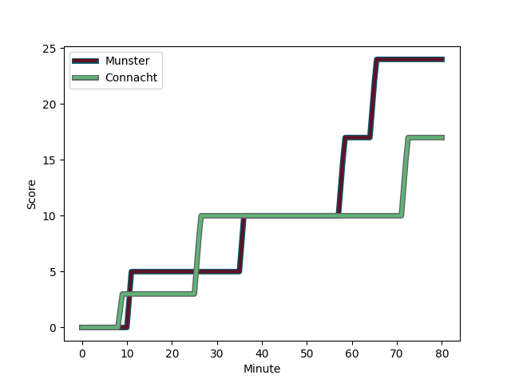
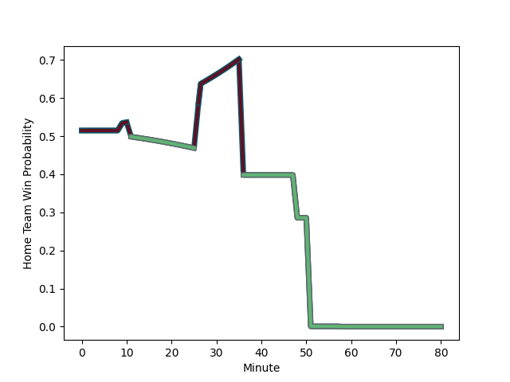

---  
layout: page  
title: Connacht at Munster; 17-24  
date: 2022-11-26 20:35:00 18:00:00 -0500  
categories: match review  
---
# Connacht (1512.59) at Munster (1538.5); 17-24

# Prediction: Munster by 5.6

Munster by 2.6 on a neutral field
## Scores over Time

## Win Probability over Time

# Pre-Match Prediction: Munster by 0.6

Connacht by 2.4 on a neutral pitch

|   Away Minutes | Away Player                                                     |   Away elo |   Away Percentile |   Number |   Home Percentile |   Home elo | Home Player                                                   |   Home Minutes |
|---------------:|:----------------------------------------------------------------|-----------:|------------------:|---------:|------------------:|-----------:|:--------------------------------------------------------------|---------------:|
|             59 | [Denis Buckley](..//playerfiles//DenisBuckley_cleaned.md)       |     102.33 |                74 |        1 |                23 |      88.53 | [Josh Wycherley](..//playerfiles//JoshWycherley_cleaned.md)   |             48 |
|             66 | [Dave Heffernan](..//playerfiles//DaveHeffernan_cleaned.md)     |      94.33 |                47 |        2 |                90 |     109.9  | [Diarmuid Barron](..//playerfiles//DiarmuidBarron_cleaned.md) |             53 |
|             51 | [Finlay Bealham](..//playerfiles//FinlayBealham_cleaned.md)     |     102.4  |                77 |        3 |               nan |      95.01 | [Roman Salanoa](..//playerfiles//RomanSalanoa_cleaned.md)     |             48 |
|             51 | [Josh Murphy](..//playerfiles//JoshMurphy_cleaned.md)           |     118.08 |                94 |        4 |                73 |     101.62 | [Jean Kleyn](..//playerfiles//JeanKleyn_cleaned.md)           |             66 |
|             64 | [Gavin Thornbury](..//playerfiles//GavinThornbury_cleaned.md)   |     101.21 |                72 |        5 |                91 |     114.05 | [Tadhg Beirne](..//playerfiles//TadhgBeirne_cleaned.md)       |             80 |
|             80 | [Cian Prendergast](..//playerfiles//CianPrendergast_cleaned.md) |      83.53 |                12 |        6 |                10 |      83.71 | [Peter O'Mahony](..//playerfiles//PeterO'Mahony_cleaned.md)   |             36 |
|             80 | [Conor Oliver](..//playerfiles//ConorOliver_cleaned.md)         |      99.33 |                64 |        7 |                38 |      92.94 | [John Hodnett](..//playerfiles//JohnHodnett_cleaned.md)       |             80 |
|             51 | [Jarrad Butler](..//playerfiles//JarradButler_cleaned.md)       |      99.2  |                59 |        8 |                35 |      91.99 | [Alex Kendellen](..//playerfiles//AlexKendellen_cleaned.md)   |             53 |
|             59 | [Caolin Blade](..//playerfiles//CaolinBlade_cleaned.md)         |      98.94 |                63 |        9 |                66 |      98.06 | [Craig Casey](..//playerfiles//CraigCasey_cleaned.md)         |             80 |
|             80 | [Jack Carty](..//playerfiles//JackCarty_cleaned.md)             |     108.37 |                82 |       10 |                44 |      95.15 | [Joey Carbery](..//playerfiles//JoeyCarbery_cleaned.md)       |             80 |
|             80 | [Alex Wootton](..//playerfiles//AlexWootton_cleaned.md)         |      98.02 |                60 |       11 |                97 |     124.32 | [Shane Daly](..//playerfiles//ShaneDaly_cleaned.md)           |             80 |
|             80 | [Bundee Aki](..//playerfiles//BundeeAki_cleaned.md)             |     124.94 |                97 |       12 |                92 |     116.27 | [Rory Scannell](..//playerfiles//RoryScannell_cleaned.md)     |             80 |
|             80 | [Tom Farrell](..//playerfiles//TomFarrell_cleaned.md)           |      84.98 |                14 |       13 |                40 |      92.66 | [Antoine Frisch](..//playerfiles//AntoineFrisch_cleaned.md)   |             80 |
|             57 | [Byron Ralston](..//playerfiles//ByronRalston_cleaned.md)       |      85.24 |                15 |       14 |                90 |     113.22 | [Calvin Nash](..//playerfiles//CalvinNash_cleaned.md)         |             80 |
|             80 | [John Porch](..//playerfiles//JohnPorch_cleaned.md)             |     113.39 |                90 |       15 |                46 |      93.96 | [Mike Haley](..//playerfiles//MikeHaley_cleaned.md)           |             42 |
|             29 | [Jack Aungier](..//playerfiles//JackAungier_cleaned.md)         |      97.84 |                58 |       16 |                82 |     106.5  | [Jack O'Donoghue](..//playerfiles//JackO'Donoghue_cleaned.md) |             44 |
|             29 | [Paul Boyle](..//playerfiles//PaulBoyle_cleaned.md)             |     102.45 |                72 |       17 |                49 |      96.5  | [Jack Crowley](..//playerfiles//JackCrowley_cleaned.md)       |             38 |
|             29 | [Oisin Dowling](..//playerfiles//OisinDowling_cleaned.md)       |      88.84 |                24 |       18 |                91 |     110.78 | [Jeremy Loughman](..//playerfiles//JeremyLoughman_cleaned.md) |             32 |
|             23 | [Conor Fitzgerald](..//playerfiles//ConorFitzgerald_cleaned.md) |      83.42 |                13 |       19 |                70 |     100.7  | [John Ryan](..//playerfiles//JohnRyan_cleaned.md)             |             32 |
|             21 | [Peter Dooley](..//playerfiles//PeterDooley_cleaned.md)         |     120.46 |                97 |       20 |                75 |     102.17 | [Niall Scannell](..//playerfiles//NiallScannell_cleaned.md)   |             27 |
|             21 | [Kieran Marmion](..//playerfiles//KieranMarmion_cleaned.md)     |     111.18 |                89 |       21 |                86 |     111.38 | [Gavin Coombes](..//playerfiles//GavinCoombes_cleaned.md)     |             27 |
|             16 | [Darragh Murray](..//playerfiles//DarraghMurray_cleaned.md)     |      93.81 |               nan |       22 |                33 |      91.62 | [Edwin Edogbo](..//playerfiles//EdwinEdogbo_cleaned.md)       |             14 |
|             14 | [Shane Delahunt](..//playerfiles//ShaneDelahunt_cleaned.md)     |     113.85 |                94 |       23 |               nan |     nan    | nan                                                           |            nan |

