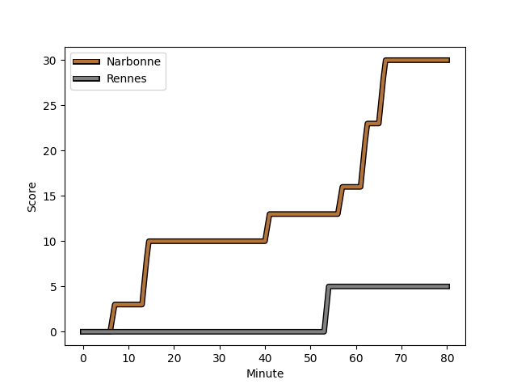
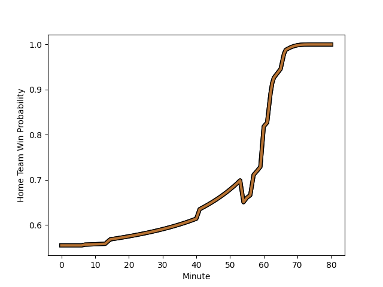

---  
layout: page  
title: Rennes at Narbonne; 5-30  
date: 2022-11-26 18:30:00 18:00:00 -0500  
categories: match review  
---
# Rennes (1308.09) at Narbonne (1404.2); 5-30

# Prediction: Narbonne by 12.6

Narbonne by 9.6 on a neutral field
## Scores over Time

## Win Probability over Time

# Pre-Match Prediction: Narbonne by 13.4

Narbonne by 10.4 on a neutral pitch

|   Away Minutes | Away Player                                                                |   Away elo |   Away Percentile |   Number |   Home Percentile |   Home elo | Home Player                                                         |   Home Minutes |
|---------------:|:---------------------------------------------------------------------------|-----------:|------------------:|---------:|------------------:|-----------:|:--------------------------------------------------------------------|---------------:|
|             76 | [Baptiste Le Jallé](..//playerfiles//BaptisteLeJallé_cleaned.md)           |      86.71 |                14 |        1 |                 8 |      84.18 | [Sylvain Abadie](..//playerfiles//SylvainAbadie_cleaned.md)         |             46 |
|             55 | [Alexandre Fau](..//playerfiles//AlexandreFau_cleaned.md)                  |      87.63 |                13 |        2 |                77 |     103.75 | [Christophe David](..//playerfiles//ChristopheDavid_cleaned.md)     |             57 |
|             40 | [Grégory Querin](..//playerfiles//GrégoryQuerin_cleaned.md)                |      91.05 |                27 |        3 |                10 |      84.63 | [Matthieu Loudet](..//playerfiles//MatthieuLoudet_cleaned.md)       |             55 |
|             51 | [Victor Fromenteze](..//playerfiles//VictorFromenteze_cleaned.md)          |      69.31 |                 2 |        4 |                29 |      90.48 | [Valentin Sese](..//playerfiles//ValentinSese_cleaned.md)           |             80 |
|             80 | [Alexandre Gueroult](..//playerfiles//AlexandreGueroult_cleaned.md)        |      84.12 |                14 |        5 |                55 |     100.11 | [Mauro Rebussone](..//playerfiles//MauroRebussone_cleaned.md)       |             55 |
|             46 | [Guillaume Cazette](..//playerfiles//GuillaumeCazette_cleaned.md)          |      87.37 |                17 |        6 |                38 |      93.6  | [Guillem Montagne](..//playerfiles//GuillemMontagne_cleaned.md)     |             63 |
|             80 | [Luca Di Salvatore](..//playerfiles//LucaDiSalvatore_cleaned.md)           |      89.62 |                24 |        7 |                 1 |      70.32 | [Paul Belzons](..//playerfiles//PaulBelzons_cleaned.md)             |             80 |
|             80 | [Téo Gazin](..//playerfiles//TéoGazin_cleaned.md)                          |      95.91 |                51 |        8 |                81 |     106.96 | [Luke Nakobukobua](..//playerfiles//LukeNakobukobua_cleaned.md)     |             80 |
|             55 | [Matéo Jeune-Joly](..//playerfiles//MatéoJeune-Joly_cleaned.md)            |      90.52 |                27 |        9 |                 4 |      78.72 | [Pierrick Nova](..//playerfiles//PierrickNova_cleaned.md)           |             63 |
|             80 | [Lucas Ollion](..//playerfiles//LucasOllion_cleaned.md)                    |      83.56 |                 9 |       10 |                21 |      89.09 | [Tom Chauvet](..//playerfiles//TomChauvet_cleaned.md)               |             80 |
|             80 | [Romuald François](..//playerfiles//RomualdFrançois_cleaned.md)            |      83.57 |                 9 |       11 |                73 |     101.83 | [Étienne Ducom](..//playerfiles//ÉtienneDucom_cleaned.md)           |             80 |
|             80 | [Gonzalo Lopez Bontempo](..//playerfiles//GonzaloLopezBontempo_cleaned.md) |      86.78 |                17 |       12 |                85 |     109.92 | [Jose Lima](..//playerfiles//JoseLima_cleaned.md)                   |             60 |
|             65 | [Alexis François](..//playerfiles//AlexisFrançois_cleaned.md)              |      90.53 |                26 |       13 |                15 |      85.39 | [Pierre Nueno](..//playerfiles//PierreNueno_cleaned.md)             |             80 |
|             40 | [Mathieu Brignonen](..//playerfiles//MathieuBrignonen_cleaned.md)          |      89.88 |                24 |       14 |                83 |     107.4  | [Pierre-Hugo Ducom](..//playerfiles//Pierre-HugoDucom_cleaned.md)   |             40 |
|             80 | [Pedro Soto](..//playerfiles//PedroSoto_cleaned.md)                        |      91.54 |                36 |       15 |                31 |      90.8  | [Tom Homer](..//playerfiles//TomHomer_cleaned.md)                   |             80 |
|             25 | [Pierre Strippoli](..//playerfiles//PierreStrippoli_cleaned.md)            |      94.71 |                49 |       16 |                57 |      97.74 | [Geoffrey Moise](..//playerfiles//GeoffreyMoise_cleaned.md)         |             34 |
|             40 | [Luvuyo Pupuma](..//playerfiles//LuvuyoPupuma_cleaned.md)                  |      90.81 |                26 |       17 |                35 |      92.51 | [Jordan Rochier](..//playerfiles//JordanRochier_cleaned.md)         |             23 |
|             34 | [Gaétan Béraud](..//playerfiles//GaétanBéraud_cleaned.md)                  |      81.37 |                 8 |       18 |                94 |     115.89 | [Théo Castinel](..//playerfiles//ThéoCastinel_cleaned.md)           |             25 |
|             25 | [Yvan Leroyer](..//playerfiles//YvanLeroyer_cleaned.md)                    |      83.24 |                10 |       19 |                54 |      96.05 | [Morgan Maga](..//playerfiles//MorganMaga_cleaned.md)               |             25 |
|             15 | [Clément Lepresle](..//playerfiles//ClémentLepresle_cleaned.md)            |      91.42 |                40 |       20 |                92 |     112.13 | [Martin Vaca](..//playerfiles//MartinVaca_cleaned.md)               |             17 |
|             40 | [Alexandre Nicoue](..//playerfiles//AlexandreNicoue_cleaned.md)            |      77.14 |                 4 |       21 |                23 |      91.03 | [Christopher Kaiser](..//playerfiles//ChristopherKaiser_cleaned.md) |             17 |
|              4 | [Clément Fontaine](..//playerfiles//ClémentFontaine_cleaned.md)            |      70.45 |                 2 |       22 |                53 |      96.86 | [Thibault Santoro](..//playerfiles//ThibaultSantoro_cleaned.md)     |             20 |
|             29 | [Gabriel Quesmel](..//playerfiles//GabrielQuesmel_cleaned.md)              |      96.13 |                52 |       23 |                37 |      92.8  | [Théo Mias](..//playerfiles//ThéoMias_cleaned.md)                   |             40 |

