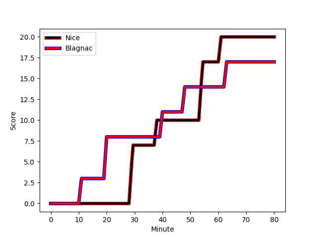

---  
layout: page  
title: Blagnac at Nice; 17-20  
date: 2022-11-26 18:00:00 18:00:00 -0500  
categories: match review  
---
# Blagnac (1391.97) at Nice (1426.86); 17-20

# Prediction: Nice by 6.5

Nice by 3.5 on a neutral field
## Scores over Time

## Win Probability over Time

# Pre-Match Prediction: Nice by 7.2

Nice by 4.2 on a neutral pitch

|   Away Minutes | Away Player                                                     |   Away elo |   Away Percentile |   Number |   Home Percentile |   Home elo | Home Player                                                               |   Home Minutes |
|---------------:|:----------------------------------------------------------------|-----------:|------------------:|---------:|------------------:|-----------:|:--------------------------------------------------------------------------|---------------:|
|             49 | [Alexis Decaux](..//playerfiles//AlexisDecaux_cleaned.md)       |      98.41 |                69 |        1 |                83 |     106    | [Nicolas Lemaire](..//playerfiles//NicolasLemaire_cleaned.md)             |             50 |
|             49 | [Gabin Villerouge](..//playerfiles//GabinVillerouge_cleaned.md) |      98.42 |                64 |        2 |                17 |      87.43 | [Badri Alkhazashvili](..//playerfiles//BadriAlkhazashvili_cleaned.md)     |             66 |
|             57 | [Fabien Lorenzon](..//playerfiles//FabienLorenzon_cleaned.md)   |      90.85 |                26 |        3 |                14 |      86.56 | [Jemal Shatirishvili](..//playerfiles//JemalShatirishvili_cleaned.md)     |             80 |
|             49 | [Nikita Bekov](..//playerfiles//NikitaBekov_cleaned.md)         |      99.4  |                64 |        4 |                70 |     100.61 | [Thibaud Rey](..//playerfiles//ThibaudRey_cleaned.md)                     |             80 |
|             80 | [Lilian Rousset](..//playerfiles//LilianRousset_cleaned.md)     |      95.43 |                52 |        5 |                45 |      94.1  | [Martin Freytes](..//playerfiles//MartinFreytes_cleaned.md)               |             59 |
|             80 | [Mathieu Vachon](..//playerfiles//MathieuVachon_cleaned.md)     |      94.65 |                44 |        6 |                21 |      89.19 | [Nicolas Tachat](..//playerfiles//NicolasTachat_cleaned.md)               |             80 |
|             80 | [Mateo Ibanez](..//playerfiles//MateoIbanez_cleaned.md)         |      99.29 |                63 |        7 |                90 |     115.23 | [Laijiasa Bolenaivalu](..//playerfiles//LaijiasaBolenaivalu_cleaned.md)   |             80 |
|             80 | [Lucas Tolofua](..//playerfiles//LucasTolofua_cleaned.md)       |      81.91 |                10 |        8 |                55 |      96.77 | [Arthur Vignolles](..//playerfiles//ArthurVignolles_cleaned.md)           |             49 |
|             80 | [Paul Ravier](..//playerfiles//PaulRavier_cleaned.md)           |      96.47 |                53 |        9 |                72 |     101.52 | [Mathieu Loree](..//playerfiles//MathieuLoree_cleaned.md)                 |             80 |
|             80 | [Valentin Delpy](..//playerfiles//ValentinDelpy_cleaned.md)     |     104.11 |                73 |       10 |                 8 |      81.65 | [Alban Conduche](..//playerfiles//AlbanConduche_cleaned.md)               |             49 |
|             80 | [Simon Villemur](..//playerfiles//SimonVillemur_cleaned.md)     |      94.48 |                43 |       11 |                17 |      87.37 | [Hugo Martin](..//playerfiles//HugoMartin_cleaned.md)                     |             80 |
|             80 | [Guillaume Piron](..//playerfiles//GuillaumePiron_cleaned.md)   |      77.53 |                 5 |       12 |                83 |     108.12 | [Julien Fritz](..//playerfiles//JulienFritz_cleaned.md)                   |             80 |
|             80 | [Aurelien Labau](..//playerfiles//AurelienLabau_cleaned.md)     |      88.03 |                21 |       13 |                35 |      91.69 | [Luca Cutayar](..//playerfiles//LucaCutayar_cleaned.md)                   |             40 |
|             57 | [Dorian Terrou](..//playerfiles//DorianTerrou_cleaned.md)       |     106.3  |                81 |       14 |                36 |      92.45 | [Sakiusa Bureitakiyaca](..//playerfiles//SakiusaBureitakiyaca_cleaned.md) |             80 |
|             80 | [Antoine Renaud](..//playerfiles//AntoineRenaud_cleaned.md)     |      76.13 |                 4 |       15 |                12 |      82.6  | [Loic Le Gal](..//playerfiles//LoicLeGal_cleaned.md)                      |             80 |
|             31 | [Cesar Biscioni](..//playerfiles//CesarBiscioni_cleaned.md)     |      89.63 |                22 |       16 |                56 |      96.69 | [Nika Neparidze](..//playerfiles//NikaNeparidze_cleaned.md)               |             30 |
|             31 | [Florian Bertrand](..//playerfiles//FlorianBertrand_cleaned.md) |      94.7  |                48 |       17 |               nan |      95.43 | [Killian Taofifenua](..//playerfiles//KillianTaofifenua_cleaned.md)       |             14 |
|             23 | [Baptiste Collet](..//playerfiles//BaptisteCollet_cleaned.md)   |      97.24 |               nan |       18 |                76 |     103.42 | [Marvin Woki](..//playerfiles//MarvinWoki_cleaned.md)                     |             21 |
|             31 | [Vincent Mutel](..//playerfiles//VincentMutel_cleaned.md)       |      90.52 |                29 |       19 |                35 |      92.56 | [Louis Suaud](..//playerfiles//LouisSuaud_cleaned.md)                     |             31 |
|             23 | [Guilhem Graulle](..//playerfiles//GuilhemGraulle_cleaned.md)   |      95.9  |                50 |       20 |                 8 |      82.14 | [Hugo Verdu](..//playerfiles//HugoVerdu_cleaned.md)                       |             31 |
|            nan | nan                                                             |     nan    |               nan |       21 |                77 |     104.99 | [Jens Torfs](..//playerfiles//JensTorfs_cleaned.md)                       |             40 |

