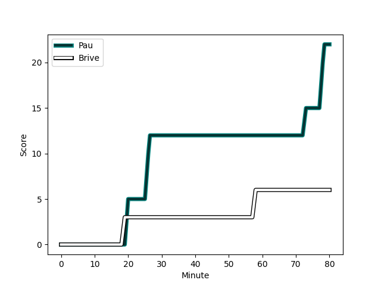
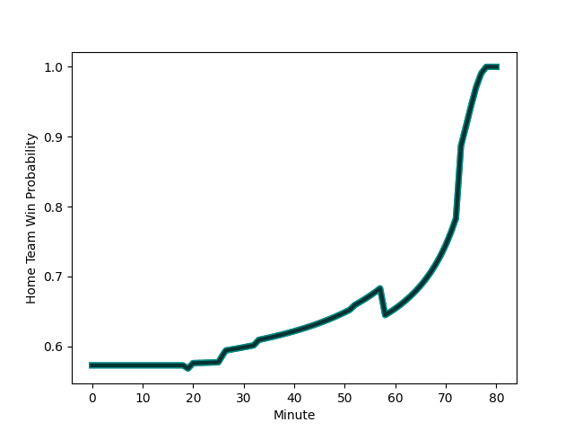

---  
layout: page  
title: Brive at Pau; 6-22  
date: 2022-11-26 15:00:00 18:00:00 -0500  
categories: match review  
---
# Brive (1457.34) at Pau (1584.98); 6-22

# Prediction: Pau by 15.8

Pau by 12.8 on a neutral field
## Scores over Time

## Win Probability over Time

# Pre-Match Prediction: Pau by 14.0

Pau by 11.0 on a neutral pitch

|   Away Minutes | Away Player                                                           |   Away elo |   Away Percentile |   Number |   Home Percentile |   Home elo | Home Player                                                           |   Home Minutes |
|---------------:|:----------------------------------------------------------------------|-----------:|------------------:|---------:|------------------:|-----------:|:----------------------------------------------------------------------|---------------:|
|             33 | [Nathan Fraissenon](..//playerfiles//NathanFraissenon_cleaned.md)     |      97.71 |               nan |        1 |                80 |     104.87 | [Ignacio Calles](..//playerfiles//IgnacioCalles_cleaned.md)           |             52 |
|             52 | [Vano Karkadze](..//playerfiles//VanoKarkadze_cleaned.md)             |      91.73 |                30 |        2 |                74 |     103.44 | [Romain Ruffenach](..//playerfiles//RomainRuffenach_cleaned.md)       |             58 |
|             52 | [Pietro Ceccarelli](..//playerfiles//PietroCeccarelli_cleaned.md)     |      91.3  |                28 |        3 |                 9 |      83.71 | [Guram Papidze](..//playerfiles//GuramPapidze_cleaned.md)             |             52 |
|             80 | [Oskar Rixen](..//playerfiles//OskarRixen_cleaned.md)                 |      95.81 |                52 |        4 |                13 |      83.46 | [Guillaume Ducat](..//playerfiles//GuillaumeDucat_cleaned.md)         |             80 |
|             24 | [Lucas Paulos](..//playerfiles//LucasPaulos_cleaned.md)               |     101.61 |                77 |        5 |                75 |     102.34 | [Fabrice Metz](..//playerfiles//FabriceMetz_cleaned.md)               |             52 |
|             80 | [Matthieu Voisin](..//playerfiles//MatthieuVoisin_cleaned.md)         |      90.27 |                26 |        6 |                76 |     103.94 | [Beka Gorgadze](..//playerfiles//BekaGorgadze_cleaned.md)             |             80 |
|             59 | [Retief Marais](..//playerfiles//RetiefMarais_cleaned.md)             |      93.54 |                41 |        7 |                48 |      96.55 | [Reece Hewat](..//playerfiles//ReeceHewat_cleaned.md)                 |             80 |
|             80 | [Esteban Abadie](..//playerfiles//EstebanAbadie_cleaned.md)           |      87.05 |                17 |        8 |                49 |      96.13 | [Jordan Joseph](..//playerfiles//JordanJoseph_cleaned.md)             |             62 |
|             52 | [Paul Abadie](..//playerfiles//PaulAbadie_cleaned.md)                 |      86.35 |                13 |        9 |                96 |     120.65 | [Thibault Daubagna](..//playerfiles//ThibaultDaubagna_cleaned.md)     |             58 |
|             59 | [Stuart Olding](..//playerfiles//StuartOlding_cleaned.md)             |      96.21 |                51 |       10 |                97 |     129.49 | [Zack Henry](..//playerfiles//ZackHenry_cleaned.md)                   |             80 |
|             80 | [Axel Muller](..//playerfiles//AxelMuller_cleaned.md)                 |     105.42 |                80 |       11 |                59 |      97.72 | [Daniel Ikpefan](..//playerfiles//DanielIkpefan_cleaned.md)           |             80 |
|             59 | [Nico Lee](..//playerfiles//NicoLee_cleaned.md)                       |     107.17 |                81 |       12 |                98 |     129.69 | [Tumua Manu](..//playerfiles//TumuaManu_cleaned.md)                   |             80 |
|             80 | [Seta Tuicuvu](..//playerfiles//SetaTuicuvu_cleaned.md)               |      93.85 |                43 |       13 |                91 |     118.9  | [Émilien Gailleton](..//playerfiles//ÉmilienGailleton_cleaned.md)     |             80 |
|             80 | [Joris Jurand](..//playerfiles//JorisJurand_cleaned.md)               |      98.7  |                64 |       14 |                99 |     133.95 | [Clement Laporte](..//playerfiles//ClementLaporte_cleaned.md)         |             41 |
|             80 | [Thomas Laranjeira](..//playerfiles//ThomasLaranjeira_cleaned.md)     |     120.15 |                95 |       15 |                62 |      98.81 | [Jack Maddocks](..//playerfiles//JackMaddocks_cleaned.md)             |             80 |
|             56 | [Julien Delannoy](..//playerfiles//JulienDelannoy_cleaned.md)         |      84.69 |                15 |       16 |                 9 |      82.86 | [Elliot Roudil](..//playerfiles//ElliotRoudil_cleaned.md)             |             39 |
|             47 | [Malino Vanai](..//playerfiles//MalinoVanai_cleaned.md)               |      93.07 |                39 |       17 |                80 |     107.77 | [Remi Seneca](..//playerfiles//RemiSeneca_cleaned.md)                 |             28 |
|             28 | [Marcel van der Merwe](..//playerfiles//MarcelvanderMerwe_cleaned.md) |     101.74 |                72 |       18 |                55 |      96.99 | [Lekima Tagitagivalu](..//playerfiles//LekimaTagitagivalu_cleaned.md) |             28 |
|             28 | [Vaso Lobzhanidze](..//playerfiles//VasoLobzhanidze_cleaned.md)       |      92.08 |                33 |       19 |                90 |     110.46 | [Siate Tokolahi](..//playerfiles//SiateTokolahi_cleaned.md)           |             28 |
|             28 | [Florian Dufour](..//playerfiles//FlorianDufour_cleaned.md)           |     105.15 |                84 |       20 |                32 |      91.61 | [Youri Delhommel](..//playerfiles//YouriDelhommel_cleaned.md)         |             22 |
|             21 | [Abraham Papali'i](..//playerfiles//AbrahamPapali'i_cleaned.md)       |     103.78 |                73 |       21 |                95 |     119.53 | [Dan Robson](..//playerfiles//DanRobson_cleaned.md)                   |             22 |
|             21 | [Nicolas Sanchez](..//playerfiles//NicolasSanchez_cleaned.md)         |     125.85 |                96 |       22 |                68 |     101.78 | [Martin Puech](..//playerfiles//MartinPuech_cleaned.md)               |             18 |
|             21 | [Sammy Arnold](..//playerfiles//SammyArnold_cleaned.md)               |      85.1  |                15 |       23 |               nan |     nan    | nan                                                                   |            nan |

