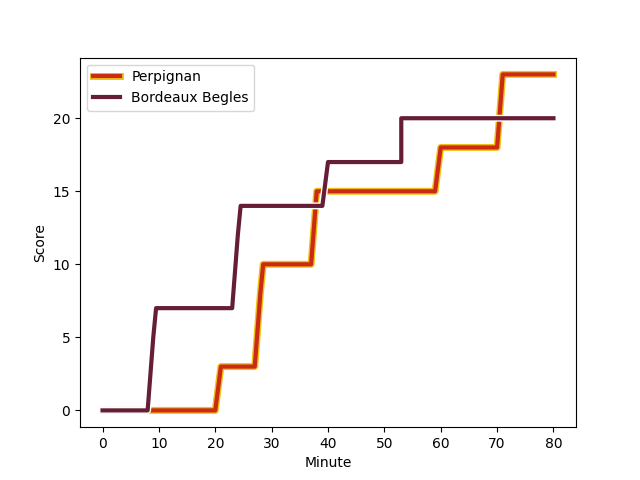
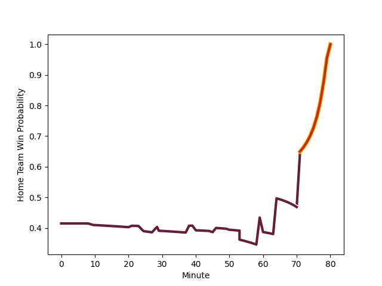

---  
layout: page  
title: Bordeaux Begles at Perpignan; 20-23  
date: 2022-11-26 15:00:00 18:00:00 -0500  
categories: match review  
---
# Bordeaux Begles (1618.78) at Perpignan (1469.72); 20-23

# Prediction: Bordeaux Begles by 11.9

Bordeaux Begles by 14.9 on a neutral field
## Scores over Time

## Win Probability over Time

# Pre-Match Prediction: Bordeaux Begles by 15.7

Bordeaux Begles by 18.7 on a neutral pitch

|   Away Minutes | Away Player                                                             |   Away elo |   Away Percentile |   Number |   Home Percentile |   Home elo | Home Player                                                             |   Home Minutes |
|---------------:|:------------------------------------------------------------------------|-----------:|------------------:|---------:|------------------:|-----------:|:------------------------------------------------------------------------|---------------:|
|             46 | [Jefferson Poirot](..//playerfiles//JeffersonPoirot_cleaned.md)         |      90.29 |                26 |        1 |                 7 |      82.36 | [Xavier Chiocci](..//playerfiles//XavierChiocci_cleaned.md)             |             80 |
|             46 | [Clement Maynadier](..//playerfiles//ClementMaynadier_cleaned.md)       |     119.9  |                97 |        2 |                 3 |      77.56 | [Seilala Lam](..//playerfiles//SeilalaLam_cleaned.md)                   |             73 |
|             46 | [Ben Tameifuna](..//playerfiles//BenTameifuna_cleaned.md)               |     126.23 |                99 |        3 |                90 |     109.84 | [Arthur Joly](..//playerfiles//ArthurJoly_cleaned.md)                   |             45 |
|             80 | [Kane Douglas](..//playerfiles//KaneDouglas_cleaned.md)                 |      94.19 |                45 |        4 |                 3 |      72.64 | [Tristan Labouteley](..//playerfiles//TristanLabouteley_cleaned.md)     |             60 |
|             80 | [Jandré Marais](..//playerfiles//JandréMarais_cleaned.md)               |     125.2  |                97 |        5 |                68 |     100.12 | [Piula Faasalele](..//playerfiles//PiulaFaasalele_cleaned.md)           |             57 |
|             78 | [Pierre Bochaton](..//playerfiles//PierreBochaton_cleaned.md)           |      93.91 |                43 |        6 |                85 |     108.66 | [Lucas Bachelier](..//playerfiles//LucasBachelier_cleaned.md)           |             50 |
|             80 | [Mahamadou Diaby](..//playerfiles//MahamadouDiaby_cleaned.md)           |      92.27 |                36 |        7 |                15 |      86.85 | [Kelian Galletier](..//playerfiles//KelianGalletier_cleaned.md)         |             80 |
|             59 | [Antoine Miquel](..//playerfiles//AntoineMiquel_cleaned.md)             |      94.07 |                44 |        8 |                80 |     106.37 | [Joaquin Oviedo](..//playerfiles//JoaquinOviedo_cleaned.md)             |             80 |
|             74 | [Maxime Lucu](..//playerfiles//MaximeLucu_cleaned.md)                   |     135.71 |                99 |        9 |                 6 |      79.74 | [Sadek Deghmache](..//playerfiles//SadekDeghmache_cleaned.md)           |             80 |
|             80 | [Matthieu Jalibert](..//playerfiles//MatthieuJalibert_cleaned.md)       |     108.06 |                85 |       10 |                64 |      99.64 | [Jake McIntyre](..//playerfiles//JakeMcIntyre_cleaned.md)               |             80 |
|             80 | [Madosh Tambwe](..//playerfiles//MadoshTambwe_cleaned.md)               |     121.28 |                96 |       11 |                99 |     134.62 | [Mathieu Acebes](..//playerfiles//MathieuAcebes_cleaned.md)             |             80 |
|             29 | [Yoram Moefana](..//playerfiles//YoramMoefana_cleaned.md)               |     105.24 |                79 |       12 |                89 |     113.64 | [Jeronimo de la Fuente](..//playerfiles//JeronimodelaFuente_cleaned.md) |             80 |
|             80 | [Jean-Baptiste Dubie](..//playerfiles//Jean-BaptisteDubie_cleaned.md)   |     108.69 |                79 |       13 |                90 |     112.89 | [Afusipa Taumoepeau](..//playerfiles//AfusipaTaumoepeau_cleaned.md)     |             80 |
|             80 | [Santiago Cordero](..//playerfiles//SantiagoCordero_cleaned.md)         |     101.54 |                72 |       14 |                75 |     103.55 | [George Tilsley](..//playerfiles//GeorgeTilsley_cleaned.md)             |             74 |
|             64 | [Romain Buros](..//playerfiles//RomainBuros_cleaned.md)                 |     110.24 |                84 |       15 |                 7 |      80.77 | [Tristan Tedder](..//playerfiles//TristanTedder_cleaned.md)             |             80 |
|             51 | [Zack Holmes](..//playerfiles//ZackHolmes_cleaned.md)                   |     127.97 |                97 |       16 |                79 |     103.63 | [Siua Halanukonuka](..//playerfiles//SiuaHalanukonuka_cleaned.md)       |             35 |
|             34 | [Maxime Lamothe](..//playerfiles//MaximeLamothe_cleaned.md)             |      87.8  |                18 |       17 |                91 |     112.93 | [Brad Shields](..//playerfiles//BradShields_cleaned.md)                 |             20 |
|             34 | [Lekso Kaulashvili](..//playerfiles//LeksoKaulashvili_cleaned.md)       |     113.13 |                93 |       18 |                74 |     103.74 | [Genesis Mamea Lemalu](..//playerfiles//GenesisMameaLemalu_cleaned.md)  |             30 |
|             34 | [Sipili Falatea](..//playerfiles//SipiliFalatea_cleaned.md)             |     101.5  |                81 |       19 |                13 |      82.65 | [Victor Moreaux](..//playerfiles//VictorMoreaux_cleaned.md)             |             23 |
|             21 | [Tom Willis](..//playerfiles//TomWillis_cleaned.md)                     |      93.38 |                40 |       20 |                13 |      85.8  | [Mike Tadjer Barbosa](..//playerfiles//MikeTadjerBarbosa_cleaned.md)    |              7 |
|             16 | [Louis Bielle-Biarrey](..//playerfiles//LouisBielle-Biarrey_cleaned.md) |      88.84 |                25 |       21 |                41 |      93.68 | [Matteo Rodor](..//playerfiles//MatteoRodor_cleaned.md)                 |              6 |
|              6 | [Yann Lesgourgues](..//playerfiles//YannLesgourgues_cleaned.md)         |      87.96 |                18 |       22 |               nan |     nan    | nan                                                                     |            nan |
|              2 | [Alban Roussel](..//playerfiles//AlbanRoussel_cleaned.md)               |      92.7  |                39 |       23 |               nan |     nan    | nan                                                                     |            nan |

