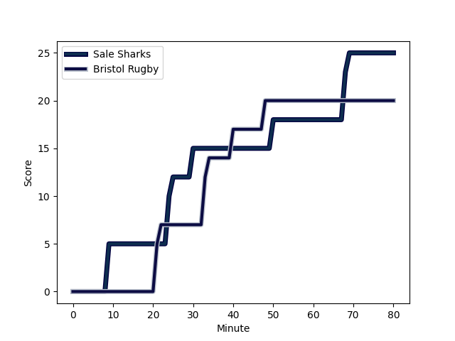
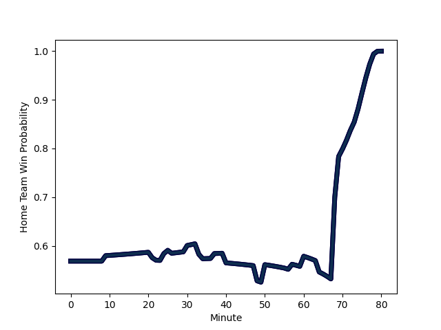

---  
layout: page  
title: Bristol Rugby at Sale Sharks; 20.0-25.0  
date: 2022-11-26 08:00:00 18:00:00 -0500  
categories: match review  
---
# Bristol Rugby (1486.3) at Sale Sharks (1606.09); 20.0-25.0

# Prediction: Sale Sharks by 15.0

Sale Sharks by 12.0 on a neutral field
## Scores over Time

## Win Probability over Time

# Pre-Match Prediction: Sale Sharks by 13.5

Sale Sharks by 10.5 on a neutral pitch

|   Away Minutes | Away Player                                                       |   Away elo |   Away Percentile |   Number |   Home Percentile |   Home elo | Home Player                                                         |   Home Minutes |
|---------------:|:------------------------------------------------------------------|-----------:|------------------:|---------:|------------------:|-----------:|:--------------------------------------------------------------------|---------------:|
|             77 | [Jake Woolmore](..//playerfiles//JakeWoolmore_cleaned.md)         |     104.17 |                78 |        1 |                97 |     119.95 | [Ross Harrison](..//playerfiles//RossHarrison_cleaned.md)           |             50 |
|             56 | [Bryan Byrne](..//playerfiles//BryanByrne_cleaned.md)             |      95.24 |                51 |        2 |                96 |     120.09 | [Akker van der Merwe](..//playerfiles//AkkervanderMerwe_cleaned.md) |             64 |
|             80 | [Max Lahiff](..//playerfiles//MaxLahiff_cleaned.md)               |      84.03 |                 9 |        3 |                29 |      91.49 | [Nic Schonert](..//playerfiles//NicSchonert_cleaned.md)             |             75 |
|             69 | [Joe Batley](..//playerfiles//JoeBatley_cleaned.md)               |     100.77 |                71 |        4 |                78 |     104.08 | [Cobus Wiese](..//playerfiles//CobusWiese_cleaned.md)               |             75 |
|             80 | [Chris Vui](..//playerfiles//ChrisVui_cleaned.md)                 |     105.54 |                81 |        5 |                85 |     108.12 | [Josh Beaumont](..//playerfiles//JoshBeaumont_cleaned.md)           |             80 |
|             67 | [Steven Luatua](..//playerfiles//StevenLuatua_cleaned.md)         |     112.53 |                90 |        6 |                98 |     131.97 | [Jean-Luc du Preez](..//playerfiles//Jean-LucduPreez_cleaned.md)    |             80 |
|             73 | [Fitz Harding](..//playerfiles//FitzHarding_cleaned.md)           |      97.92 |                53 |        7 |                69 |     101.31 | [Jono Ross](..//playerfiles//JonoRoss_cleaned.md)                   |             64 |
|             63 | [Magnus Bradbury](..//playerfiles//MagnusBradbury_cleaned.md)     |      89.13 |                23 |        8 |                94 |     124.54 | [Daniel du Preez](..//playerfiles//DanielduPreez_cleaned.md)        |             80 |
|             75 | [Will Porter](..//playerfiles//WillPorter_cleaned.md)             |      89.17 |                21 |        9 |                31 |      91.53 | [Gus Warr](..//playerfiles//GusWarr_cleaned.md)                     |             50 |
|             37 | [Callum Sheedy](..//playerfiles//CallumSheedy_cleaned.md)         |     111.36 |                86 |       10 |                13 |      85.43 | [Robert du Preez](..//playerfiles//RobertduPreez_cleaned.md)        |             80 |
|             80 | [Gabriel Ibitoye](..//playerfiles//GabrielIbitoye_cleaned.md)     |      92.03 |                34 |       11 |                97 |     125.09 | [Byron McGuigan](..//playerfiles//ByronMcGuigan_cleaned.md)         |             80 |
|             64 | [Sam Bedlow](..//playerfiles//SamBedlow_cleaned.md)               |      93.83 |                43 |       12 |                60 |      98.48 | [Sam Hill](..//playerfiles//SamHill_cleaned.md)                     |             80 |
|             80 | [Piers O'Conor](..//playerfiles//PiersO'Conor_cleaned.md)         |      78.51 |                 6 |       13 |                96 |     125.22 | [Sam James](..//playerfiles//SamJames_cleaned.md)                   |             80 |
|             80 | [Luke Morahan](..//playerfiles//LukeMorahan_cleaned.md)           |     143.46 |                99 |       14 |                46 |      94.76 | [Tom Roebuck](..//playerfiles//TomRoebuck_cleaned.md)               |             57 |
|             80 | [Charles Piutau](..//playerfiles//CharlesPiutau_cleaned.md)       |     108.78 |                82 |       15 |                12 |      82.93 | [Joe Carpenter](..//playerfiles//JoeCarpenter_cleaned.md)           |             80 |
|             24 | [Harry Thacker](..//playerfiles//HarryThacker_cleaned.md)         |      96.49 |                55 |       16 |                60 |      97.41 | [Tommy Taylor](..//playerfiles//TommyTaylor_cleaned.md)             |             16 |
|              0 | [Toti Benz-Salomon](..//playerfiles//TotiBenz-Salomon_cleaned.md) |      95    |               nan |       17 |                87 |     108.24 | [Simon McIntyre](..//playerfiles//SimonMcIntyre_cleaned.md)         |             30 |
|              3 | [Jay Tyack](..//playerfiles//JayTyack_cleaned.md)                 |     119.22 |                97 |       18 |               nan |      92.42 | [Joe Jones](..//playerfiles//JoeJones_cleaned.md)                   |              5 |
|             11 | [John Hawkins](..//playerfiles//JohnHawkins_cleaned.md)           |      82.05 |                10 |       19 |               nan |      94.38 | [Rouban Birch](..//playerfiles//RoubanBirch_cleaned.md)             |              5 |
|             37 | [Jake Heenan](..//playerfiles//JakeHeenan_cleaned.md)             |      78.98 |                 5 |       20 |                39 |      92.83 | [Sam Dugdale](..//playerfiles//SamDugdale_cleaned.md)               |             16 |
|              5 | [Andy Uren](..//playerfiles//AndyUren_cleaned.md)                 |      72    |                 1 |       21 |               nan |     110.67 | [Joe Simpson](..//playerfiles//JoeSimpson_cleaned.md)               |             30 |
|             43 | [AJ MacGinty](..//playerfiles//AJMacGinty_cleaned.md)             |      97.03 |                51 |       22 |               nan |     103.69 | [Kieran Wilkinson](..//playerfiles//KieranWilkinson_cleaned.md)     |              0 |
|             16 | [Joe Jenkins](..//playerfiles//JoeJenkins_cleaned.md)             |      91.35 |                32 |       23 |                89 |     112.44 | [Arron Reed](..//playerfiles//ArronReed_cleaned.md)                 |             23 |

