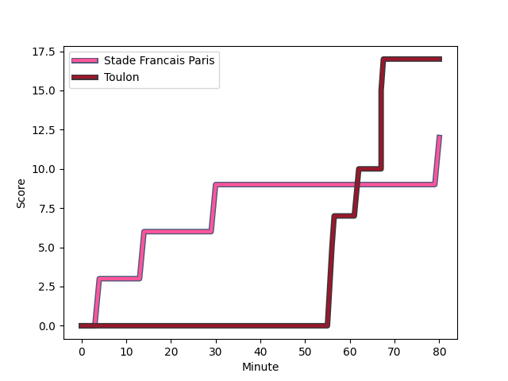
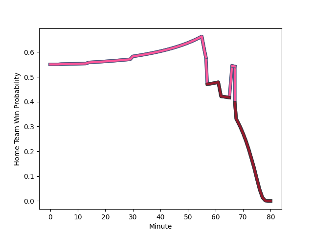

---  
layout: page  
title: Toulon at Stade Francais Paris; 17-12  
date: 2022-11-26 21:00:00 18:00:00 -0500  
categories: match review  
---
# Toulon (1490.65) at Stade Francais Paris (1578.78); 17-12

# Prediction: Stade Francais Paris by 11.8

Stade Francais Paris by 8.8 on a neutral field
## Scores over Time

## Win Probability over Time

# Pre-Match Prediction: Stade Francais Paris by 8.6

Stade Francais Paris by 5.6 on a neutral pitch

|   Away Minutes | Away Player                                                       |   Away elo |   Away Percentile |   Number |   Home Percentile |   Home elo | Home Player                                                                   |   Home Minutes |
|---------------:|:------------------------------------------------------------------|-----------:|------------------:|---------:|------------------:|-----------:|:------------------------------------------------------------------------------|---------------:|
|             57 | [Bruce Devaux](..//playerfiles//BruceDevaux_cleaned.md)           |      84.03 |                 9 |        1 |                80 |     105    | [Clement Castets](..//playerfiles//ClementCastets_cleaned.md)                 |             51 |
|             57 | [Anthony Etrillard](..//playerfiles//AnthonyEtrillard_cleaned.md) |     101.82 |                75 |        2 |                56 |      96.84 | [Mickael Ivaldi](..//playerfiles//MickaelIvaldi_cleaned.md)                   |             71 |
|             57 | [Beka Gigashvili](..//playerfiles//BekaGigashvili_cleaned.md)     |     106.19 |                85 |        3 |                79 |     104.63 | [Giorgi Melikidze](..//playerfiles//GiorgiMelikidze_cleaned.md)               |             75 |
|             80 | [Swan Rebbadj](..//playerfiles//SwanRebbadj_cleaned.md)           |      86.79 |                18 |        4 |                57 |      97.16 | [Paul Gabrillagues](..//playerfiles//PaulGabrillagues_cleaned.md)             |             74 |
|             75 | [Brian Alainu'uese](..//playerfiles//BrianAlainu'uese_cleaned.md) |     100.38 |                69 |        5 |                43 |      93.9  | [Baptiste Pesenti](..//playerfiles//BaptistePesenti_cleaned.md)               |             51 |
|             66 | [Cornell du Preez](..//playerfiles//CornellduPreez_cleaned.md)    |      94.15 |                44 |        6 |                52 |      96.15 | [Romain Briatte](..//playerfiles//RomainBriatte_cleaned.md)                   |             80 |
|             80 | [Charles Ollivon](..//playerfiles//CharlesOllivon_cleaned.md)     |     118.15 |                94 |        7 |                84 |     104.47 | [Sekou Macalou](..//playerfiles//SekouMacalou_cleaned.md)                     |             80 |
|             80 | [Facundo Isa](..//playerfiles//FacundoIsa_cleaned.md)             |     117.8  |                94 |        8 |                97 |     129.45 | [Giovanni Habel-Kueffner](..//playerfiles//GiovanniHabel-Kueffner_cleaned.md) |             80 |
|             79 | [Baptiste Serin](..//playerfiles//BaptisteSerin_cleaned.md)       |     106.68 |                83 |        9 |                17 |      87.59 | [Morgan Parra](..//playerfiles//MorganParra_cleaned.md)                       |             57 |
|             80 | [Ihaia West](..//playerfiles//IhaiaWest_cleaned.md)               |     106.31 |                78 |       10 |                95 |     125.11 | [Joris Segonds](..//playerfiles//JorisSegonds_cleaned.md)                     |             80 |
|             79 | [Gabin Villiere](..//playerfiles//GabinVilliere_cleaned.md)       |     105.49 |                80 |       11 |                98 |     128.3  | [Harry Glover](..//playerfiles//HarryGlover_cleaned.md)                       |             80 |
|             80 | [Jérémy Sinzelle](..//playerfiles//JérémySinzelle_cleaned.md)     |      77.34 |                 5 |       12 |                18 |      86.9  | [Alex Arrate](..//playerfiles//AlexArrate_cleaned.md)                         |             80 |
|             57 | [Maëlan Rabut](..//playerfiles//MaëlanRabut_cleaned.md)           |      84.48 |                15 |       13 |                82 |     107.55 | [Jeremy Ward](..//playerfiles//JeremyWard_cleaned.md)                         |             63 |
|             80 | [Jiuta Wainiqolo](..//playerfiles//JiutaWainiqolo_cleaned.md)     |      98.41 |                62 |       14 |                50 |      95.78 | [Sione Tui](..//playerfiles//SioneTui_cleaned.md)                             |             80 |
|             80 | [Aymeric Luc](..//playerfiles//AymericLuc_cleaned.md)             |      94.79 |                46 |       15 |                78 |     106.21 | [Leo Barre](..//playerfiles//LeoBarre_cleaned.md)                             |             80 |
|             23 | [Teddy Baubigny](..//playerfiles//TeddyBaubigny_cleaned.md)       |      91.07 |                29 |       16 |                82 |     107.18 | [JJ van der Mescht](..//playerfiles//JJvanderMescht_cleaned.md)               |             29 |
|             23 | [Emerick Setiano](..//playerfiles//EmerickSetiano_cleaned.md)     |     101.73 |                81 |       17 |                59 |      98.16 | [Moses Alo-Emile](..//playerfiles//MosesAlo-Emile_cleaned.md)                 |             29 |
|             23 | [Dany Priso](..//playerfiles//DanyPriso_cleaned.md)               |      99.58 |                78 |       18 |                93 |     119.91 | [James Hall](..//playerfiles//JamesHall_cleaned.md)                           |             23 |
|             23 | [Mathieu Smaili](..//playerfiles//MathieuSmaili_cleaned.md)       |      98.55 |                60 |       19 |                92 |     117.7  | [Julien Delbouis](..//playerfiles//JulienDelbouis_cleaned.md)                 |             17 |
|             14 | [Raphael Lakafia](..//playerfiles//RaphaelLakafia_cleaned.md)     |     110.14 |                88 |       20 |                82 |     105.82 | [Lucas Peyresblanques](..//playerfiles//LucasPeyresblanques_cleaned.md)       |              9 |
|              5 | [Sitaleki Timani](..//playerfiles//SitalekiTimani_cleaned.md)     |     120.91 |                96 |       21 |                33 |      91.68 | [Mathieu de Giovanni](..//playerfiles//MathieudeGiovanni_cleaned.md)          |              6 |
|              1 | [Gaël Dréan](..//playerfiles//GaëlDréan_cleaned.md)               |      88.2  |                19 |       22 |                51 |      94.21 | [Vincent Koch](..//playerfiles//VincentKoch_cleaned.md)                       |              5 |
|              1 | [Jules Danglot](..//playerfiles//JulesDanglot_cleaned.md)         |      94.08 |                44 |       23 |               nan |     nan    | nan                                                                           |            nan |

