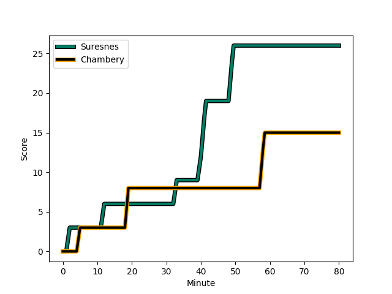
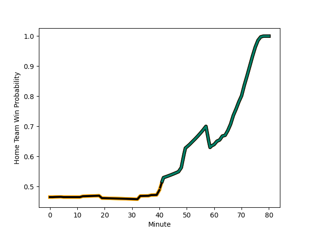

---  
layout: page  
title: Chambery at Suresnes; 15-26  
date: 2022-11-26 18:00:00 18:00:00 -0500  
categories: match review  
---
# Chambery (1396.58) at Suresnes (1335.09); 15-26

# Prediction: Chambery by 3.1

Chambery by 6.1 on a neutral field
## Scores over Time

## Win Probability over Time

# Pre-Match Prediction: Chambery by 3.2

Chambery by 6.2 on a neutral pitch

|   Away Minutes | Away Player                                                                 |   Away elo |   Away Percentile |   Number |   Home Percentile |   Home elo | Home Player                                                                  |   Home Minutes |
|---------------:|:----------------------------------------------------------------------------|-----------:|------------------:|---------:|------------------:|-----------:|:-----------------------------------------------------------------------------|---------------:|
|             52 | [Fabio Gonzalez](..//playerfiles//FabioGonzalez_cleaned.md)                 |      95.83 |                50 |        1 |                29 |      90.77 | [Lucas Dycke](..//playerfiles//LucasDycke_cleaned.md)                        |             60 |
|             52 | [Julien Primault](..//playerfiles//JulienPrimault_cleaned.md)               |      96.31 |                63 |        2 |                11 |      84.89 | [Thomas Bordes](..//playerfiles//ThomasBordes_cleaned.md)                    |             60 |
|             37 | [Nail Audoire](..//playerfiles//NailAudoire_cleaned.md)                     |      99.46 |                48 |        3 |                93 |     112.21 | [Leandro Mario Assi](..//playerfiles//LeandroMarioAssi_cleaned.md)           |             60 |
|             62 | [Fabien Witz](..//playerfiles//FabienWitz_cleaned.md)                       |      89.84 |                26 |        4 |                 4 |      74.94 | [Christopher van Leeuwen](..//playerfiles//ChristophervanLeeuwen_cleaned.md) |             48 |
|             80 | [Romain Guyot](..//playerfiles//RomainGuyot_cleaned.md)                     |      80.45 |                10 |        5 |                42 |      93.65 | [Wian Vosloo](..//playerfiles//WianVosloo_cleaned.md)                        |             80 |
|             80 | [Pierre-Nicolas Dance](..//playerfiles//Pierre-NicolasDance_cleaned.md)     |     112.57 |                90 |        6 |                15 |      86.42 | [Louis-Mathieu Jazeix](..//playerfiles//Louis-MathieuJazeix_cleaned.md)      |             67 |
|             52 | [Martin Bertrand](..//playerfiles//MartinBertrand_cleaned.md)               |      91.1  |                29 |        7 |                 3 |      76.23 | [Florian Desbordes](..//playerfiles//FlorianDesbordes_cleaned.md)            |             80 |
|             80 | [Thomas Coignat](..//playerfiles//ThomasCoignat_cleaned.md)                 |     100.64 |                72 |        8 |                99 |     138.59 | [Antonie Claassen](..//playerfiles//AntonieClaassen_cleaned.md)              |             80 |
|             80 | [Thibault Dufau](..//playerfiles//ThibaultDufau_cleaned.md)                 |      88.76 |                19 |        9 |                 5 |      79.1  | [Enzo Barbarit](..//playerfiles//EnzoBarbarit_cleaned.md)                    |             60 |
|             52 | [Dylan Nocete](..//playerfiles//DylanNocete_cleaned.md)                     |      92.19 |                34 |       10 |                85 |     110.38 | [Ignacio Mieres](..//playerfiles//IgnacioMieres_cleaned.md)                  |             64 |
|             71 | [Arthur Nennig](..//playerfiles//ArthurNennig_cleaned.md)                   |      93.1  |                39 |       11 |                 0 |      47.15 | [Ervin Muric](..//playerfiles//ErvinMuric_cleaned.md)                        |             80 |
|             80 | [Mattéo Faucher](..//playerfiles//MattéoFaucher_cleaned.md)                 |      93.07 |                36 |       12 |                31 |      91.11 | [Petero Tuwai](..//playerfiles//PeteroTuwai_cleaned.md)                      |             70 |
|             80 | [Vereniki Goneva](..//playerfiles//VerenikiGoneva_cleaned.md)               |      69.98 |                 1 |       13 |                13 |      84.28 | [Arthur Proult](..//playerfiles//ArthurProult_cleaned.md)                    |             80 |
|             80 | [Theo Velten](..//playerfiles//TheoVelten_cleaned.md)                       |      99.41 |                64 |       14 |                 9 |      82.8  | [Alexis Clément](..//playerfiles//AlexisClément_cleaned.md)                  |             80 |
|             66 | [Thomas Hecquet](..//playerfiles//ThomasHecquet_cleaned.md)                 |      96.19 |                51 |       15 |                10 |      81.27 | [Thomas Baudy](..//playerfiles//ThomasBaudy_cleaned.md)                      |             80 |
|             43 | [Giorgi Pertaia](..//playerfiles//GiorgiPertaia_cleaned.md)                 |      95.59 |                48 |       16 |                40 |      92.29 | [Youssouf Yatera](..//playerfiles//YoussoufYatera_cleaned.md)                |             32 |
|             28 | [Géraud Clermont](..//playerfiles//GéraudClermont_cleaned.md)               |      95.61 |                49 |       17 |                 4 |      78.86 | [Kakhaber Koberize](..//playerfiles//KakhaberKoberize_cleaned.md)            |             20 |
|             28 | [Gauthier Brute de Remur](..//playerfiles//GauthierBrutedeRemur_cleaned.md) |      87.43 |                17 |       18 |                36 |      92.24 | [Hayam El Bibouji](..//playerfiles//HayamElBibouji_cleaned.md)               |             20 |
|             28 | [Bastien Reymond](..//playerfiles//BastienReymond_cleaned.md)               |      96.06 |                50 |       19 |                30 |      91.25 | [Théo Bachiri](..//playerfiles//ThéoBachiri_cleaned.md)                      |             20 |
|             28 | [Matheo Triki](..//playerfiles//MatheoTriki_cleaned.md)                     |      95    |               nan |       20 |               nan |      95.37 | [Elias Coulibaly](..//playerfiles//EliasCoulibaly_cleaned.md)                |             20 |
|             18 | [Corentin Astier](..//playerfiles//CorentinAstier_cleaned.md)               |     104.77 |                80 |       21 |                16 |      86.3  | [Gaëtan Robert](..//playerfiles//GaëtanRobert_cleaned.md)                    |             16 |
|             14 | [Jules Dorrival](..//playerfiles//JulesDorrival_cleaned.md)                 |      89.12 |                26 |       22 |                84 |     107.75 | [Bastien Berenguel](..//playerfiles//BastienBerenguel_cleaned.md)            |             13 |
|              9 | [Victor Pisano](..//playerfiles//VictorPisano_cleaned.md)                   |      76.08 |                 4 |       23 |                 5 |      75.19 | [Clément Amon](..//playerfiles//ClémentAmon_cleaned.md)                      |             10 |

