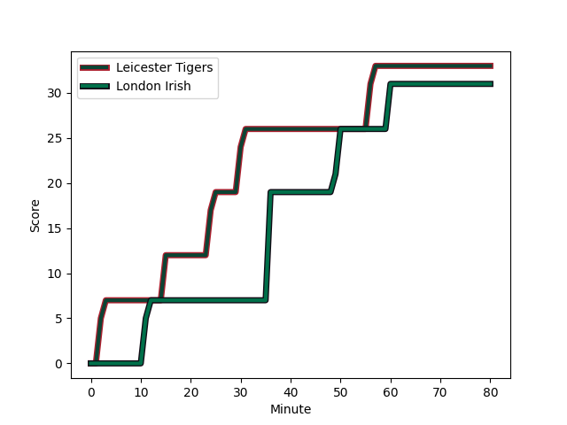
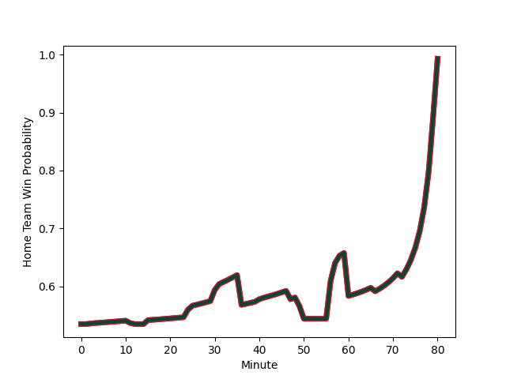

---  
layout: page  
title: London Irish at Leicester Tigers; 31.0-33.0  
date: 2022-11-27 10:00:00 18:00:00 -0500  
categories: match review  
---
# London Irish (1540.09) at Leicester Tigers (1601.35); 31.0-33.0

# Prediction: Leicester Tigers by 9.1

Leicester Tigers by 6.1 on a neutral field
## Scores over Time

## Win Probability over Time

# Pre-Match Prediction: Leicester Tigers by 7.5

Leicester Tigers by 4.5 on a neutral pitch

|   Away Minutes | Away Player                                                                       |   Away elo |   Away Percentile |   Number |   Home Percentile |   Home elo | Home Player                                                             |   Home Minutes |
|---------------:|:----------------------------------------------------------------------------------|-----------:|------------------:|---------:|------------------:|-----------:|:------------------------------------------------------------------------|---------------:|
|             41 | [Facundo Gigena](..//playerfiles//FacundoGigena_cleaned.md)                       |      91.88 |                27 |        1 |                36 |      93.9  | [James Whitcombe](..//playerfiles//JamesWhitcombe_cleaned.md)           |             59 |
|             40 | [Agustin Creevy](..//playerfiles//AgustinCreevy_cleaned.md)                       |     106.16 |                83 |        2 |                75 |     102.56 | [Julian Montoya](..//playerfiles//JulianMontoya_cleaned.md)             |             66 |
|             66 | [Lovejoy Chawatama](..//playerfiles//LovejoyChawatama_cleaned.md)                 |      91.96 |                31 |        3 |                70 |     100.78 | [Dan Cole](..//playerfiles//DanCole_cleaned.md)                         |             66 |
|             58 | [Api Ratuniyarawa](..//playerfiles//ApiRatuniyarawa_cleaned.md)                   |     101.7  |                68 |        4 |                71 |     102.03 | [George Martin](..//playerfiles//GeorgeMartin_cleaned.md)               |             80 |
|             80 | [Chunya Munga](..//playerfiles//ChunyaMunga_cleaned.md)                           |      95.01 |                48 |        5 |                47 |      94.61 | [Calum Green](..//playerfiles//CalumGreen_cleaned.md)                   |             50 |
|             58 | [Matt Rogerson](..//playerfiles//MattRogerson_cleaned.md)                         |     112.67 |                87 |        6 |                95 |     119.2  | [Hanro Liebenberg](..//playerfiles//HanroLiebenberg_cleaned.md)         |             80 |
|             80 | [Tom Pearson](..//playerfiles//TomPearson_cleaned.md)                             |     110.7  |                88 |        7 |                97 |     125.45 | [Tommy Reffell](..//playerfiles//TommyReffell_cleaned.md)               |             80 |
|             66 | [So'otala Fa'aso'o](..//playerfiles//So'otalaFa'aso'o_cleaned.md)                 |     114.66 |                89 |        8 |                14 |      85.43 | [Olly Cracknell](..//playerfiles//OllyCracknell_cleaned.md)             |             50 |
|             59 | [Joe Powell](..//playerfiles//JoePowell_cleaned.md)                               |      94.44 |                45 |        9 |                92 |     115.14 | [Richard Wigglesworth](..//playerfiles//RichardWigglesworth_cleaned.md) |             80 |
|             80 | [Paddy Jackson](..//playerfiles//PaddyJackson_cleaned.md)                         |     108.53 |                82 |       10 |                95 |     124.52 | [Freddie Burns](..//playerfiles//FreddieBurns_cleaned.md)               |             80 |
|             80 | [Ollie Hassell-Collins](..//playerfiles//OllieHassell-Collins_cleaned.md)         |      92.12 |                34 |       11 |                97 |     123.65 | [Nemani Nadolo](..//playerfiles//NemaniNadolo_cleaned.md)               |             47 |
|             80 | [Benhard Janse van Rensburg](..//playerfiles//BenhardJansevanRensburg_cleaned.md) |      92.6  |                39 |       12 |                62 |      99.21 | [Matt Scott](..//playerfiles//MattScott_cleaned.md)                     |             80 |
|             80 | [Will Joseph](..//playerfiles//WillJoseph_cleaned.md)                             |      95.08 |                47 |       13 |                50 |      95.91 | [Harry Potter](..//playerfiles//HarryPotter_cleaned.md)                 |             80 |
|             80 | [Ben Loader](..//playerfiles//BenLoader_cleaned.md)                               |     105.72 |                80 |       14 |                98 |     127.61 | [Chris Ashton](..//playerfiles//ChrisAshton_cleaned.md)                 |             72 |
|             80 | [Tom Parton](..//playerfiles//TomParton_cleaned.md)                               |     128.6  |                98 |       15 |                32 |      90.96 | [Anthony Watson](..//playerfiles//AnthonyWatson_cleaned.md)             |             80 |
|             40 | [Mike Willemse](..//playerfiles//MikeWillemse_cleaned.md)                         |     101.8  |                73 |       16 |                14 |      86.7  | [Charlie Clare](..//playerfiles//CharlieClare_cleaned.md)               |             14 |
|             39 | [Danilo Fischetti](..//playerfiles//DaniloFischetti_cleaned.md)                   |      91    |                26 |       17 |                85 |     105.69 | [Francois van Wyk](..//playerfiles//FrancoisvanWyk_cleaned.md)          |             21 |
|             14 | [Oli Hoskins](..//playerfiles//OliHoskins_cleaned.md)                             |     114.8  |                94 |       18 |                73 |     102.24 | [Joe Heyes](..//playerfiles//JoeHeyes_cleaned.md)                       |             14 |
|             22 | [Josh Caulfield](..//playerfiles//JoshCaulfield_cleaned.md)                       |      90.19 |               nan |       19 |                85 |     106.95 | [Ollie Chessum](..//playerfiles//OllieChessum_cleaned.md)               |             30 |
|             22 | [Juan Martin Gonzalez](..//playerfiles//JuanMartinGonzalez_cleaned.md)            |     111.9  |                89 |       20 |                87 |     112.68 | [Jasper Wiese](..//playerfiles//JasperWiese_cleaned.md)                 |             30 |
|             14 | [Chandler Cunningham-South](..//playerfiles//ChandlerCunningham-South_cleaned.md) |      94.52 |                50 |       21 |               nan |      95    | [Sam Edwards](..//playerfiles//SamEdwards_cleaned.md)                   |              0 |
|             21 | [Ben White](..//playerfiles//BenWhite_cleaned.md)                                 |     108.77 |                80 |       22 |                60 |      98.89 | [Charlie Atkinson](..//playerfiles//CharlieAtkinson_cleaned.md)         |              8 |
|              0 | [Luca Morisi](..//playerfiles//LucaMorisi_cleaned.md)                             |     117.56 |                93 |       23 |                46 |      94.2  | [Guy Porter](..//playerfiles//GuyPorter_cleaned.md)                     |             33 |

