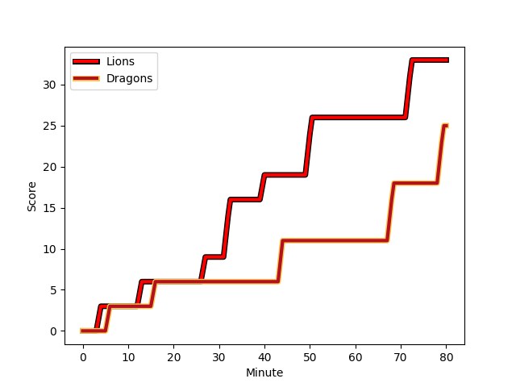
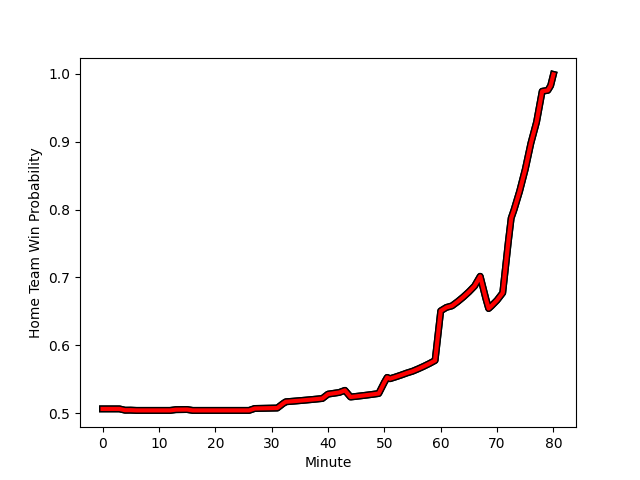

---  
layout: page  
title: Dragons at Lions; 25-33  
date: 2022-11-27 15:00:00 18:00:00 -0500  
categories: match review  
---
# Dragons (1484.46) at Lions (1495.3); 25-33

# Prediction: Lions by 4.1

Lions by 1.1 on a neutral field
## Scores over Time

## Win Probability over Time

# Pre-Match Prediction: Lions by 6.4

Lions by 3.4 on a neutral pitch

|   Away Minutes | Away Player                                                       |   Away elo |   Away Percentile |   Number |   Home Percentile |   Home elo | Home Player                                                                   |   Home Minutes |
|---------------:|:------------------------------------------------------------------|-----------:|------------------:|---------:|------------------:|-----------:|:------------------------------------------------------------------------------|---------------:|
|             67 | [Aki Seiuli](..//playerfiles//AkiSeiuli_cleaned.md)               |      94.41 |                44 |        1 |                83 |     105.68 | [Sti Sithole](..//playerfiles//StiSithole_cleaned.md)                         |             57 |
|             75 | [James Benjamin](..//playerfiles//JamesBenjamin_cleaned.md)       |      89.89 |               nan |        2 |                20 |      88.64 | [PJ Botha](..//playerfiles//PJBotha_cleaned.md)                               |             65 |
|             60 | [Lloyd Fairbrother](..//playerfiles//LloydFairbrother_cleaned.md) |      85.78 |                12 |        3 |                97 |     120.89 | [Ruan Dreyer](..//playerfiles//RuanDreyer_cleaned.md)                         |             64 |
|             43 | [Joseph Davies](..//playerfiles//JosephDavies_cleaned.md)         |      88.77 |                23 |        4 |                84 |     107.53 | [Ruben Schoeman](..//playerfiles//RubenSchoeman_cleaned.md)                   |             55 |
|             62 | [Sean Lonsdale](..//playerfiles//SeanLonsdale_cleaned.md)         |      87.15 |                19 |        5 |                71 |     100.89 | [Reinhard Nothnagel](..//playerfiles//ReinhardNothnagel_cleaned.md)           |             80 |
|             80 | [Aaron Wainwright](..//playerfiles//AaronWainwright_cleaned.md)   |     105.97 |                81 |        6 |                88 |     110.31 | [Vincent Tshituka](..//playerfiles//VincentTshituka_cleaned.md)               |             80 |
|             80 | [Ben Fry](..//playerfiles//BenFry_cleaned.md)                     |     101.64 |                67 |        7 |                56 |     100.83 | [Ruhan Straeuli](..//playerfiles//RuhanStraeuli_cleaned.md)                   |             77 |
|             80 | [Ross Moriarty](..//playerfiles//RossMoriarty_cleaned.md)         |     108.36 |                83 |        8 |                74 |     103.96 | [Francke Horn](..//playerfiles//FranckeHorn_cleaned.md)                       |              4 |
|             71 | [Lewis Jones](..//playerfiles//LewisJones_cleaned.md)             |      98.72 |                64 |        9 |                82 |     106.76 | [Sanele Nohamba](..//playerfiles//SaneleNohamba_cleaned.md)                   |             51 |
|             55 | [Sam Davies](..//playerfiles//SamDavies_cleaned.md)               |     114.69 |                90 |       10 |                12 |      84.61 | [Jordan Hendrikse](..//playerfiles//JordanHendrikse_cleaned.md)               |             67 |
|             80 | [Sio Tomkinson](..//playerfiles//SioTomkinson_cleaned.md)         |     105.17 |                78 |       11 |                39 |      93.13 | [Edwill van der Merwe](..//playerfiles//EdwillvanderMerwe_cleaned.md)         |             80 |
|             80 | [Jack Dixon](..//playerfiles//JackDixon_cleaned.md)               |     110.48 |                86 |       12 |                85 |     110.09 | [Marius Louw](..//playerfiles//MariusLouw_cleaned.md)                         |             80 |
|             80 | [Steffan Hughes](..//playerfiles//SteffanHughes_cleaned.md)       |     119.83 |                94 |       13 |                63 |      99.57 | [Henco van Wyk](..//playerfiles//HencovanWyk_cleaned.md)                      |             80 |
|             60 | [David Richards](..//playerfiles//DavidRichards_cleaned.md)       |      98.7  |                63 |       14 |                11 |      83.79 | [Rabz Maxwane](..//playerfiles//RabzMaxwane_cleaned.md)                       |             80 |
|             80 | [Angus O'Brien](..//playerfiles//AngusO'Brien_cleaned.md)         |      76.95 |                 6 |       15 |                75 |     102.81 | [Quan Horn](..//playerfiles//QuanHorn_cleaned.md)                             |             80 |
|             25 | [JJ Hanrahan](..//playerfiles//JJHanrahan_cleaned.md)             |     118.18 |                92 |       16 |                41 |      92.22 | [Sibusiso Sangweni](..//playerfiles//SibusisoSangweni_cleaned.md)             |             76 |
|             37 | [Matthew Screech](..//playerfiles//MatthewScreech_cleaned.md)     |      79.5  |                 7 |       17 |                23 |      90.11 | [Andre Warner](..//playerfiles//AndreWarner_cleaned.md)                       |             29 |
|             20 | [Jordan Williams](..//playerfiles//JordanWilliams_cleaned.md)     |     105.75 |                75 |       18 |                69 |      98.63 | [Pieter Jansen van Vuuren](..//playerfiles//PieterJansenvanVuuren_cleaned.md) |             25 |
|             20 | [Chris Coleman](..//playerfiles//ChrisColeman_cleaned.md)         |      92.26 |                27 |       19 |                44 |      94.39 | [Jean-Pierre Smith](..//playerfiles//Jean-PierreSmith_cleaned.md)             |             23 |
|             18 | [Huw Taylor](..//playerfiles//HuwTaylor_cleaned.md)               |      79.26 |                 4 |       20 |                 4 |      81.24 | [Asenathi Ntlabakanye](..//playerfiles//AsenathiNtlabakanye_cleaned.md)       |             16 |
|             13 | [Josh Reynolds](..//playerfiles//JoshReynolds_cleaned.md)         |      94.65 |               nan |       21 |                85 |     106.32 | [Jaco Visagie](..//playerfiles//JacoVisagie_cleaned.md)                       |             15 |
|              9 | [Che Hope](..//playerfiles//CheHope_cleaned.md)                   |      95    |               nan |       22 |                78 |     105.43 | [Gianni Dean Lombard](..//playerfiles//GianniDeanLombard_cleaned.md)          |             13 |
|              5 | [Ellis Shipp](..//playerfiles//EllisShipp_cleaned.md)             |      88.86 |                20 |       23 |                78 |     107.74 | [Zander du Plessis](..//playerfiles//ZanderduPlessis_cleaned.md)              |              3 |

