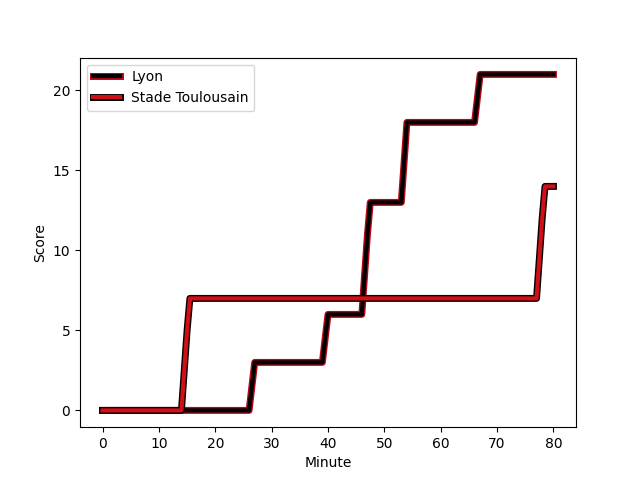
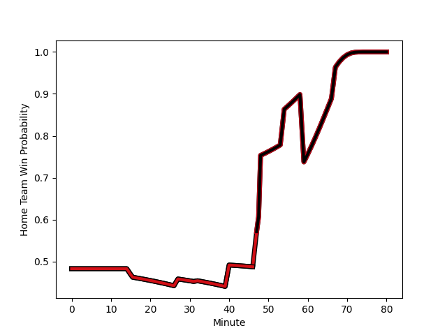

---  
layout: page  
title: Stade Toulousain at Lyon; 14-21  
date: 2022-11-27 21:00:00 18:00:00 -0500  
categories: match review  
---
# Stade Toulousain (1575.37) at Lyon (1545.97); 14-21

# Prediction: Lyon by 0.1

Stade Toulousain by 2.9 on a neutral field
## Scores over Time

## Win Probability over Time

# Pre-Match Prediction: Stade Toulousain by 3.0

Stade Toulousain by 6.0 on a neutral pitch

|   Away Minutes | Away Player                                                             |   Away elo |   Away Percentile |   Number |   Home Percentile |   Home elo | Home Player                                                                |   Home Minutes |
|---------------:|:------------------------------------------------------------------------|-----------:|------------------:|---------:|------------------:|-----------:|:---------------------------------------------------------------------------|---------------:|
|             65 | [Rodrigue Neti](..//playerfiles//RodrigueNeti_cleaned.md)               |      83.68 |                 8 |        1 |                37 |      92.54 | [Hamza Kaabeche](..//playerfiles//HamzaKaabeche_cleaned.md)                |             48 |
|             65 | [Peato Mauvaka](..//playerfiles//PeatoMauvaka_cleaned.md)               |     113.56 |                94 |        2 |                54 |      96.2  | [Yanis Charcosset](..//playerfiles//YanisCharcosset_cleaned.md)            |             48 |
|             59 | [Dorian Aldegheri](..//playerfiles//DorianAldegheri_cleaned.md)         |     113.99 |                94 |        3 |                93 |     112.62 | [Francisco Gomez Kodela](..//playerfiles//FranciscoGomezKodela_cleaned.md) |             48 |
|             80 | [Yannick Youyoutte](..//playerfiles//YannickYouyoutte_cleaned.md)       |      97.89 |                59 |        4 |                47 |      94.86 | [Theo William](..//playerfiles//TheoWilliam_cleaned.md)                    |             65 |
|             80 | [Emmanuel Meafou](..//playerfiles//EmmanuelMeafou_cleaned.md)           |      90.87 |                31 |        5 |                89 |     111.07 | [Romain Taofifenua](..//playerfiles//RomainTaofifenua_cleaned.md)          |             80 |
|             48 | [Alban Placines](..//playerfiles//AlbanPlacines_cleaned.md)             |     109.69 |                87 |        6 |                76 |     104.22 | [Dylan Cretin](..//playerfiles//DylanCretin_cleaned.md)                    |             80 |
|             40 | [Theo Ntamack](..//playerfiles//TheoNtamack_cleaned.md)                 |      96.75 |                55 |        7 |                85 |     108.31 | [Beka Saghinadze](..//playerfiles//BekaSaghinadze_cleaned.md)              |             80 |
|             80 | [Alexandre Roumat](..//playerfiles//AlexandreRoumat_cleaned.md)         |     127.7  |                96 |        8 |                95 |     118.65 | [Arno Botha](..//playerfiles//ArnoBotha_cleaned.md)                        |             48 |
|             48 | [Martin Page-Relo](..//playerfiles//MartinPage-Relo_cleaned.md)         |      92.47 |                37 |        9 |                98 |     123.91 | [Baptiste Couilloud](..//playerfiles//BaptisteCouilloud_cleaned.md)        |             74 |
|             80 | [Romain Ntamack](..//playerfiles//RomainNtamack_cleaned.md)             |     109.29 |                83 |       10 |                24 |      90.13 | [Leo Berdeu](..//playerfiles//LeoBerdeu_cleaned.md)                        |             80 |
|             80 | [Matthis Lebel](..//playerfiles//MatthisLebel_cleaned.md)               |     127.99 |                98 |       11 |                70 |     101.05 | [Ethan Dumortier](..//playerfiles//EthanDumortier_cleaned.md)              |             80 |
|             80 | [Sofiane Guitoune](..//playerfiles//SofianeGuitoune_cleaned.md)         |     104.9  |                78 |       12 |                89 |     113.35 | [Kyle Godwin](..//playerfiles//KyleGodwin_cleaned.md)                      |             80 |
|             32 | [Pierre-Louis Barassi](..//playerfiles//Pierre-LouisBarassi_cleaned.md) |      97.86 |                57 |       13 |                65 |     100.29 | [Thibault Regard](..//playerfiles//ThibaultRegard_cleaned.md)              |             80 |
|             48 | [Dimitri Delibes](..//playerfiles//DimitriDelibes_cleaned.md)           |      98.39 |                61 |       14 |                43 |      94.11 | [Xavier Mignot](..//playerfiles//XavierMignot_cleaned.md)                  |             80 |
|             80 | [Ange Capuozzo](..//playerfiles//AngeCapuozzo_cleaned.md)               |     107.79 |                82 |       15 |                58 |      97.79 | [Davit Niniashvili](..//playerfiles//DavitNiniashvili_cleaned.md)          |             80 |
|             40 | [Richie Arnold](..//playerfiles//RichieArnold_cleaned.md)               |      82.56 |                12 |       16 |                 0 |      58.96 | [Jerome Rey](..//playerfiles//JeromeRey_cleaned.md)                        |             32 |
|             48 | [Paul Costes](..//playerfiles//PaulCostes_cleaned.md)                   |      95.24 |               nan |       17 |                21 |      91.13 | [Paulo Tafili](..//playerfiles//PauloTafili_cleaned.md)                    |             32 |
|             32 | [Arthur Retiere](..//playerfiles//ArthurRetiere_cleaned.md)             |     103.1  |                75 |       18 |                90 |     116.79 | [Jordan Taufua](..//playerfiles//JordanTaufua_cleaned.md)                  |             32 |
|             32 | [Jack Willis](..//playerfiles//JackWillis_cleaned.md)                   |     116.91 |                94 |       19 |                88 |     108.52 | [Liam Coltman](..//playerfiles//LiamColtman_cleaned.md)                    |             32 |
|             32 | [Lucas Tauzin](..//playerfiles//LucasTauzin_cleaned.md)                 |     100.28 |                68 |       20 |                96 |     121.77 | [Felix Lambey](..//playerfiles//FelixLambey_cleaned.md)                    |             15 |
|             21 | [Charlie Faumuina](..//playerfiles//CharlieFaumuina_cleaned.md)         |     130.91 |                99 |       21 |                95 |     119.54 | [Jean-Marc Doussain](..//playerfiles//Jean-MarcDoussain_cleaned.md)        |              6 |
|             15 | [Guillaume Cramont](..//playerfiles//GuillaumeCramont_cleaned.md)       |      96.26 |                54 |       22 |               nan |     nan    | nan                                                                        |            nan |
|             15 | [Hugo Reilhes](..//playerfiles//HugoReilhes_cleaned.md)                 |      95    |               nan |       23 |               nan |     nan    | nan                                                                        |            nan |

