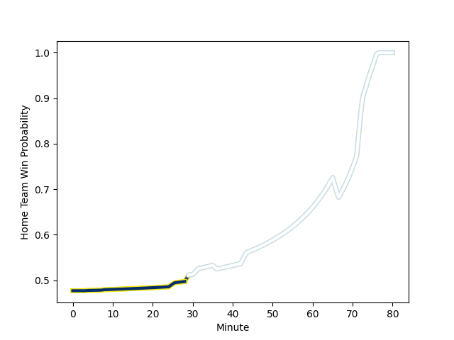

---  
layout: page  
title: Clermont Auvergne at Racing 92; 12-46  
date: 2022-11-27 17:00:00 18:00:00 -0500  
categories: match review  
---
# Clermont Auvergne (1533.09) at Racing 92 (1492.89); 12-46

# Prediction: Clermont Auvergne by 1.0

Clermont Auvergne by 4.0 on a neutral field
## Scores over Time

## Win Probability over Time

# Pre-Match Prediction: Clermont Auvergne by 4.4

Clermont Auvergne by 7.4 on a neutral pitch

|   Away Minutes | Away Player                                                         |   Away elo |   Away Percentile |   Number |   Home Percentile |   Home elo | Home Player                                                           |   Home Minutes |
|---------------:|:--------------------------------------------------------------------|-----------:|------------------:|---------:|------------------:|-----------:|:----------------------------------------------------------------------|---------------:|
|             52 | [Giorgi Beria](..//playerfiles//GiorgiBeria_cleaned.md)             |     101.34 |                73 |        1 |                14 |      86.82 | [Hassane Kolingar](..//playerfiles//HassaneKolingar_cleaned.md)       |             50 |
|             52 | [Benjamin Boudou](..//playerfiles//BenjaminBoudou_cleaned.md)       |      92.02 |                40 |        2 |                91 |     110.61 | [Camille Chat](..//playerfiles//CamilleChat_cleaned.md)               |             50 |
|             49 | [Cristian Ojovan](..//playerfiles//CristianOjovan_cleaned.md)       |      98.48 |                61 |        3 |                20 |      89.48 | [Cedate Gomes Sa](..//playerfiles//CedateGomesSa_cleaned.md)          |             50 |
|             80 | [Thibaud Lanen](..//playerfiles//ThibaudLanen_cleaned.md)           |     102.77 |                73 |        4 |                18 |      86.41 | [Cameron Woki](..//playerfiles//CameronWoki_cleaned.md)               |             64 |
|             80 | [Miles Amatosero](..//playerfiles//MilesAmatosero_cleaned.md)       |      90.52 |                26 |        5 |                 2 |      69.99 | [Fabien Sanconnie](..//playerfiles//FabienSanconnie_cleaned.md)       |             60 |
|             80 | [Loic Godener](..//playerfiles//LoicGodener_cleaned.md)             |      94.61 |                44 |        6 |                96 |     122.04 | [Wenceslas Lauret](..//playerfiles//WenceslasLauret_cleaned.md)       |             80 |
|             73 | [Killian Tixeront](..//playerfiles//KillianTixeront_cleaned.md)     |      96.58 |                54 |        7 |                35 |      91.96 | [Ibrahim Diallo](..//playerfiles//IbrahimDiallo_cleaned.md)           |             80 |
|             29 | [Fritz Lee](..//playerfiles//FritzLee_cleaned.md)                   |     142    |                99 |        8 |                59 |      99.72 | [Maxime Baudonne](..//playerfiles//MaximeBaudonne_cleaned.md)         |             80 |
|             52 | [Kevin Viallard](..//playerfiles//KevinViallard_cleaned.md)         |     104.91 |                80 |        9 |                71 |     101.01 | [Nolann Le Garrec](..//playerfiles//NolannLeGarrec_cleaned.md)        |             71 |
|             52 | [Anthony Belleau](..//playerfiles//AnthonyBelleau_cleaned.md)       |     111.1  |                86 |       10 |                70 |     102.08 | [Antoine Gibert](..//playerfiles//AntoineGibert_cleaned.md)           |             80 |
|             80 | [Alivereti Raka](..//playerfiles//AliveretiRaka_cleaned.md)         |     110.47 |                87 |       11 |                95 |     120.85 | [Juan Imhoff](..//playerfiles//JuanImhoff_cleaned.md)                 |             80 |
|             80 | [Julien Heriteau](..//playerfiles//JulienHeriteau_cleaned.md)       |      94.84 |                46 |       12 |                44 |      94.1  | [Francis Saili](..//playerfiles//FrancisSaili_cleaned.md)             |             75 |
|             64 | [George Moala](..//playerfiles//GeorgeMoala_cleaned.md)             |     116.98 |                93 |       13 |                45 |      95.02 | [Olivier Klemenczak](..//playerfiles//OlivierKlemenczak_cleaned.md)   |             80 |
|             80 | [Bautista Delguy](..//playerfiles//BautistaDelguy_cleaned.md)       |     110.86 |                87 |       14 |                73 |     102.16 | [Christian Wade](..//playerfiles//ChristianWade_cleaned.md)           |             80 |
|             80 | [Cheikh Tiberghien](..//playerfiles//CheikhTiberghien_cleaned.md)   |      93.19 |                42 |       15 |                55 |      97.81 | [Max Spring](..//playerfiles//MaxSpring_cleaned.md)                   |             41 |
|             31 | [Davit Kubriashvili](..//playerfiles//DavitKubriashvili_cleaned.md) |     118.61 |                96 |       16 |                83 |     109.14 | [Warrick Gelant](..//playerfiles//WarrickGelant_cleaned.md)           |             39 |
|             51 | [Edward Annandale](..//playerfiles//EdwardAnnandale_cleaned.md)     |      90.8  |               nan |       17 |                16 |      88.45 | [Janick Tarrit](..//playerfiles//JanickTarrit_cleaned.md)             |             30 |
|             28 | [Jules Plisson](..//playerfiles//JulesPlisson_cleaned.md)           |     107.98 |                81 |       18 |                74 |     102.12 | [Trevor Nyakane](..//playerfiles//TrevorNyakane_cleaned.md)           |             30 |
|             28 | [Sebastien Bezy](..//playerfiles//SebastienBezy_cleaned.md)         |     114.23 |                92 |       19 |                79 |     104.49 | [Guram Gogichashvili](..//playerfiles//GuramGogichashvili_cleaned.md) |             30 |
|             28 | [Daniel Bibi Biziwu](..//playerfiles//DanielBibiBiziwu_cleaned.md)  |     100.3  |                73 |       20 |                83 |     107.21 | [Boris Palu](..//playerfiles//BorisPalu_cleaned.md)                   |             20 |
|             28 | [Adrien Pelissie](..//playerfiles//AdrienPelissie_cleaned.md)       |     101.51 |                75 |       21 |                54 |      96.59 | [Baptiste Chouzenoux](..//playerfiles//BaptisteChouzenoux_cleaned.md) |             16 |
|             16 | [Samuel Ezeala](..//playerfiles//SamuelEzeala_cleaned.md)           |      78.33 |                 5 |       22 |                96 |     125.84 | [Finn Russell](..//playerfiles//FinnRussell_cleaned.md)               |              9 |
|              7 | [Yoni Tuataane](..//playerfiles//YoniTuataane_cleaned.md)           |      95    |               nan |       23 |                50 |      96.01 | [Inia Tabuavou](..//playerfiles//IniaTabuavou_cleaned.md)             |              5 |

