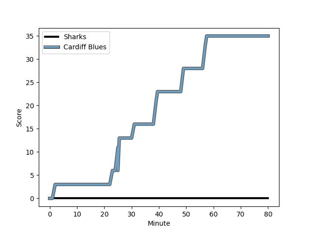
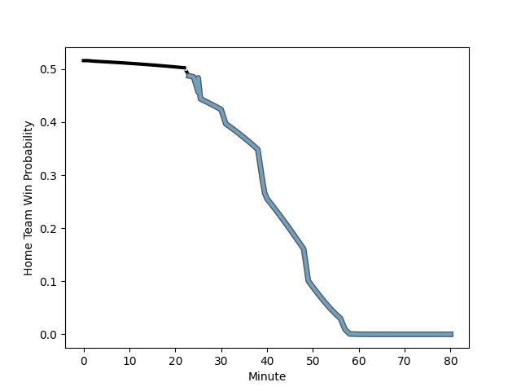

---  
layout: page  
title: Cardiff Blues at Sharks; 35-0  
date: 2022-11-27 17:00:00 18:00:00 -0500  
categories: match review  
---
# Cardiff Blues (1481.21) at Sharks (1509.02); 35-0

# Prediction: Sharks by 5.8

Sharks by 2.8 on a neutral field
## Scores over Time

## Win Probability over Time

# Pre-Match Prediction: Sharks by 10.2

Sharks by 7.2 on a neutral pitch

|   Away Minutes | Away Player                                                           |   Away elo |   Away Percentile |   Number |   Home Percentile |   Home elo | Home Player                                                                      |   Home Minutes |
|---------------:|:----------------------------------------------------------------------|-----------:|------------------:|---------:|------------------:|-----------:|:---------------------------------------------------------------------------------|---------------:|
|             68 | [Rhys Carré](..//playerfiles//RhysCarré_cleaned.md)                   |      90.88 |                26 |        1 |                34 |      91.64 | [Dian Bleuler](..//playerfiles//DianBleuler_cleaned.md)                          |             51 |
|             40 | [Liam Belcher](..//playerfiles//LiamBelcher_cleaned.md)               |      86.17 |                16 |        2 |                24 |      89.92 | [Kerron van Vuuren](..//playerfiles//KerronvanVuuren_cleaned.md)                 |             51 |
|             68 | [Dimitri Arhip](..//playerfiles//DimitriArhip_cleaned.md)             |      94.49 |                44 |        3 |                 7 |      83.46 | [Carlu Sadie](..//playerfiles//CarluSadie_cleaned.md)                            |             68 |
|             58 | [Lopeti Timani](..//playerfiles//LopetiTimani_cleaned.md)             |      91.77 |                31 |        4 |                28 |      90.21 | [Justin Johan Basson](..//playerfiles//JustinJohanBasson_cleaned.md)             |             51 |
|             40 | [Rory Thornton](..//playerfiles//RoryThornton_cleaned.md)             |      81.67 |                10 |        5 |                 8 |      79.87 | [Gerbrandt Grobler](..//playerfiles//GerbrandtGrobler_cleaned.md)                |             80 |
|             80 | [Josh Turnbull](..//playerfiles//JoshTurnbull_cleaned.md)             |      95.31 |                50 |        6 |                88 |     110.7  | [James Venter](..//playerfiles//JamesVenter_cleaned.md)                          |             80 |
|             80 | [Thomas Young](..//playerfiles//ThomasYoung_cleaned.md)               |     104.21 |                77 |        7 |                85 |     108.88 | [Vincent Tshituka](..//playerfiles//VincentTshituka_cleaned.md)                  |             58 |
|             80 | [James Botham](..//playerfiles//JamesBotham_cleaned.md)               |     108.43 |                85 |        8 |                88 |     112.95 | [Sikhumbuzo Notshe](..//playerfiles//SikhumbuzoNotshe_cleaned.md)                |             80 |
|             80 | [Lloyd Williams](..//playerfiles//LloydWilliams_cleaned.md)           |     107.3  |                83 |        9 |                42 |      93.81 | [Cameron Wright](..//playerfiles//CameronWright_cleaned.md)                      |             68 |
|             80 | [Jarrod Evans](..//playerfiles//JarrodEvans_cleaned.md)               |     108.23 |                81 |       10 |                75 |     104.52 | [Boeta Chamberlain](..//playerfiles//BoetaChamberlain_cleaned.md)                |             80 |
|             80 | [Theo Cabango](..//playerfiles//TheoCabango_cleaned.md)               |      85.15 |                13 |       11 |                55 |      97.02 | [Werner Kok](..//playerfiles//WernerKok_cleaned.md)                              |             40 |
|             80 | [Max Llewellyn](..//playerfiles//MaxLlewellyn_cleaned.md)             |      93.92 |                44 |       12 |                85 |     109.21 | [Rohan Janse van Rensburg](..//playerfiles//RohanJansevanRensburg_cleaned.md)    |             58 |
|             68 | [Rey Lee-Lo](..//playerfiles//ReyLee-Lo_cleaned.md)                   |     127.16 |                97 |       13 |                91 |     115.95 | [Francois Venter](..//playerfiles//FrancoisVenter_cleaned.md)                    |             80 |
|             80 | [Jason Harries](..//playerfiles//JasonHarries_cleaned.md)             |     106.82 |                82 |       14 |                78 |     102.57 | [Marnus Potgieter](..//playerfiles//MarnusPotgieter_cleaned.md)                  |             80 |
|             80 | [Ben Thomas](..//playerfiles//BenThomas_cleaned.md)                   |      89.02 |                26 |       15 |                39 |      93.06 | [Anthony Volmink](..//playerfiles//AnthonyVolmink_cleaned.md)                    |             80 |
|             40 | [Kristian Dacey](..//playerfiles//KristianDacey_cleaned.md)           |     108.95 |                88 |       16 |                93 |     121.11 | [Lionel Cronje](..//playerfiles//LionelCronje_cleaned.md)                        |             40 |
|             40 | [Seb Davies](..//playerfiles//SebDavies_cleaned.md)                   |      88.13 |                21 |       17 |                97 |     117.94 | [Khwezi Mona](..//playerfiles//KhweziMona_cleaned.md)                            |             29 |
|             22 | [James Ratti](..//playerfiles//JamesRatti_cleaned.md)                 |      96.61 |                51 |       18 |                58 |      97.4  | [Hyron Andrews](..//playerfiles//HyronAndrews_cleaned.md)                        |             29 |
|             12 | [William Davies-King](..//playerfiles//WilliamDavies-King_cleaned.md) |      87.63 |                16 |       19 |                47 |      93.17 | [Daniel Viljoen Jooste](..//playerfiles//DanielViljoenJooste_cleaned.md)         |             29 |
|             12 | [Corey Domachowski](..//playerfiles//CoreyDomachowski_cleaned.md)     |      94.63 |                48 |       20 |                81 |     107.08 | [Phepsi Buthelezi](..//playerfiles//PhepsiButhelezi_cleaned.md)                  |             22 |
|             12 | [Ellis Bevan](..//playerfiles//EllisBevan_cleaned.md)                 |      95    |               nan |       21 |                72 |     102.54 | [Ben Tapuai](..//playerfiles//BenTapuai_cleaned.md)                              |             22 |
|            nan | nan                                                                   |     nan    |               nan |       22 |                53 |      96.64 | [Khuthuzani Kingdom Mchunu](..//playerfiles//KhuthuzaniKingdomMchunu_cleaned.md) |             12 |
|            nan | nan                                                                   |     nan    |               nan |       23 |               nan |      95.42 | [Bradley Davids](..//playerfiles//BradleyDavids_cleaned.md)                      |             12 |

