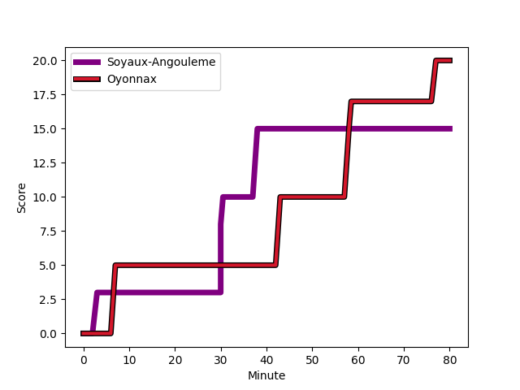
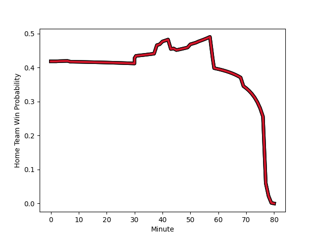

---  
layout: page  
title: Oyonnax at Soyaux-Angouleme; 20-15  
date: 2022-12-01 21:00:00 18:00:00 -0500  
categories: match review  
---
# Oyonnax (1624.81) at Soyaux-Angouleme (1481.95); 20-15

# Prediction: Oyonnax by 11.3

Oyonnax by 14.3 on a neutral field
## Scores over Time

## Win Probability over Time

# Pre-Match Prediction: Oyonnax by 15.6

Oyonnax by 18.6 on a neutral pitch

|   Away Minutes | Away Player                                                           |   Away elo |   Away Percentile |   Number |   Home Percentile |   Home elo | Home Player                                                            |   Home Minutes |
|---------------:|:----------------------------------------------------------------------|-----------:|------------------:|---------:|------------------:|-----------:|:-----------------------------------------------------------------------|---------------:|
|             57 | [Tommy Raynaud](..//playerfiles//TommyRaynaud_cleaned.md)             |      93.35 |                38 |        1 |                80 |     104.67 | [Omar Odishvili](..//playerfiles//OmarOdishvili_cleaned.md)            |             50 |
|             40 | [Teddy Durand](..//playerfiles//TeddyDurand_cleaned.md)               |     100.08 |                58 |        2 |                65 |     100.03 | [Rayne Barka](..//playerfiles//RayneBarka_cleaned.md)                  |             57 |
|             40 | [Thibault Berthaud](..//playerfiles//ThibaultBerthaud_cleaned.md)     |      92.62 |                29 |        3 |                15 |      87.38 | [Yassine Boutemane](..//playerfiles//YassineBoutemane_cleaned.md)      |             50 |
|             53 | [Victor Lebas](..//playerfiles//VictorLebas_cleaned.md)               |      87.53 |                18 |        4 |                78 |     103.96 | [Saba Pesvianidze](..//playerfiles//SabaPesvianidze_cleaned.md)        |             45 |
|             80 | [Tom Murday](..//playerfiles//TomMurday_cleaned.md)                   |     147.6  |                99 |        5 |                94 |     117.27 | [Sikeli Nabou](..//playerfiles//SikeliNabou_cleaned.md)                |             80 |
|             80 | [Wandrille Picault](..//playerfiles//WandrillePicault_cleaned.md)     |      96.18 |                53 |        6 |                29 |      91.09 | [Germain Burgaud](..//playerfiles//GermainBurgaud_cleaned.md)          |             63 |
|             80 | [Loïc Credoz](..//playerfiles//LoïcCredoz_cleaned.md)                 |      95.52 |                49 |        7 |                65 |      99.75 | [Hubert Texier](..//playerfiles//HubertTexier_cleaned.md)              |             59 |
|             40 | [Filimo Taofifenua](..//playerfiles//FilimoTaofifenua_cleaned.md)     |     132.33 |                98 |        8 |                90 |     112.5  | [Robin Copeland](..//playerfiles//RobinCopeland_cleaned.md)            |             80 |
|             69 | [Jeremy Gondrand](..//playerfiles//JeremyGondrand_cleaned.md)         |     135.29 |                99 |        9 |                78 |     104.84 | [Manu Saubusse](..//playerfiles//ManuSaubusse_cleaned.md)              |             80 |
|             57 | [Jules Soulan](..//playerfiles//JulesSoulan_cleaned.md)               |     113.84 |                89 |       10 |                76 |     106.29 | [Matthieu Ugalde](..//playerfiles//MatthieuUgalde_cleaned.md)          |             80 |
|             80 | [Aurelien Callandret](..//playerfiles//AurelienCallandret_cleaned.md) |     117.42 |                93 |       11 |                46 |      95.05 | [Marvin Lestremau](..//playerfiles//MarvinLestremau_cleaned.md)        |             80 |
|             53 | [Florian Vialelle](..//playerfiles//FlorianVialelle_cleaned.md)       |      99.48 |                63 |       12 |                65 |     100.47 | [Mathis Lafon](..//playerfiles//MathisLafon_cleaned.md)                |             80 |
|             80 | [Theo Millet](..//playerfiles//TheoMillet_cleaned.md)                 |     124.35 |                96 |       13 |                13 |      85.51 | [Ledua Mau](..//playerfiles//LeduaMau_cleaned.md)                      |             80 |
|             80 | [Gavin Stark](..//playerfiles//GavinStark_cleaned.md)                 |      91.09 |                25 |       14 |                23 |      88.84 | [Inaki Ayarza Saporta](..//playerfiles//InakiAyarzaSaporta_cleaned.md) |             80 |
|             80 | [Darren Sweetnam](..//playerfiles//DarrenSweetnam_cleaned.md)         |     113.96 |                91 |       15 |                43 |      92.61 | [Rémi Brosset](..//playerfiles//RémiBrosset_cleaned.md)                |             80 |
|             40 | [Manu Leiataua](..//playerfiles//ManuLeiataua_cleaned.md)             |      89.92 |                24 |       16 |                37 |      92.37 | [Janse Roux](..//playerfiles//JanseRoux_cleaned.md)                    |             35 |
|             40 | [Kevin Lebreton](..//playerfiles//KevinLebreton_cleaned.md)           |     116.98 |                94 |       17 |                27 |      91.99 | [Khatchik Vartanov](..//playerfiles//KhatchikVartanov_cleaned.md)      |             30 |
|             40 | [Thomas Laclayat](..//playerfiles//ThomasLaclayat_cleaned.md)         |     107.31 |                86 |       18 |                96 |     117.87 | [Manasa Saulo Romumu](..//playerfiles//ManasaSauloRomumu_cleaned.md)   |             30 |
|             27 | [Steve Mafi](..//playerfiles//SteveMafi_cleaned.md)                   |      97.66 |                51 |       19 |                46 |      94.09 | [Patxi Bidart](..//playerfiles//PatxiBidart_cleaned.md)                |             23 |
|             27 | [Gaby Lovobalavu](..//playerfiles//GabyLovobalavu_cleaned.md)         |      81.74 |                 9 |       20 |                 3 |      76.33 | [Gautier Gibouin](..//playerfiles//GautierGibouin_cleaned.md)          |             21 |
|             23 | [Antoine Abraham](..//playerfiles//AntoineAbraham_cleaned.md)         |      92.12 |                19 |       21 |                 7 |      81.41 | [Matt Beukeboom](..//playerfiles//MattBeukeboom_cleaned.md)            |             17 |
|             23 | [Justin Bouraux](..//playerfiles//JustinBouraux_cleaned.md)           |     106.31 |                78 |       22 |               nan |     nan    | nan                                                                    |            nan |
|             11 | [Ilan El Khattabi](..//playerfiles//IlanElKhattabi_cleaned.md)        |      96.55 |                46 |       23 |               nan |     nan    | nan                                                                    |            nan |

