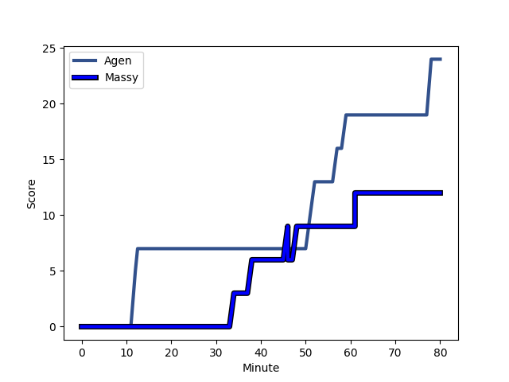
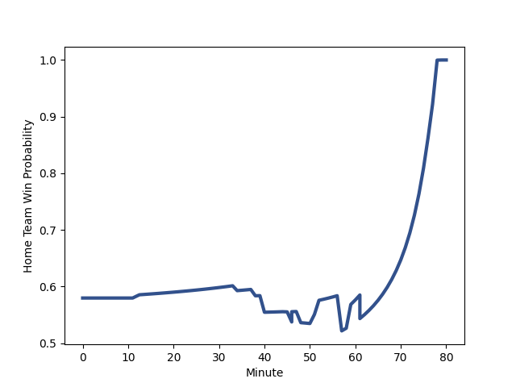

---  
layout: page  
title: Massy at Agen; 12-24  
date: 2022-12-02 19:30:00 18:00:00 -0500  
categories: match review  
---
# Massy (1363.0) at Agen (1502.68); 12-24

# Prediction: Agen by 17.0

Agen by 14.0 on a neutral field
## Scores over Time

## Win Probability over Time

# Pre-Match Prediction: Agen by 18.9

Agen by 15.9 on a neutral pitch

|   Away Minutes | Away Player                                                                     |   Away elo |   Away Percentile |   Number |   Home Percentile |   Home elo | Home Player                                                         |   Home Minutes |
|---------------:|:--------------------------------------------------------------------------------|-----------:|------------------:|---------:|------------------:|-----------:|:--------------------------------------------------------------------|---------------:|
|             63 | [Robin Poipy](..//playerfiles//RobinPoipy_cleaned.md)                           |     101.25 |                75 |        1 |                87 |     107.71 | [Richard Barrington](..//playerfiles//RichardBarrington_cleaned.md) |             40 |
|             45 | [Pierre-Alexandre Duclieu](..//playerfiles//Pierre-AlexandreDuclieu_cleaned.md) |      88.02 |                21 |        2 |                89 |     109.18 | [Mike Sosene-Feagai](..//playerfiles//MikeSosene-Feagai_cleaned.md) |             51 |
|             57 | [Tijde Visser](..//playerfiles//TijdeVisser_cleaned.md)                         |      83.83 |                11 |        3 |                84 |     106.37 | [Alex Burin](..//playerfiles//AlexBurin_cleaned.md)                 |             40 |
|             80 | [Marco Fuser](..//playerfiles//MarcoFuser_cleaned.md)                           |     101.19 |                71 |        4 |                52 |      96.67 | [Corentin Vernet](..//playerfiles//CorentinVernet_cleaned.md)       |             51 |
|             80 | [Dion Evrard Oulai](..//playerfiles//DionEvrardOulai_cleaned.md)                |      77.76 |                 7 |        5 |                77 |     104.67 | [Zak Farrance](..//playerfiles//ZakFarrance_cleaned.md)             |             68 |
|             40 | [Ewan Coetzee](..//playerfiles//EwanCoetzee_cleaned.md)                         |      74.63 |                 3 |        6 |                89 |     112.13 | [Arnaud Duputs](..//playerfiles//ArnaudDuputs_cleaned.md)           |             80 |
|             57 | [Abongile Nonkontwana](..//playerfiles//AbongileNonkontwana_cleaned.md)         |      92.63 |                48 |        7 |                58 |      97.76 | [Antoine Erbani](..//playerfiles//AntoineErbani_cleaned.md)         |             51 |
|             80 | [Yohann Gbizie](..//playerfiles//YohannGbizie_cleaned.md)                       |      90.88 |                32 |        8 |                87 |     110.7  | [Martin Devergie](..//playerfiles//MartinDevergie_cleaned.md)       |             80 |
|             61 | [Gaetan Pichon](..//playerfiles//GaetanPichon_cleaned.md)                       |      95.18 |                47 |        9 |                24 |      90.3  | [Tane Takulua](..//playerfiles//TaneTakulua_cleaned.md)             |             66 |
|             57 | [Tom Deleuze](..//playerfiles//TomDeleuze_cleaned.md)                           |      90.49 |                32 |       10 |                53 |      99.14 | [Emile Dayral](..//playerfiles//EmileDayral_cleaned.md)             |             79 |
|             60 | [Nathan Farissier](..//playerfiles//NathanFarissier_cleaned.md)                 |      90.85 |                28 |       11 |                93 |     117.68 | [Iban Etcheverry](..//playerfiles//IbanEtcheverry_cleaned.md)       |             80 |
|             80 | [Arthur Seigneuret](..//playerfiles//ArthurSeigneuret_cleaned.md)               |      98.87 |                64 |       12 |                52 |      97.7  | [Kolinio Ramoka](..//playerfiles//KolinioRamoka_cleaned.md)         |             80 |
|             80 | [Tom Cusson](..//playerfiles//TomCusson_cleaned.md)                             |      92.67 |               nan |       13 |                12 |      83.79 | [Baptiste Lafond](..//playerfiles//BaptisteLafond_cleaned.md)       |             80 |
|             80 | [Yanis Dit Robaglia](..//playerfiles//YanisDitRobaglia_cleaned.md)              |      85.74 |                14 |       14 |                 5 |      77.78 | [Loris Tolot](..//playerfiles//LorisTolot_cleaned.md)               |             80 |
|             80 | [Juan Kotze](..//playerfiles//JuanKotze_cleaned.md)                             |      91.86 |                45 |       15 |                94 |     118.21 | [Mathieu Lamoulie](..//playerfiles//MathieuLamoulie_cleaned.md)     |             80 |
|             40 | [Andy Timo](..//playerfiles//AndyTimo_cleaned.md)                               |      94.14 |               nan |       16 |                 2 |      72.21 | [Florent Guion](..//playerfiles//FlorentGuion_cleaned.md)           |             40 |
|             35 | [Mamoudou Meite](..//playerfiles//MamoudouMeite_cleaned.md)                     |      89.29 |                22 |       17 |                52 |      96.36 | [Malik Hamadache](..//playerfiles//MalikHamadache_cleaned.md)       |             40 |
|             23 | [Will Haydon-Wood](..//playerfiles//WillHaydon-Wood_cleaned.md)                 |      96.18 |                57 |       18 |                16 |      85.5  | [Joe Maksymiw](..//playerfiles//JoeMaksymiw_cleaned.md)             |             29 |
|             23 | [Tony Tissot](..//playerfiles//TonyTissot_cleaned.md)                           |      91.95 |                35 |       19 |                79 |     106.06 | [Matthieu Bonnet](..//playerfiles//MatthieuBonnet_cleaned.md)       |             29 |
|             23 | [Guiterembi Vickos](..//playerfiles//GuiterembiVickos_cleaned.md)               |     101.01 |                70 |       20 |                84 |     106.48 | [Clement Martinez](..//playerfiles//ClementMartinez_cleaned.md)     |             29 |
|             20 | [Uwanakaro Tawalo](..//playerfiles//UwanakaroTawalo_cleaned.md)                 |      79.66 |                 6 |       21 |                27 |      90.95 | [Theo Idjellidaine](..//playerfiles//TheoIdjellidaine_cleaned.md)   |             14 |
|             19 | [Kilian Marion](..//playerfiles//KilianMarion_cleaned.md)                       |      98.34 |                64 |       22 |                21 |      88.08 | [Evan Olmstead](..//playerfiles//EvanOlmstead_cleaned.md)           |             12 |
|             17 | [Ushangi Tcheishvili](..//playerfiles//UshangiTcheishvili_cleaned.md)           |      66.03 |                 0 |       23 |                71 |     100.6  | [Danré Gerber](..//playerfiles//DanréGerber_cleaned.md)             |              1 |

