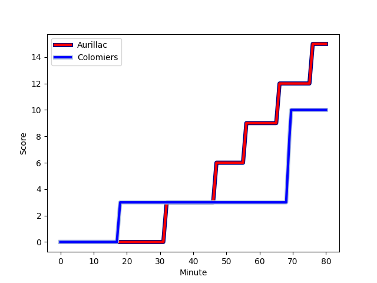
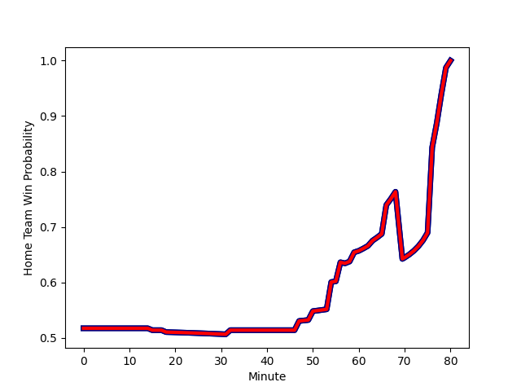

---  
layout: page  
title: Colomiers at Aurillac; 10-15  
date: 2022-12-02 19:00:00 18:00:00 -0500  
categories: match review  
---
# Colomiers (1381.9) at Aurillac (1411.89); 10-15

# Prediction: Aurillac by 6.0

Aurillac by 3.0 on a neutral field
## Scores over Time

## Win Probability over Time

# Pre-Match Prediction: Aurillac by 7.8

Aurillac by 4.8 on a neutral pitch

|   Away Minutes | Away Player                                                               |   Away elo |   Away Percentile |   Number |   Home Percentile |   Home elo | Home Player                                                               |   Home Minutes |
|---------------:|:--------------------------------------------------------------------------|-----------:|------------------:|---------:|------------------:|-----------:|:--------------------------------------------------------------------------|---------------:|
|             50 | [Guillaume Tartas](..//playerfiles//GuillaumeTartas_cleaned.md)           |     108.03 |                88 |        1 |                73 |     101.85 | [Alexandre Plantier](..//playerfiles//AlexandrePlantier_cleaned.md)       |             57 |
|             50 | [Andrew Ready](..//playerfiles//AndrewReady_cleaned.md)                   |      84.92 |                11 |        2 |                86 |     107.18 | [Adrian Smith](..//playerfiles//AdrianSmith_cleaned.md)                   |             57 |
|             15 | [Hugo Pirlet](..//playerfiles//HugoPirlet_cleaned.md)                     |      82.97 |                 8 |        3 |                93 |     111.45 | [Giorgi Kartvelishvili](..//playerfiles//GiorgiKartvelishvili_cleaned.md) |             54 |
|             56 | [Jean Thomas](..//playerfiles//JeanThomas_cleaned.md)                     |      96.95 |                56 |        4 |                91 |     113.63 | [Cam Dodson](..//playerfiles//CamDodson_cleaned.md)                       |             60 |
|             80 | [Alexandre Ricard](..//playerfiles//AlexandreRicard_cleaned.md)           |      94.08 |                44 |        5 |                71 |     100.94 | [Georgi Javakhia](..//playerfiles//GeorgiJavakhia_cleaned.md)             |             54 |
|             59 | [Pierre-Samuel Pacheco](..//playerfiles//Pierre-SamuelPacheco_cleaned.md) |      85.95 |                18 |        6 |                45 |      94.41 | [Eoghan Masterson](..//playerfiles//EoghanMasterson_cleaned.md)           |             80 |
|             80 | [Waël Ponpon](..//playerfiles//WaëlPonpon_cleaned.md)                     |      83.4  |                 9 |        7 |                26 |      90.14 | [Beka Shvangiradze](..//playerfiles//BekaShvangiradze_cleaned.md)         |             80 |
|             59 | [Aldric Lescure](..//playerfiles//AldricLescure_cleaned.md)               |      95.45 |                52 |        8 |                80 |     105.37 | [Dylan Cretin](..//playerfiles//DylanCretin_cleaned.md)                   |             54 |
|             63 | [Edoardo Gori](..//playerfiles//EdoardoGori_cleaned.md)                   |      98.13 |                63 |        9 |                 8 |      82.93 | [David Delarue](..//playerfiles//DavidDelarue_cleaned.md)                 |             60 |
|             63 | [Romuald Séguy](..//playerfiles//RomualdSéguy_cleaned.md)                 |      88.52 |                23 |       10 |                72 |     102.32 | [Marc Palmier](..//playerfiles//MarcPalmier_cleaned.md)                   |             80 |
|             80 | [Paul Pimienta](..//playerfiles//PaulPimienta_cleaned.md)                 |     107.36 |                82 |       11 |                14 |      85.8  | [AJ Coertzen](..//playerfiles//AJCoertzen_cleaned.md)                     |             80 |
|             80 | [Johan Deysel (Jnr)](..//playerfiles//JohanDeysel(Jnr)_cleaned.md)        |     111.19 |                86 |       12 |                10 |      82.48 | [Christa Powell](..//playerfiles//ChristaPowell_cleaned.md)               |             47 |
|             80 | [Michele Campagnaro](..//playerfiles//MicheleCampagnaro_cleaned.md)       |     102.48 |                71 |       13 |                 3 |      76.76 | [Jimmy Yobo](..//playerfiles//JimmyYobo_cleaned.md)                       |             80 |
|             80 | [Victor Moro](..//playerfiles//VictorMoro_cleaned.md)                     |      68.75 |                 0 |       14 |                75 |     102.86 | [Elijah Niko](..//playerfiles//ElijahNiko_cleaned.md)                     |             80 |
|             80 | [Max Auriac](..//playerfiles//MaxAuriac_cleaned.md)                       |      87.92 |                22 |       15 |                11 |      80.91 | [Anderson Neisen](..//playerfiles//AndersonNeisen_cleaned.md)             |             80 |
|             65 | [Robin Bellemand](..//playerfiles//RobinBellemand_cleaned.md)             |      91.44 |                35 |       16 |                 9 |      82.28 | [Peter Nelson](..//playerfiles//PeterNelson_cleaned.md)                   |             33 |
|             30 | [Thomas Dubois](..//playerfiles//ThomasDubois_cleaned.md)                 |      70.55 |                 1 |       17 |                 5 |      77.71 | [Latuka Maituku](..//playerfiles//LatukaMaituku_cleaned.md)               |             26 |
|             30 | [Hika Elliot](..//playerfiles//HikaElliot_cleaned.md)                     |     111.68 |                92 |       18 |                10 |      80.48 | [Jean-Baptiste Singer](..//playerfiles//Jean-BaptisteSinger_cleaned.md)   |             26 |
|             24 | [Jack Whetton](..//playerfiles//JackWhetton_cleaned.md)                   |      78.52 |                 8 |       19 |                25 |      90.47 | [Henzo Kiteau](..//playerfiles//HenzoKiteau_cleaned.md)                   |             26 |
|             21 | [Anthony Coletta](..//playerfiles//AnthonyColetta_cleaned.md)             |      57.87 |                 0 |       20 |                79 |     104.26 | [Luka Nioradze](..//playerfiles//LukaNioradze_cleaned.md)                 |             23 |
|             21 | [Yann Peysson](..//playerfiles//YannPeysson_cleaned.md)                   |      88.94 |                25 |       21 |                36 |      91.7  | [Jean-Jacques Gymael](..//playerfiles//Jean-JacquesGymael_cleaned.md)     |             23 |
|             17 | [Maxime Javaux](..//playerfiles//MaximeJavaux_cleaned.md)                 |      80.75 |                 6 |       22 |                83 |     106.62 | [Yann Tivoli](..//playerfiles//YannTivoli_cleaned.md)                     |             20 |
|             17 | [Mathis Galthié](..//playerfiles//MathisGalthié_cleaned.md)               |      94.33 |               nan |       23 |                17 |      86.53 | [Mikheil Alania](..//playerfiles//MikheilAlania_cleaned.md)               |             20 |

