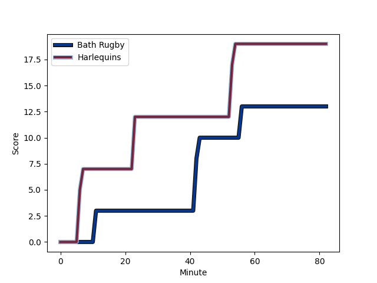
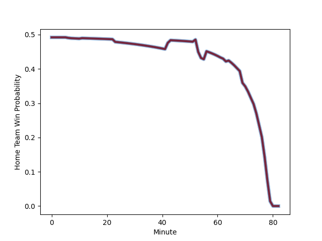

---  
layout: page  
title: Harlequins at Bath Rugby; 19-13  
date: 2022-12-02 14:45:00 18:00:00 -0500  
categories: match review  
---
# Harlequins (1575.2) at Bath Rugby (1561.46); 19-13

# Prediction: Bath Rugby by 1.6

Harlequins by 1.4 on a neutral field
## Scores over Time

## Win Probability over Time

# Pre-Match Prediction: Harlequins by 1.2

Harlequins by 1.8 on a neutral pitch

|   Away Minutes | Away Player                                                       |   Away elo |   Away Percentile |   Number |   Home Percentile |   Home elo | Home Player                                                              |   Home Minutes |
|---------------:|:------------------------------------------------------------------|-----------:|------------------:|---------:|------------------:|-----------:|:-------------------------------------------------------------------------|---------------:|
|             56 | [Joe Marler](..//playerfiles//JoeMarler_cleaned.md)               |     100.9  |                70 |        1 |                25 |      90.24 | [Valery Morozov](..//playerfiles//ValeryMorozov_cleaned.md)              |             68 |
|             73 | [Jack Walker](..//playerfiles//JackWalker_cleaned.md)             |      93.6  |                44 |        2 |                95 |     118.24 | [Tom Dunn](..//playerfiles//TomDunn_cleaned.md)                          |             69 |
|             69 | [Wilco Louw](..//playerfiles//WilcoLouw_cleaned.md)               |     116.6  |                96 |        3 |                13 |      86.34 | [D'Arcy Rae](..//playerfiles//D'ArcyRae_cleaned.md)                      |             62 |
|             82 | [Dino Lamb](..//playerfiles//DinoLamb_cleaned.md)                 |     101.41 |                72 |        4 |                99 |     141.5  | [Dave Attwood](..//playerfiles//DaveAttwood_cleaned.md)                  |             69 |
|             64 | [Irne Herbst](..//playerfiles//IrneHerbst_cleaned.md)             |     110.56 |                88 |        5 |                44 |      94.03 | [Fergus Lee-Warner](..//playerfiles//FergusLee-Warner_cleaned.md)        |             68 |
|             82 | [Jack Kenningham](..//playerfiles//JackKenningham_cleaned.md)     |     110.15 |                88 |        6 |                48 |      95.22 | [Ted Hill](..//playerfiles//TedHill_cleaned.md)                          |             82 |
|             82 | [Will Evans](..//playerfiles//WillEvans_cleaned.md)               |      88.69 |                22 |        7 |                96 |     121.21 | [Miles Reid](..//playerfiles//MilesReid_cleaned.md)                      |             69 |
|             73 | [Alex Dombrandt](..//playerfiles//AlexDombrandt_cleaned.md)       |     111.41 |                86 |        8 |                14 |      85.7  | [Josh Bayliss](..//playerfiles//JoshBayliss_cleaned.md)                  |             82 |
|             76 | [Danny Care](..//playerfiles//DannyCare_cleaned.md)               |     133.17 |                99 |        9 |                69 |     100.15 | [Ben Spencer](..//playerfiles//BenSpencer_cleaned.md)                    |             80 |
|             82 | [Tommaso Allan](..//playerfiles//TommasoAllan_cleaned.md)         |      99.15 |                61 |       10 |                30 |      91.87 | [Orlando Bailey](..//playerfiles//OrlandoBailey_cleaned.md)              |             59 |
|             82 | [Josh Bassett](..//playerfiles//JoshBassett_cleaned.md)           |     115.77 |                92 |       11 |                82 |     106.9  | [Will Butt](..//playerfiles//WillButt_cleaned.md)                        |             82 |
|             82 | [Andre Esterhuizen](..//playerfiles//AndreEsterhuizen_cleaned.md) |     111.87 |                87 |       12 |                79 |     106.98 | [Cameron Redpath](..//playerfiles//CameronRedpath_cleaned.md)            |             82 |
|             63 | [Oscar Beard](..//playerfiles//OscarBeard_cleaned.md)             |     101.07 |                76 |       13 |                41 |      93.37 | [Ollie Lawrence](..//playerfiles//OllieLawrence_cleaned.md)              |             82 |
|             70 | [Cadan Murley](..//playerfiles//CadanMurley_cleaned.md)           |      98.46 |                62 |       14 |                78 |     104.03 | [Joe Cokanasiga](..//playerfiles//JoeCokanasiga_cleaned.md)              |             82 |
|             82 | [Nick David](..//playerfiles//NickDavid_cleaned.md)               |      96.14 |                53 |       15 |                98 |     131.92 | [Matt Gallagher](..//playerfiles//MattGallagher_cleaned.md)              |             82 |
|              9 | [George Head](..//playerfiles//GeorgeHead_cleaned.md)             |      92.71 |                44 |       16 |                46 |      94.02 | [Niall Annett](..//playerfiles//NiallAnnett_cleaned.md)                  |             13 |
|             26 | [Fin Baxter](..//playerfiles//FinBaxter_cleaned.md)               |      94.03 |               nan |       17 |                60 |      96.5  | [Arthur Cordwell](..//playerfiles//ArthurCordwell_cleaned.md)            |             14 |
|             13 | [Simon Kerrod](..//playerfiles//SimonKerrod_cleaned.md)           |     105.37 |                82 |       18 |               nan |      89.18 | [Johannes Jonker](..//playerfiles//JohannesJonker_cleaned.md)            |             20 |
|             18 | [George Hammond](..//playerfiles//GeorgeHammond_cleaned.md)       |      87.87 |                22 |       19 |                79 |     104.51 | [Will Spencer](..//playerfiles//WillSpencer_cleaned.md)                  |             13 |
|              9 | [Archie White](..//playerfiles//ArchieWhite_cleaned.md)           |      99.42 |                59 |       20 |                30 |      91.09 | [Tom Ellis](..//playerfiles//TomEllis_cleaned.md)                        |             14 |
|              6 | [Lewis Gjaltema](..//playerfiles//LewisGjaltema_cleaned.md)       |      98.32 |                62 |       21 |                21 |      89.25 | [Max Green](..//playerfiles//MaxGreen_cleaned.md)                        |              2 |
|             12 | [Will Edwards](..//playerfiles//WillEdwards_cleaned.md)           |     109.32 |                82 |       22 |                84 |     109.81 | [Piers Francis](..//playerfiles//PiersFrancis_cleaned.md)                |             23 |
|             19 | [Lennox Anyanwu](..//playerfiles//LennoxAnyanwu_cleaned.md)       |      90.59 |                29 |       23 |                77 |     105.1  | [Richard de Carpentier](..//playerfiles//RicharddeCarpentier_cleaned.md) |             13 |

