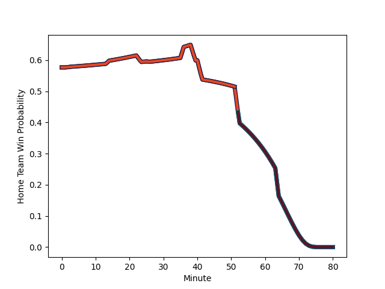

---  
layout: page  
title: Munster at Edinburgh; 38-17  
date: 2022-12-02 20:35:00 18:00:00 -0500  
categories: match review  
---
# Munster (1500.85) at Edinburgh (1634.86); 38-17

# Prediction: Edinburgh by 16.4

Edinburgh by 13.4 on a neutral field
## Scores over Time

## Win Probability over Time

# Pre-Match Prediction: Edinburgh by 10.8

Edinburgh by 7.8 on a neutral pitch

|   Away Minutes | Away Player                                                     |   Away elo |   Away Percentile |   Number |   Home Percentile |   Home elo | Home Player                                                         |   Home Minutes |
|---------------:|:----------------------------------------------------------------|-----------:|------------------:|---------:|------------------:|-----------:|:--------------------------------------------------------------------|---------------:|
|             66 | [Jeremy Loughman](..//playerfiles//JeremyLoughman_cleaned.md)   |     110.34 |                91 |        1 |                40 |      93.8  | [Pierre Schoeman](..//playerfiles//PierreSchoeman_cleaned.md)       |             40 |
|             49 | [Niall Scannell](..//playerfiles//NiallScannell_cleaned.md)     |     101.8  |                75 |        2 |               nan |      94.56 | [Patrick Harrison](..//playerfiles//PatrickHarrison_cleaned.md)     |             49 |
|             66 | [John Ryan](..//playerfiles//JohnRyan_cleaned.md)               |     100.26 |                70 |        3 |                53 |      96.64 | [Luan de Bruin](..//playerfiles//LuandeBruin_cleaned.md)            |             40 |
|             80 | [Jean Kleyn](..//playerfiles//JeanKleyn_cleaned.md)             |     100.7  |                71 |        4 |                59 |      98.05 | [Jamie Hodgson](..//playerfiles//JamieHodgson_cleaned.md)           |             55 |
|             80 | [Tadhg Beirne](..//playerfiles//TadhgBeirne_cleaned.md)         |     112.94 |                90 |        5 |                90 |     112.95 | [Grant Gilchrist](..//playerfiles//GrantGilchrist_cleaned.md)       |             80 |
|             64 | [Peter O'Mahony](..//playerfiles//PeterO'Mahony_cleaned.md)     |      83.21 |                 9 |        6 |                98 |     134.23 | [Jamie Ritchie](..//playerfiles//JamieRitchie_cleaned.md)           |             73 |
|             80 | [John Hodnett](..//playerfiles//JohnHodnett_cleaned.md)         |      90.72 |                28 |        7 |                89 |     111.99 | [Luke Crosbie](..//playerfiles//LukeCrosbie_cleaned.md)             |             80 |
|             57 | [Gavin Coombes](..//playerfiles//GavinCoombes_cleaned.md)       |     111    |                86 |        8 |                49 |      96.21 | [Viliame Mata](..//playerfiles//ViliameMata_cleaned.md)             |             80 |
|             51 | [Craig Casey](..//playerfiles//CraigCasey_cleaned.md)           |      96.95 |                54 |        9 |                75 |     102.98 | [Ben Vellacott](..//playerfiles//BenVellacott_cleaned.md)           |             80 |
|             80 | [Joey Carbery](..//playerfiles//JoeyCarbery_cleaned.md)         |      94.04 |                40 |       10 |                98 |     136.77 | [Blair Kinghorn](..//playerfiles//BlairKinghorn_cleaned.md)         |             80 |
|             45 | [Simon Zebo](..//playerfiles//SimonZebo_cleaned.md)             |     106.76 |                82 |       11 |                56 |      97.18 | [Duhan van der Merwe](..//playerfiles//DuhanvanderMerwe_cleaned.md) |             80 |
|             57 | [Rory Scannell](..//playerfiles//RoryScannell_cleaned.md)       |     115.17 |                91 |       12 |                20 |      86.84 | [Chris Dean](..//playerfiles//ChrisDean_cleaned.md)                 |             44 |
|             80 | [Antoine Frisch](..//playerfiles//AntoineFrisch_cleaned.md)     |      90.45 |                28 |       13 |                87 |     112.83 | [Mark Bennett](..//playerfiles//MarkBennett_cleaned.md)             |             80 |
|             80 | [Calvin Nash](..//playerfiles//CalvinNash_cleaned.md)           |     111    |                87 |       14 |                95 |     120.04 | [Darcy Graham](..//playerfiles//DarcyGraham_cleaned.md)             |             26 |
|             80 | [Jack Daly](..//playerfiles//JackDaly_cleaned.md)               |      95    |               nan |       15 |                90 |     112.57 | [Wes Goosen](..//playerfiles//WesGoosen_cleaned.md)                 |             80 |
|             35 | [Patrick Campbell](..//playerfiles//PatrickCampbell_cleaned.md) |      88.13 |                19 |       16 |                92 |     117.57 | [Jaco van der Walt](..//playerfiles//JacovanderWalt_cleaned.md)     |             54 |
|             31 | [Diarmuid Barron](..//playerfiles//DiarmuidBarron_cleaned.md)   |     108.43 |                88 |       17 |                99 |     128.56 | [WP Nel](..//playerfiles//WPNel_cleaned.md)                         |             40 |
|             29 | [Paddy Patterson](..//playerfiles//PaddyPatterson_cleaned.md)   |      90.42 |                26 |       18 |                85 |     107.06 | [Boan Venter](..//playerfiles//BoanVenter_cleaned.md)               |             40 |
|             23 | [Alex Kendellen](..//playerfiles//AlexKendellen_cleaned.md)     |      90.52 |                29 |       19 |                82 |     107.78 | [James Lang](..//playerfiles//JamesLang_cleaned.md)                 |             36 |
|             23 | [Jack Crowley](..//playerfiles//JackCrowley_cleaned.md)         |      95.98 |                49 |       20 |                20 |      88.82 | [Tom Cruse](..//playerfiles//TomCruse_cleaned.md)                   |             31 |
|             16 | [Jack O'Donoghue](..//playerfiles//JackO'Donoghue_cleaned.md)   |     105.89 |                82 |       21 |                66 |      99.3  | [Marshall Sykes](..//playerfiles//MarshallSykes_cleaned.md)         |             25 |
|             14 | [Roman Salanoa](..//playerfiles//RomanSalanoa_cleaned.md)       |      93.68 |                40 |       22 |                95 |     119.53 | [Nick Haining](..//playerfiles//NickHaining_cleaned.md)             |              7 |
|             14 | [Fineen Wycherley](..//playerfiles//FineenWycherley_cleaned.md) |      90.23 |                29 |       23 |               nan |     nan    | nan                                                                 |            nan |

