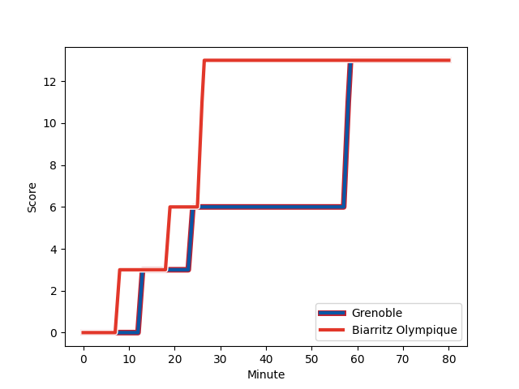
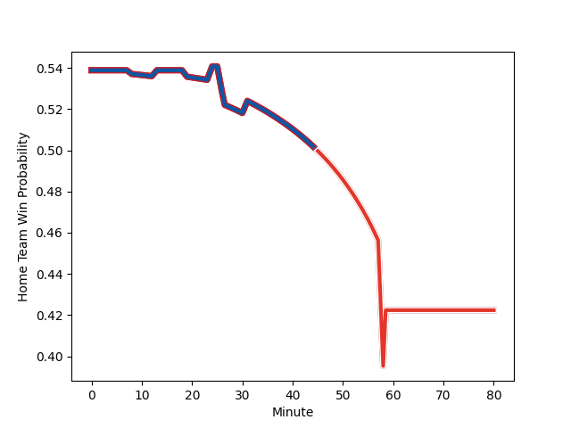

---  
layout: page  
title: Biarritz Olympique at Grenoble; 13-13  
date: 2022-12-02 21:00:00 18:00:00 -0500  
categories: match review  
---
# Biarritz Olympique (1431.41) at Grenoble (1499.04); 13-13

# Prediction: Grenoble by 9.8

Grenoble by 6.8 on a neutral field
## Scores over Time

## Win Probability over Time

# Pre-Match Prediction: Grenoble by 4.2

Grenoble by 1.2 on a neutral pitch

|   Away Minutes | Away Player                                                           |   Away elo |   Away Percentile |   Number |   Home Percentile |   Home elo | Home Player                                                                         |   Home Minutes |
|---------------:|:----------------------------------------------------------------------|-----------:|------------------:|---------:|------------------:|-----------:|:------------------------------------------------------------------------------------|---------------:|
|             58 | [Baptiste Erdocio](..//playerfiles//BaptisteErdocio_cleaned.md)       |      90.15 |                24 |        1 |                92 |     111.35 | [Zack Gauthier](..//playerfiles//ZackGauthier_cleaned.md)                           |             80 |
|             58 | [Thomas Sauveterre](..//playerfiles//ThomasSauveterre_cleaned.md)     |      95.61 |                53 |        2 |                49 |      95.38 | [Mathis Sarragallet](..//playerfiles//MathisSarragallet_cleaned.md)                 |             31 |
|             80 | [Guy Millar](..//playerfiles//GuyMillar_cleaned.md)                   |     118.74 |                97 |        3 |                49 |      96.44 | [Irakli Aptsiauri](..//playerfiles//IrakliAptsiauri_cleaned.md)                     |             67 |
|             80 | [Dave O'Callaghan](..//playerfiles//DaveO'Callaghan_cleaned.md)       |      86.88 |                16 |        4 |                77 |     103.75 | [Thomas Lainault](..//playerfiles//ThomasLainault_cleaned.md)                       |             56 |
|             80 | [Johnny Dyer](..//playerfiles//JohnnyDyer_cleaned.md)                 |      74.51 |                 3 |        5 |                83 |     106.57 | [Pio Muarua](..//playerfiles//PioMuarua_cleaned.md)                                 |             80 |
|             80 | [Elliot Dixon](..//playerfiles//ElliotDixon_cleaned.md)               |      95.17 |                46 |        6 |                75 |     102.97 | [Tanginoa Halaifonua](..//playerfiles//TanginoaHalaifonua_cleaned.md)               |             80 |
|             58 | [Thomas Hebert](..//playerfiles//ThomasHebert_cleaned.md)             |      98    |                59 |        7 |                75 |     103.96 | [Steeve Blanc-Mappaz](..//playerfiles//SteeveBlanc-Mappaz_cleaned.md)               |             80 |
|             74 | [Tornike Jalagonia](..//playerfiles//TornikeJalagonia_cleaned.md)     |     103.47 |                73 |        8 |                40 |      93.42 | [Talalelei Gray](..//playerfiles//TalaleleiGray_cleaned.md)                         |             59 |
|             58 | [Kerman Aurrekoetxea](..//playerfiles//KermanAurrekoetxea_cleaned.md) |      83.41 |                 9 |        9 |                99 |     132.41 | [Felipe Ezcurra](..//playerfiles//FelipeEzcurra_cleaned.md)                         |             80 |
|             80 | [Baptiste Germain](..//playerfiles//BaptisteGermain_cleaned.md)       |      94.69 |                43 |       10 |                41 |      94.46 | [Thomas Fortunel](..//playerfiles//ThomasFortunel_cleaned.md)                       |             80 |
|             58 | [Yohann Artru](..//playerfiles//YohannArtru_cleaned.md)               |      95.4  |                49 |       11 |                27 |      90.41 | [Karim Qadiri](..//playerfiles//KarimQadiri_cleaned.md)                             |             80 |
|             80 | [Francois Vergnaud](..//playerfiles//FrancoisVergnaud_cleaned.md)     |      80.5  |                 7 |       12 |                68 |     101.48 | [Bautista Ezcurra](..//playerfiles//BautistaEzcurra_cleaned.md)                     |             60 |
|             19 | [Tyler Morgan](..//playerfiles//TylerMorgan_cleaned.md)               |     108.1  |                83 |       13 |                38 |      92.4  | [Terrence Hepetema](..//playerfiles//TerrenceHepetema_cleaned.md)                   |             80 |
|             80 | [Romain Lonca](..//playerfiles//RomainLonca_cleaned.md)               |     108.66 |                81 |       14 |                10 |      83.51 | [Atunaisa Taulanga Vaka Manu](..//playerfiles//AtunaisaTaulangaVakaManu_cleaned.md) |             80 |
|             80 | [Joe Jonas](..//playerfiles//JoeJonas_cleaned.md)                     |      93.77 |                41 |       15 |                26 |      89.14 | [Hugo Trouilloud](..//playerfiles//HugoTrouilloud_cleaned.md)                       |             80 |
|             61 | [Ilian Perraux](..//playerfiles//IlianPerraux_cleaned.md)             |     104.65 |                78 |       16 |                88 |     108.24 | [Lilian Rossi](..//playerfiles//LilianRossi_cleaned.md)                             |             49 |
|             22 | [Barnabe Couilloud](..//playerfiles//BarnabeCouilloud_cleaned.md)     |      84.71 |                11 |       17 |                72 |     101.47 | [Jose Madeira](..//playerfiles//JoseMadeira_cleaned.md)                             |             24 |
|             22 | [Josh Tyrell](..//playerfiles//JoshTyrell_cleaned.md)                 |      97.26 |                57 |       18 |                 6 |      79.28 | [Thibaut Martel](..//playerfiles//ThibautMartel_cleaned.md)                         |             21 |
|             22 | [Henry Speight](..//playerfiles//HenrySpeight_cleaned.md)             |     120.71 |                96 |       19 |                42 |      94.12 | [Romain Trouilloud](..//playerfiles//RomainTrouilloud_cleaned.md)                   |             20 |
|             22 | [Quentin Samaran](..//playerfiles//QuentinSamaran_cleaned.md)         |      92.4  |                38 |       20 |                46 |      94.93 | [Vincent Vial](..//playerfiles//VincentVial_cleaned.md)                             |             13 |
|             22 | [Clement Renaud](..//playerfiles//ClementRenaud_cleaned.md)           |      94.89 |                45 |       21 |               nan |     nan    | nan                                                                                 |            nan |
|              6 | [Temo Matiu](..//playerfiles//TemoMatiu_cleaned.md)                   |      96.24 |               nan |       22 |               nan |     nan    | nan                                                                                 |            nan |

