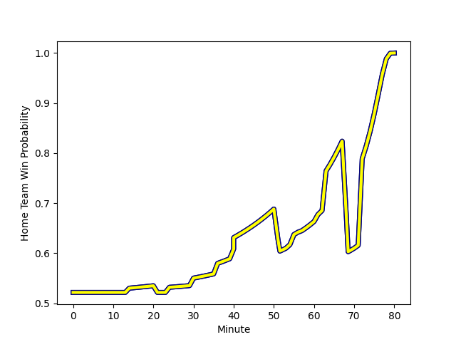

---  
layout: page  
title: Beziers at Nevers; 19-23  
date: 2022-12-02 19:30:00 18:00:00 -0500  
categories: match review  
---
# Beziers (1459.27) at Nevers (1497.1); 19-23

# Prediction: Nevers by 6.8

Nevers by 3.8 on a neutral field
## Scores over Time

## Win Probability over Time

# Pre-Match Prediction: Nevers by 7.8

Nevers by 4.8 on a neutral pitch

|   Away Minutes | Away Player                                                                    |   Away elo |   Away Percentile |   Number |   Home Percentile |   Home elo | Home Player                                                           |   Home Minutes |
|---------------:|:-------------------------------------------------------------------------------|-----------:|------------------:|---------:|------------------:|-----------:|:----------------------------------------------------------------------|---------------:|
|             40 | [Zhorzhi (Jorji) Saldadze](..//playerfiles//Zhorzhi(Jorji)Saldadze_cleaned.md) |      86.08 |                13 |        1 |                 9 |      84.3  | [Tomike Mataradze](..//playerfiles//TomikeMataradze_cleaned.md)       |             40 |
|             54 | [Clément Esteriola](..//playerfiles//ClémentEsteriola_cleaned.md)              |      92.3  |                37 |        2 |                90 |     111.1  | [Issam Hamel](..//playerfiles//IssamHamel_cleaned.md)                 |             61 |
|             61 | [Jon Zabala Arrieta](..//playerfiles//JonZabalaArrieta_cleaned.md)             |     104.51 |                78 |        3 |                20 |      88.89 | [Cleopas Kundiona](..//playerfiles//CleopasKundiona_cleaned.md)       |             63 |
|             80 | [Pierre Gayraud](..//playerfiles//PierreGayraud_cleaned.md)                    |      91.24 |                32 |        4 |                65 |      99.27 | [Maxence Barjaud](..//playerfiles//MaxenceBarjaud_cleaned.md)         |             80 |
|             66 | [John Madigan](..//playerfiles//JohnMadigan_cleaned.md)                        |      96.12 |                53 |        5 |                45 |      94.3  | [Lado Chachanidze](..//playerfiles//LadoChachanidze_cleaned.md)       |             61 |
|             80 | [Pierrick Gunther](..//playerfiles//PierrickGunther_cleaned.md)                |      81.89 |                 7 |        6 |                12 |      85.06 | [Luka Plataret](..//playerfiles//LukaPlataret_cleaned.md)             |             80 |
|             80 | [Gillian Benoy](..//playerfiles//GillianBenoy_cleaned.md)                      |      93.32 |                41 |        7 |                 4 |      77.8  | [Steven David](..//playerfiles//StevenDavid_cleaned.md)               |             55 |
|             57 | [Sias Koen](..//playerfiles//SiasKoen_cleaned.md)                              |      88.02 |                17 |        8 |                94 |     121.62 | [Jason-Colin Fraser](..//playerfiles//Jason-ColinFraser_cleaned.md)   |             80 |
|             40 | [Josh Valentine](..//playerfiles//JoshValentine_cleaned.md)                    |     128.92 |                98 |        9 |                81 |     106.2  | [Guillaume Manevy](..//playerfiles//GuillaumeManevy_cleaned.md)       |             55 |
|             51 | [Victor Dreuille](..//playerfiles//VictorDreuille_cleaned.md)                  |      90.42 |                27 |       10 |                23 |      89.88 | [Shaun Reynolds](..//playerfiles//ShaunReynolds_cleaned.md)           |             66 |
|             80 | [Gabin Lorre](..//playerfiles//GabinLorre_cleaned.md)                          |     101.36 |                68 |       11 |                91 |     114.45 | [Christian Erasmus](..//playerfiles//ChristianErasmus_cleaned.md)     |             80 |
|             80 | [Paul Recor](..//playerfiles//PaulRecor_cleaned.md)                            |      98.4  |                53 |       12 |                 4 |      79.96 | [Aviata Silago](..//playerfiles//AviataSilago_cleaned.md)             |             80 |
|             80 | [Maxime Espeut](..//playerfiles//MaximeEspeut_cleaned.md)                      |     129.25 |                98 |       13 |                89 |     112.92 | [Leonard Paris](..//playerfiles//LeonardParis_cleaned.md)             |             61 |
|             80 | [Paul Reau](..//playerfiles//PaulReau_cleaned.md)                              |      97.8  |                60 |       14 |                80 |     105.81 | [Lucas Blanc](..//playerfiles//LucasBlanc_cleaned.md)                 |             80 |
|             80 | [Charly Malie](..//playerfiles//CharlyMalie_cleaned.md)                        |      90.97 |                32 |       15 |                97 |     125.83 | [Kylian Jaminet](..//playerfiles//KylianJaminet_cleaned.md)           |             80 |
|             40 | [Giorgi Akhaladze](..//playerfiles//GiorgiAkhaladze_cleaned.md)                |      99.79 |                67 |       16 |                16 |      89.09 | [Kamaliele Tufele](..//playerfiles//KamalieleTufele_cleaned.md)       |             40 |
|             40 | [Jean Victor Goillot](..//playerfiles//JeanVictorGoillot_cleaned.md)           |      99.48 |                66 |       17 |                79 |     105.91 | [Kevin Noah](..//playerfiles//KevinNoah_cleaned.md)                   |             25 |
|             29 | [Romain Uruty](..//playerfiles//RomainUruty_cleaned.md)                        |      95.32 |                45 |       18 |                63 |      98.31 | [Yoan Cottin](..//playerfiles//YoanCottin_cleaned.md)                 |             25 |
|             26 | [Marco Pinto Ferrer](..//playerfiles//MarcoPintoFerrer_cleaned.md)             |      88.38 |                18 |       19 |                11 |      84.85 | [Elia Elia](..//playerfiles//EliaElia_cleaned.md)                     |             19 |
|             23 | [Maxence Lemardelet](..//playerfiles//MaxenceLemardelet_cleaned.md)            |      90.67 |                30 |       20 |                 3 |      74.4  | [Alifereti Loaloa](..//playerfiles//AliferetiLoaloa_cleaned.md)       |             19 |
|             19 | [Jamie Hagan](..//playerfiles//JamieHagan_cleaned.md)                          |      94.93 |                46 |       21 |                89 |     111.8  | [Will Skelton](..//playerfiles//WillSkelton_cleaned.md)               |             19 |
|             14 | [Yassine Maamry](..//playerfiles//YassineMaamry_cleaned.md)                    |      82.01 |                 7 |       22 |                34 |      92.63 | [Ilia Kaikatsishvili](..//playerfiles//IliaKaikatsishvili_cleaned.md) |             17 |
|            nan | nan                                                                            |     nan    |               nan |       23 |                55 |      98.09 | [Yohan Le Bourhis](..//playerfiles//YohanLeBourhis_cleaned.md)        |             14 |

