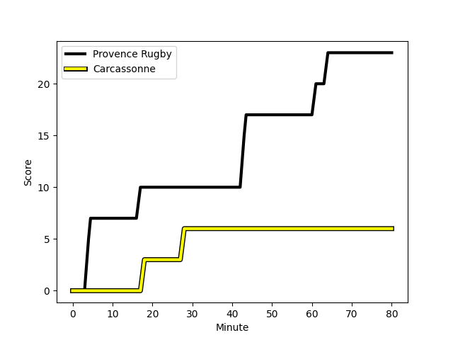
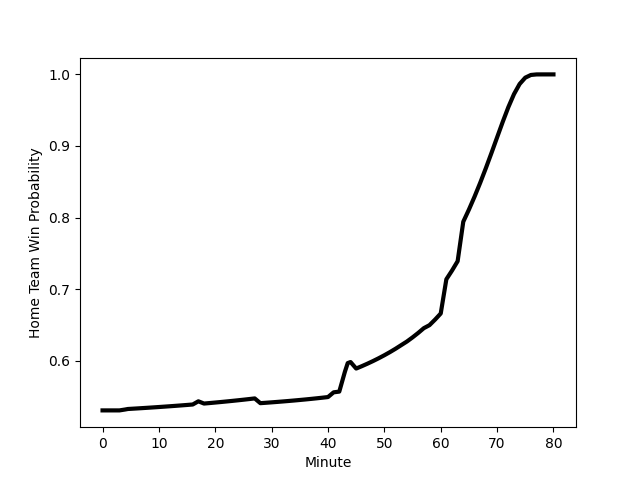

---  
layout: page  
title: Carcassonne at Provence Rugby; 6-23  
date: 2022-12-02 19:30:00 18:00:00 -0500  
categories: match review  
---
# Carcassonne (1389.71) at Provence Rugby (1443.07); 6-23

# Prediction: Provence Rugby by 8.3

Provence Rugby by 5.3 on a neutral field
## Scores over Time

## Win Probability over Time

# Pre-Match Prediction: Provence Rugby by 9.2

Provence Rugby by 6.2 on a neutral pitch

|   Away Minutes | Away Player                                                                     |   Away elo |   Away Percentile |   Number |   Home Percentile |   Home elo | Home Player                                                               |   Home Minutes |
|---------------:|:--------------------------------------------------------------------------------|-----------:|------------------:|---------:|------------------:|-----------:|:--------------------------------------------------------------------------|---------------:|
|             61 | [Youssef Amrouni](..//playerfiles//YoussefAmrouni_cleaned.md)                   |      80.24 |                 4 |        1 |                93 |     112.5  | [Federico Wegrzyn](..//playerfiles//FedericoWegrzyn_cleaned.md)           |             54 |
|             61 | [Raphael Carbou](..//playerfiles//RaphaelCarbou_cleaned.md)                     |      76.69 |                 3 |        2 |                57 |      95.56 | [German Kessler Lordon](..//playerfiles//GermanKesslerLordon_cleaned.md)  |             54 |
|             54 | [Soso Bekoshvili](..//playerfiles//SosoBekoshvili_cleaned.md)                   |      83.62 |                 8 |        3 |                43 |      93.27 | [Luke Tagi](..//playerfiles//LukeTagi_cleaned.md)                         |             58 |
|             80 | [George Merrick](..//playerfiles//GeorgeMerrick_cleaned.md)                     |      90.56 |                29 |        4 |                80 |     104.72 | [Clément Chartier](..//playerfiles//ClémentChartier_cleaned.md)           |             54 |
|             52 | [Rynard Landman](..//playerfiles//RynardLandman_cleaned.md)                     |      96.5  |                54 |        5 |                 3 |      72.31 | [Hans N'kinsi](..//playerfiles//HansN'kinsi_cleaned.md)                   |             80 |
|             61 | [Gregory Annetta](..//playerfiles//GregoryAnnetta_cleaned.md)                   |      80.43 |                 7 |        6 |                12 |      84.02 | [Carl Axtens](..//playerfiles//CarlAxtens_cleaned.md)                     |             80 |
|             80 | [Rob Harley](..//playerfiles//RobHarley_cleaned.md)                             |     114.13 |                91 |        7 |                 6 |      80.68 | [Bilel Taieb](..//playerfiles//BilelTaieb_cleaned.md)                     |             80 |
|             80 | [Etienne Herjean](..//playerfiles//EtienneHerjean_cleaned.md)                   |      88    |                21 |        8 |                28 |      90.34 | [Charles Malet](..//playerfiles//CharlesMalet_cleaned.md)                 |             41 |
|             80 | [Samuel Marques](..//playerfiles//SamuelMarques_cleaned.md)                     |     122.8  |                97 |        9 |                71 |     101.44 | [Jonathan Ruru](..//playerfiles//JonathanRuru_cleaned.md)                 |             74 |
|             54 | [Dorian Jones](..//playerfiles//DorianJones_cleaned.md)                         |     101.21 |                68 |       10 |                90 |     114.96 | [Enzo Selponi](..//playerfiles//EnzoSelponi_cleaned.md)                   |             80 |
|             61 | [Maxime Marty](..//playerfiles//MaximeMarty_cleaned.md)                         |      79.97 |                 6 |       11 |                82 |     106.78 | [Nadir Bouhedjeur](..//playerfiles//NadirBouhedjeur_cleaned.md)           |             80 |
|             62 | [Nick Grigg](..//playerfiles//NickGrigg_cleaned.md)                             |      95.79 |                49 |       12 |                87 |     114.04 | [Louis Marrou](..//playerfiles//LouisMarrou_cleaned.md)                   |             45 |
|             80 | [Pierre Aguillon](..//playerfiles//PierreAguillon_cleaned.md)                   |      84.49 |                13 |       13 |                89 |     113.9  | [Peter Betham](..//playerfiles//PeterBetham_cleaned.md)                   |             80 |
|             80 | [Benoit Jasmin](..//playerfiles//BenoitJasmin_cleaned.md)                       |     122.05 |                96 |       14 |                80 |     105.89 | [Kevin Bly](..//playerfiles//KevinBly_cleaned.md)                         |             80 |
|             80 | [Baptiste Mouchous](..//playerfiles//BaptisteMouchous_cleaned.md)               |      82.56 |                12 |       15 |                 2 |      72.57 | [Adrien Lapegue-Lafaye](..//playerfiles//AdrienLapegue-Lafaye_cleaned.md) |             19 |
|             28 | [Stephane Onambele](..//playerfiles//StephaneOnambele_cleaned.md)               |      66.64 |                 1 |       16 |                71 |     102.23 | [Adrian Sanday](..//playerfiles//AdrianSanday_cleaned.md)                 |             61 |
|             26 | [Vakhtangi Akhobadze](..//playerfiles//VakhtangiAkhobadze_cleaned.md)           |      62.79 |                 0 |       17 |                 0 |      61.17 | [Jessy Jegerlehner](..//playerfiles//JessyJegerlehner_cleaned.md)         |             39 |
|             26 | [Damien Añon](..//playerfiles//DamienAñon_cleaned.md)                           |     102.23 |                69 |       18 |                20 |      87.85 | [Dorian Lavernhe](..//playerfiles//DorianLavernhe_cleaned.md)             |             35 |
|             19 | [Luka Petriashvili](..//playerfiles//LukaPetriashvili_cleaned.md)               |      95.87 |               nan |       19 |                66 |      99.4  | [Jérôme Dufour](..//playerfiles//JérômeDufour_cleaned.md)                 |             26 |
|             19 | [Aaron Carroll](..//playerfiles//AaronCarroll_cleaned.md)                       |     104.01 |                77 |       20 |                59 |      97.17 | [Lucas Martin](..//playerfiles//LucasMartin_cleaned.md)                   |             26 |
|             19 | [Jules Martinez](..//playerfiles//JulesMartinez_cleaned.md)                     |      78.5  |                 5 |       21 |                 1 |      71.16 | [Dave Lolohea](..//playerfiles//DaveLolohea_cleaned.md)                   |             26 |
|             19 | [Clément Clavières](..//playerfiles//ClémentClavières_cleaned.md)               |      84.9  |                13 |       22 |                13 |      86.46 | [Thomas Vernet](..//playerfiles//ThomasVernet_cleaned.md)                 |             22 |
|             18 | [Brieuc Plessis-Couillaud](..//playerfiles//BrieucPlessis-Couillaud_cleaned.md) |      80.91 |                 8 |       23 |                55 |      97.11 | [Simon Tarel](..//playerfiles//SimonTarel_cleaned.md)                     |              6 |

