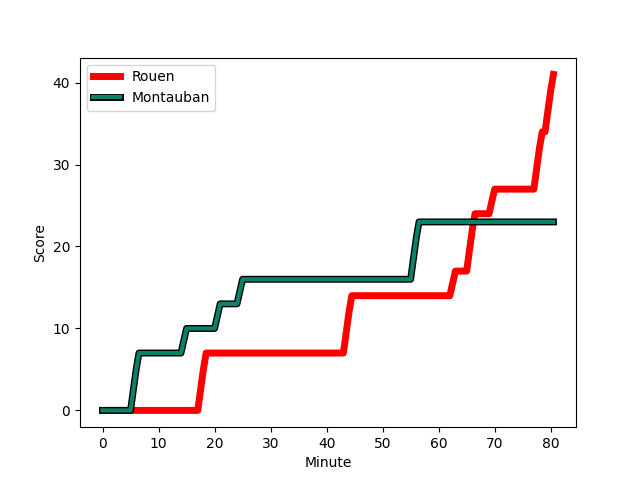
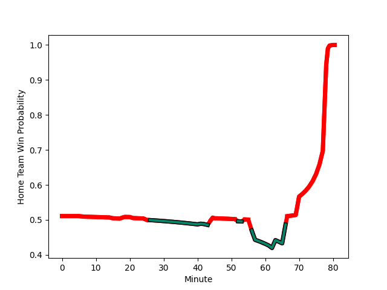

---  
layout: page  
title: Montauban at Rouen; 23-41  
date: 2022-12-02 19:30:00 18:00:00 -0500  
categories: match review  
---
# Montauban (1404.85) at Rouen (1423.67); 23-41

# Prediction: Rouen by 4.9

Rouen by 1.9 on a neutral field
## Scores over Time

## Win Probability over Time

# Pre-Match Prediction: Rouen by 4.3

Rouen by 1.3 on a neutral pitch

|   Away Minutes | Away Player                                                                    |   Away elo |   Away Percentile |   Number |   Home Percentile |   Home elo | Home Player                                                       |   Home Minutes |
|---------------:|:-------------------------------------------------------------------------------|-----------:|------------------:|---------:|------------------:|-----------:|:------------------------------------------------------------------|---------------:|
|             65 | [Nicolas Agnesi](..//playerfiles//NicolasAgnesi_cleaned.md)                    |     109.29 |                91 |        1 |                80 |     104.78 | [Dylan Jacquot](..//playerfiles//DylanJacquot_cleaned.md)         |             45 |
|             43 | [Kevin Firmin](..//playerfiles//KevinFirmin_cleaned.md)                        |      89.12 |                21 |        2 |                12 |      85.41 | [Efitusi Ma'afu](..//playerfiles//EfitusiMa'afu_cleaned.md)       |             54 |
|             52 | [Victor Laval](..//playerfiles//VictorLaval_cleaned.md)                        |      83.72 |                 7 |        3 |                22 |      89.33 | [Hugo Ndiaye](..//playerfiles//HugoNdiaye_cleaned.md)             |             41 |
|             80 | [Kevin Gimeno](..//playerfiles//KevinGimeno_cleaned.md)                        |      65.07 |                 1 |        4 |                51 |      95.88 | [Tienie Burger](..//playerfiles//TienieBurger_cleaned.md)         |             72 |
|             52 | [Alexandre Manukula](..//playerfiles//AlexandreManukula_cleaned.md)            |     107.52 |                84 |        5 |                45 |      94.2  | [Toby Salmon](..//playerfiles//TobySalmon_cleaned.md)             |             80 |
|             80 | [Quentin Witt](..//playerfiles//QuentinWitt_cleaned.md)                        |      91.61 |                33 |        6 |                75 |     101.2  | [Willy N'Diaye](..//playerfiles//WillyN'Diaye_cleaned.md)         |             80 |
|             80 | [Frédéric Quercy](..//playerfiles//FrédéricQuercy_cleaned.md)                  |      82.05 |                 8 |        7 |                79 |     104.23 | [Fabien Vincent](..//playerfiles//FabienVincent_cleaned.md)       |             64 |
|             62 | [Tyrone Viiga](..//playerfiles//TyroneViiga_cleaned.md)                        |      95.32 |                46 |        8 |                 7 |      80.33 | [Tino Mapapalangi](..//playerfiles//TinoMapapalangi_cleaned.md)   |             80 |
|             57 | [Quentin Delord](..//playerfiles//QuentinDelord_cleaned.md)                    |      76.84 |                 3 |        9 |                 4 |      79.04 | [Florent Campeggia](..//playerfiles//FlorentCampeggia_cleaned.md) |             62 |
|             57 | [Tedo Abzhandadze](..//playerfiles//TedoAbzhandadze_cleaned.md)                |      99.71 |                65 |       10 |                43 |      94.2  | [Thibault Olender](..//playerfiles//ThibaultOlender_cleaned.md)   |             80 |
|             80 | [Bastien Guillemin](..//playerfiles//BastienGuillemin_cleaned.md)              |      95.57 |                49 |       11 |                92 |     114.78 | [Benito Masilevu](..//playerfiles//BenitoMasilevu_cleaned.md)     |             52 |
|             65 | [Maxime Mathy](..//playerfiles//MaximeMathy_cleaned.md)                        |     106.65 |                80 |       12 |                 5 |      77.51 | [JT Jackson](..//playerfiles//JTJackson_cleaned.md)               |             80 |
|             80 | [Taleta Tupuola](..//playerfiles//TaletaTupuola_cleaned.md)                    |      91.62 |                35 |       13 |                42 |      92.31 | [Opetera Peleseuma](..//playerfiles//OpeteraPeleseuma_cleaned.md) |             80 |
|             80 | [Semesa Rokoduguni](..//playerfiles//SemesaRokoduguni_cleaned.md)              |     124.45 |                97 |       14 |                63 |      98.72 | [Malcolm Bertschy](..//playerfiles//MalcolmBertschy_cleaned.md)   |             66 |
|             80 | [Segundo Tuculet](..//playerfiles//SegundoTuculet_cleaned.md)                  |      72.84 |                 3 |       15 |                92 |     119.66 | [Pete Lydon](..//playerfiles//PeteLydon_cleaned.md)               |             80 |
|             37 | [Arnaud Feltrin](..//playerfiles//ArnaudFeltrin_cleaned.md)                    |      92.64 |                41 |       16 |                70 |     100.87 | [Cody Thomas](..//playerfiles//CodyThomas_cleaned.md)             |             39 |
|             28 | [Mirian Burduli](..//playerfiles//MirianBurduli_cleaned.md)                    |      84.31 |                10 |       17 |                67 |      98.81 | [Antoine Fournier](..//playerfiles//AntoineFournier_cleaned.md)   |             35 |
|             28 | [Rodrigo Fernandez Criado](..//playerfiles//RodrigoFernandezCriado_cleaned.md) |     110.55 |                87 |       18 |                57 |      96.95 | [Alex Luatua](..//playerfiles//AlexLuatua_cleaned.md)             |             28 |
|             23 | [Alexis Bernadet](..//playerfiles//AlexisBernadet_cleaned.md)                  |      99.9  |                68 |       19 |                90 |     109.67 | [Mathieu Bonnot](..//playerfiles//MathieuBonnot_cleaned.md)       |             26 |
|             23 | [Jérôme Bosviel](..//playerfiles//JérômeBosviel_cleaned.md)                    |     119.89 |                92 |       20 |               nan |      76.98 | [Theo Nanette](..//playerfiles//TheoNanette_cleaned.md)           |             18 |
|             18 | [Otar Giorgadze](..//playerfiles//OtarGiorgadze_cleaned.md)                    |     103.14 |                74 |       21 |                 0 |      63.74 | [Abdelkarim Fofana](..//playerfiles//AbdelkarimFofana_cleaned.md) |             16 |
|             15 | [Nicolas Solveyra](..//playerfiles//NicolasSolveyra_cleaned.md)                |     103.08 |                76 |       22 |                15 |      86.76 | [Paul Surano](..//playerfiles//PaulSurano_cleaned.md)             |             14 |
|             15 | [Raphael Sanchez](..//playerfiles//RaphaelSanchez_cleaned.md)                  |      93.62 |                42 |       23 |                 6 |      76.86 | [Shay Kerry](..//playerfiles//ShayKerry_cleaned.md)               |              8 |

