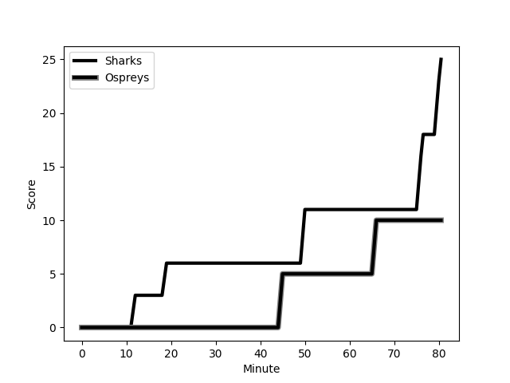
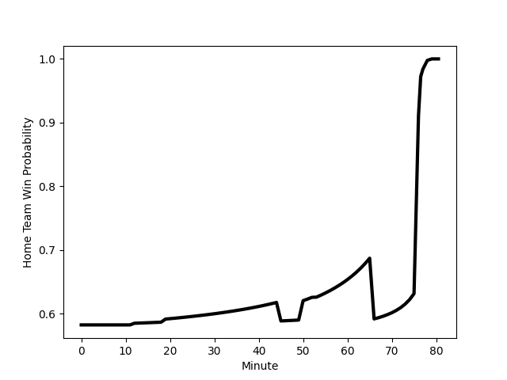

---  
layout: page  
title: Ospreys at Sharks; 10-25  
date: 2022-12-02 18:10:00 18:00:00 -0500  
categories: match review  
---
# Ospreys (1390.38) at Sharks (1534.46); 10-25

# Prediction: Sharks by 17.4

Sharks by 14.4 on a neutral field
## Scores over Time

## Win Probability over Time

# Pre-Match Prediction: Sharks by 13.0

Sharks by 10.0 on a neutral pitch

|   Away Minutes | Away Player                                                             |   Away elo |   Away Percentile |   Number |   Home Percentile |   Home elo | Home Player                                                                      |   Home Minutes |
|---------------:|:------------------------------------------------------------------------|-----------:|------------------:|---------:|------------------:|-----------:|:---------------------------------------------------------------------------------|---------------:|
|             50 | [Rhys Henry](..//playerfiles//RhysHenry_cleaned.md)                     |      99.35 |                56 |        1 |                89 |     109.25 | [Ox Nche](..//playerfiles//OxNche_cleaned.md)                                    |             53 |
|             50 | [Sam Parry](..//playerfiles//SamParry_cleaned.md)                       |      88.31 |                14 |        2 |                97 |     121.56 | [Bongi Mbonambi](..//playerfiles//BongiMbonambi_cleaned.md)                      |             54 |
|             60 | [Tom Botha](..//playerfiles//TomBotha_cleaned.md)                       |      76.11 |                 3 |        3 |                 4 |      79.22 | [Carlu Sadie](..//playerfiles//CarluSadie_cleaned.md)                            |             54 |
|             57 | [Bradley Davies](..//playerfiles//BradleyDavies_cleaned.md)             |     101.94 |                73 |        4 |                80 |     105.26 | [Vincent Tshituka](..//playerfiles//VincentTshituka_cleaned.md)                  |             80 |
|             80 | [Huw Owen-Sutton](..//playerfiles//HuwOwen-Sutton_cleaned.md)           |     100.87 |                71 |        5 |                 4 |      74.88 | [Gerbrandt Grobler](..//playerfiles//GerbrandtGrobler_cleaned.md)                |             80 |
|             80 | [Ethan Roots](..//playerfiles//EthanRoots_cleaned.md)                   |      97.83 |                58 |        6 |                85 |     110.45 | [Sikhumbuzo Notshe](..//playerfiles//SikhumbuzoNotshe_cleaned.md)                |             63 |
|             57 | [Will Hickey](..//playerfiles//WillHickey_cleaned.md)                   |      98.69 |                62 |        7 |                23 |      88.94 | [Jeandre Labuschagne](..//playerfiles//JeandreLabuschagne_cleaned.md)            |             80 |
|             80 | [Morgan Morris](..//playerfiles//MorganMorris_cleaned.md)               |      82.37 |                 9 |        8 |                80 |     105.71 | [Phepsi Buthelezi](..//playerfiles//PhepsiButhelezi_cleaned.md)                  |             80 |
|             80 | [Matthew Aubrey](..//playerfiles//MatthewAubrey_cleaned.md)             |      86.05 |               nan |        9 |                81 |     106.47 | [Jaden Hendrikse](..//playerfiles//JadenHendrikse_cleaned.md)                    |             53 |
|             80 | [Jack Walsh](..//playerfiles//JackWalsh_cleaned.md)                     |      98.45 |                57 |       10 |                80 |     107.3  | [Curwin Bosch](..//playerfiles//CurwinBosch_cleaned.md)                          |             80 |
|             63 | [Keelan Giles](..//playerfiles//KeelanGiles_cleaned.md)                 |      74.51 |                 2 |       11 |                95 |     121.14 | [Makazole Mapimpi](..//playerfiles//MakazoleMapimpi_cleaned.md)                  |             80 |
|             80 | [Tiaan Thomas-Wheeler](..//playerfiles//TiaanThomas-Wheeler_cleaned.md) |      90.11 |                27 |       12 |                71 |     101.86 | [Ben Tapuai](..//playerfiles//BenTapuai_cleaned.md)                              |             80 |
|             60 | [Michael Collins](..//playerfiles//MichaelCollins_cleaned.md)           |     107.27 |                82 |       13 |                89 |     113.45 | [Francois Venter](..//playerfiles//FrancoisVenter_cleaned.md)                    |             80 |
|             80 | [Luke Morgan](..//playerfiles//LukeMorgan_cleaned.md)                   |      81.33 |                 8 |       14 |                58 |      97.57 | [Marnus Potgieter](..//playerfiles//MarnusPotgieter_cleaned.md)                  |             80 |
|             80 | [Max Nagy](..//playerfiles//MaxNagy_cleaned.md)                         |      97.11 |                55 |       15 |                63 |      99.52 | [Boeta Chamberlain](..//playerfiles//BoetaChamberlain_cleaned.md)                |             80 |
|             30 | [Garyn Phillips](..//playerfiles//GarynPhillips_cleaned.md)             |      94.21 |                42 |       16 |                71 |     101.03 | [Ntuthuko Mchunu](..//playerfiles//NtuthukoMchunu_cleaned.md)                    |             27 |
|             30 | [Scott Baldwin](..//playerfiles//ScottBaldwin_cleaned.md)               |     113.1  |                93 |       17 |                82 |     106.65 | [Grant Williams](..//playerfiles//GrantWilliams_cleaned.md)                      |             27 |
|             23 | [Harri Deaves](..//playerfiles//HarriDeaves_cleaned.md)                 |      92.99 |                39 |       18 |                47 |      91.36 | [Daniel Viljoen Jooste](..//playerfiles//DanielViljoenJooste_cleaned.md)         |             26 |
|             23 | [Jack Regan](..//playerfiles//JackRegan_cleaned.md)                     |      96.61 |               nan |       19 |                53 |      95.89 | [Khuthuzani Kingdom Mchunu](..//playerfiles//KhuthuzaniKingdomMchunu_cleaned.md) |             26 |
|             20 | [Cai Evans](..//playerfiles//CaiEvans_cleaned.md)                       |      92.01 |               nan |       20 |                80 |     105.7  | [James Venter](..//playerfiles//JamesVenter_cleaned.md)                          |             17 |
|             20 | [Ben Warren](..//playerfiles//BenWarren_cleaned.md)                     |      97.51 |               nan |       21 |               nan |     nan    | nan                                                                              |            nan |
|             17 | [Tom Florence](..//playerfiles//TomFlorence_cleaned.md)                 |      95    |               nan |       22 |               nan |     nan    | nan                                                                              |            nan |

