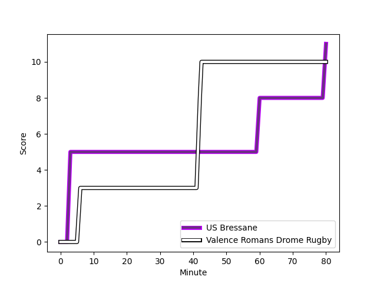
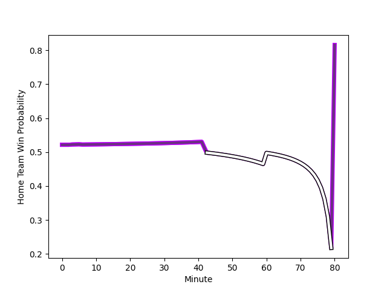

---  
layout: page  
title: Valence Romans Drome Rugby at US Bressane; 10-11  
date: 2022-12-02 19:30:00 18:00:00 -0500  
categories: match review  
---
# Valence Romans Drome Rugby (1484.14) at US Bressane (1521.72); 10-11

# Prediction: US Bressane by 6.8

US Bressane by 3.8 on a neutral field
## Scores over Time

## Win Probability over Time

# Pre-Match Prediction: US Bressane by 2.5

Valence Romans Drome Rugby by 0.5 on a neutral pitch

|   Away Minutes | Away Player                                                                |   Away elo |   Away Percentile |   Number |   Home Percentile |   Home elo | Home Player                                                                       |   Home Minutes |
|---------------:|:---------------------------------------------------------------------------|-----------:|------------------:|---------:|------------------:|-----------:|:----------------------------------------------------------------------------------|---------------:|
|             52 | [Anthony Aléo](..//playerfiles//AnthonyAléo_cleaned.md)                    |     109.17 |                88 |        1 |                 7 |      82.38 | [Vazha Kapanadze](..//playerfiles//VazhaKapanadze_cleaned.md)                     |             59 |
|             59 | [Dorian Marco Pena](..//playerfiles//DorianMarcoPena_cleaned.md)           |      84.07 |                10 |        2 |                94 |     115.71 | [Sione Anga'aelangi](..//playerfiles//SioneAnga'aelangi_cleaned.md)               |             51 |
|             69 | [John Henry Fincham](..//playerfiles//JohnHenryFincham_cleaned.md)         |      95.86 |                50 |        3 |                92 |     111.81 | [Erich de Jager](..//playerfiles//ErichdeJager_cleaned.md)                        |             69 |
|             80 | [Darrell Dyer](..//playerfiles//DarrellDyer_cleaned.md)                    |      97.78 |                58 |        4 |                50 |      95.22 | [Louis Bruinsma](..//playerfiles//LouisBruinsma_cleaned.md)                       |             80 |
|             80 | [Ian Groenewald](..//playerfiles//IanGroenewald_cleaned.md)                |     113.02 |                90 |        5 |                93 |     115.41 | [Cyril Veyret](..//playerfiles//CyrilVeyret_cleaned.md)                           |             80 |
|             15 | [Alexis Armary](..//playerfiles//AlexisArmary_cleaned.md)                  |      99.41 |                64 |        6 |                68 |     101.11 | [Thomas Déliance](..//playerfiles//ThomasDéliance_cleaned.md)                     |             76 |
|             80 | [Sven Bernat Girlando](..//playerfiles//SvenBernatGirlando_cleaned.md)     |     103.55 |                71 |        7 |                23 |      89.86 | [Loic Baradel](..//playerfiles//LoicBaradel_cleaned.md)                           |             80 |
|             52 | [Ioane Iashagashvili](..//playerfiles//IoaneIashagashvili_cleaned.md)      |     105.25 |                78 |        8 |                 4 |      76.89 | [TJ Ioane](..//playerfiles//TJIoane_cleaned.md)                                   |             63 |
|             19 | [Tim Menzel](..//playerfiles//TimMenzel_cleaned.md)                        |      86.69 |                14 |        9 |                96 |     122.46 | [Nicolas Faure](..//playerfiles//NicolasFaure_cleaned.md)                         |             80 |
|             54 | [Joris Moura](..//playerfiles//JorisMoura_cleaned.md)                      |      96.77 |                50 |       10 |                45 |      96    | [Sebastian Poet](..//playerfiles//SebastianPoet_cleaned.md)                       |             69 |
|             80 | [Adam Vargas](..//playerfiles//AdamVargas_cleaned.md)                      |     105.3  |                80 |       11 |                34 |      92.08 | [Élie De Fleurian](..//playerfiles//ÉlieDeFleurian_cleaned.md)                    |             80 |
|             69 | [Ben Neiceru](..//playerfiles//BenNeiceru_cleaned.md)                      |      97.87 |                58 |       12 |                86 |     110.35 | [Parataiso Silafai-Lea'ana](..//playerfiles//ParataisoSilafai-Lea'ana_cleaned.md) |             80 |
|             80 | [Anatole Pauvert](..//playerfiles//AnatolePauvert_cleaned.md)              |      89.11 |                24 |       13 |                70 |     102.54 | [Maile Mamao](..//playerfiles//MaileMamao_cleaned.md)                             |             80 |
|             80 | [Tim Giresse](..//playerfiles//TimGiresse_cleaned.md)                      |      98.52 |                63 |       14 |                75 |     103.1  | [Audric Sanlaville](..//playerfiles//AudricSanlaville_cleaned.md)                 |             80 |
|             80 | [Quentin Gobet](..//playerfiles//QuentinGobet_cleaned.md)                  |      95.76 |                52 |       15 |                91 |     114.53 | [Pierre Berard](..//playerfiles//PierreBerard_cleaned.md)                         |             80 |
|             28 | [Andrea Pontanier](..//playerfiles//AndreaPontanier_cleaned.md)            |      93.12 |                36 |       16 |                36 |      92.98 | [Teo Bordenave](..//playerfiles//TeoBordenave_cleaned.md)                         |             21 |
|             21 | [Mehdi Boundjema](..//playerfiles//MehdiBoundjema_cleaned.md)              |     103.85 |                77 |       17 |                18 |      88.06 | [Clement Jullien](..//playerfiles//ClementJullien_cleaned.md)                     |             29 |
|             11 | [Vincent Pelo](..//playerfiles//VincentPelo_cleaned.md)                    |      92.43 |                33 |       18 |                14 |      86.81 | [Zauri Tevdorashvili](..//playerfiles//ZauriTevdorashvili_cleaned.md)             |             11 |
|             65 | [Francois Uys](..//playerfiles//FrancoisUys_cleaned.md)                    |     109.97 |                87 |       19 |                66 |      99.64 | [Wael May](..//playerfiles//WaelMay_cleaned.md)                                   |              4 |
|             28 | [Matthew Gicquel](..//playerfiles//MatthewGicquel_cleaned.md)              |      85.17 |                13 |       20 |                 8 |      81.77 | [Christian Lacombe](..//playerfiles//ChristianLacombe_cleaned.md)                 |             11 |
|             61 | [Mickael Thébault](..//playerfiles//MickaelThébault_cleaned.md)            |      97.51 |               nan |       21 |                69 |     100.29 | [Marius Antonescu](..//playerfiles//MariusAntonescu_cleaned.md)                   |             17 |
|             26 | [Lucas Meret](..//playerfiles//LucasMeret_cleaned.md)                      |      91.95 |                31 |       22 |               nan |     nan    | nan                                                                               |            nan |
|             11 | [Akuila Joeli Tabualevu](..//playerfiles//AkuilaJoeliTabualevu_cleaned.md) |      88.11 |                21 |       23 |               nan |     nan    | nan                                                                               |            nan |

