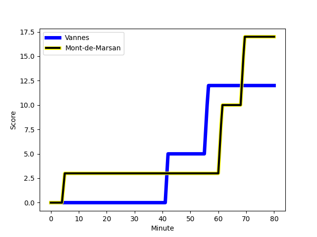
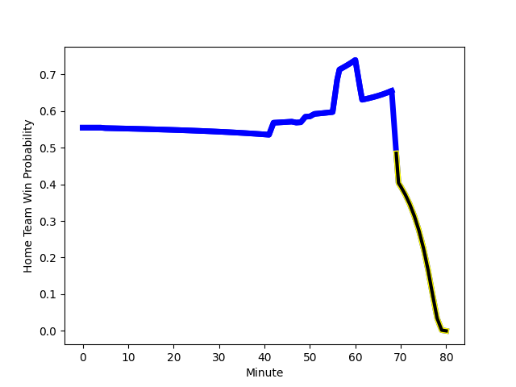

---  
layout: page  
title: Mont-de-Marsan at Vannes; 17-12  
date: 2022-12-02 19:30:00 18:00:00 -0500  
categories: match review  
---
# Mont-de-Marsan (1419.88) at Vannes (1514.9); 17-12

# Prediction: Vannes by 12.5

Vannes by 9.5 on a neutral field
## Scores over Time

## Win Probability over Time

# Pre-Match Prediction: Vannes by 9.5

Vannes by 6.5 on a neutral pitch

|   Away Minutes | Away Player                                                                      |   Away elo |   Away Percentile |   Number |   Home Percentile |   Home elo | Home Player                                                                  |   Home Minutes |
|---------------:|:---------------------------------------------------------------------------------|-----------:|------------------:|---------:|------------------:|-----------:|:-----------------------------------------------------------------------------|---------------:|
|             63 | [Jean-Luc Innocente](..//playerfiles//Jean-LucInnocente_cleaned.md)              |      83.17 |                 8 |        1 |                36 |      93.1  | [Charles-Henri Berguet](..//playerfiles//Charles-HenriBerguet_cleaned.md)    |             51 |
|             56 | [Jose Luis Gonzalez](..//playerfiles//JoseLuisGonzalez_cleaned.md)               |     102.15 |                76 |        2 |                57 |      97.01 | [Pat Leafa](..//playerfiles//PatLeafa_cleaned.md)                            |             51 |
|             49 | [Gheorge Gajion](..//playerfiles//GheorgeGajion_cleaned.md)                      |      81.8  |                 6 |        3 |                96 |     118.63 | [Paga Tafili](..//playerfiles//PagaTafili_cleaned.md)                        |             47 |
|             56 | [Romain Durand](..//playerfiles//RomainDurand_cleaned.md)                        |     101.37 |                72 |        4 |                 1 |      66.48 | [Eric Marks](..//playerfiles//EricMarks_cleaned.md)                          |             80 |
|             80 | [Aston Fortuin](..//playerfiles//AstonFortuin_cleaned.md)                        |      80.37 |                 9 |        5 |                67 |      99.57 | [Ewan Thomas Johnson](..//playerfiles//EwanThomasJohnson_cleaned.md)         |             51 |
|             80 | [Veresa Tuqovu Ramototabua](..//playerfiles//VeresaTuqovuRamototabua_cleaned.md) |      95    |               nan |        6 |                48 |      95.22 | [Juan Bautista Pedemonte](..//playerfiles//JuanBautistaPedemonte_cleaned.md) |             47 |
|             80 | [Nicolas Garrault](..//playerfiles//NicolasGarrault_cleaned.md)                  |     104.1  |                77 |        7 |                98 |     134.94 | [Francisco Gorrissen](..//playerfiles//FranciscoGorrissen_cleaned.md)        |             80 |
|             56 | [Raphaël Robic](..//playerfiles//RaphaëlRobic_cleaned.md)                        |      95.11 |               nan |        8 |                79 |     106.72 | [Léon Boulier](..//playerfiles//LéonBoulier_cleaned.md)                      |             71 |
|             60 | [Christophe Loustalot](..//playerfiles//ChristopheLoustalot_cleaned.md)          |      70.39 |                 0 |        9 |                20 |      88.96 | [Hugo Zabalza](..//playerfiles//HugoZabalza_cleaned.md)                      |             47 |
|             80 | [Willie du Plessis](..//playerfiles//WillieduPlessis_cleaned.md)                 |     111.97 |                87 |       10 |                43 |      94.74 | [Maxime Lafage](..//playerfiles//MaximeLafage_cleaned.md)                    |             80 |
|             80 | [Kaminieli Rasaku](..//playerfiles//KaminieliRasaku_cleaned.md)                  |      92    |                34 |       11 |                68 |     101.54 | [Nicolas Freitas](..//playerfiles//NicolasFreitas_cleaned.md)                |             80 |
|             60 | [Jules Even](..//playerfiles//JulesEven_cleaned.md)                              |      98.25 |                59 |       12 |                43 |      93.69 | [Andres Vilaseca Hontou](..//playerfiles//AndresVilasecaHontou_cleaned.md)   |             80 |
|             80 | [Nacani Wakaya](..//playerfiles//NacaniWakaya_cleaned.md)                        |     107.05 |                81 |       13 |                55 |      97.24 | [Theo Costosseque](..//playerfiles//TheoCostosseque_cleaned.md)              |             80 |
|             80 | [Ambrose Curtis](..//playerfiles//AmbroseCurtis_cleaned.md)                      |      90.89 |                30 |       14 |                71 |     101.37 | [Nathanael Hulleu](..//playerfiles//NathanaelHulleu_cleaned.md)              |             80 |
|             49 | [Yoann Laousse Azpiazu](..//playerfiles//YoannLaousseAzpiazu_cleaned.md)         |     115.64 |                92 |       15 |                98 |     126.65 | [Nick Abendanon](..//playerfiles//NickAbendanon_cleaned.md)                  |             80 |
|             31 | [Max Curie](..//playerfiles//MaxCurie_cleaned.md)                                |      91.76 |                34 |       16 |                45 |      94.82 | [Phil Kite](..//playerfiles//PhilKite_cleaned.md)                            |             33 |
|             31 | [Alexandre de Nardi](..//playerfiles//AlexandredeNardi_cleaned.md)               |      83.09 |                 9 |       17 |                62 |      98.68 | [Alexandre Gouaux](..//playerfiles//AlexandreGouaux_cleaned.md)              |             33 |
|             24 | [Leandro Cedaro](..//playerfiles//LeandroCedaro_cleaned.md)                      |      98.42 |                57 |       18 |                78 |     103.92 | [Joe Edwards](..//playerfiles//JoeEdwards_cleaned.md)                        |             33 |
|             24 | [Léo Banos](..//playerfiles//LéoBanos_cleaned.md)                                |      81.24 |                 8 |       19 |                84 |     107.81 | [Edoardo Iachizzi](..//playerfiles//EdoardoIachizzi_cleaned.md)              |             29 |
|             24 | [Romain Laterrade](..//playerfiles//RomainLaterrade_cleaned.md)                  |      87.49 |                17 |       20 |                73 |     101.83 | [Cyril Blanchard](..//playerfiles//CyrilBlanchard_cleaned.md)                |             29 |
|             20 | [Martin Doan](..//playerfiles//MartinDoan_cleaned.md)                            |     104.58 |                78 |       21 |                18 |      89.34 | [Ximun Bessonart](..//playerfiles//XimunBessonart_cleaned.md)                |             29 |
|             20 | [Simon Desaubies](..//playerfiles//SimonDesaubies_cleaned.md)                    |      86.87 |                19 |       22 |                20 |      87.97 | [Kevin Burgaud](..//playerfiles//KevinBurgaud_cleaned.md)                    |              9 |
|             17 | [Dino Casadei](..//playerfiles//DinoCasadei_cleaned.md)                          |      97.88 |                57 |       23 |               nan |     nan    | nan                                                                          |            nan |

